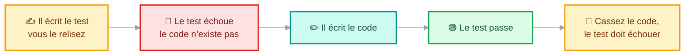
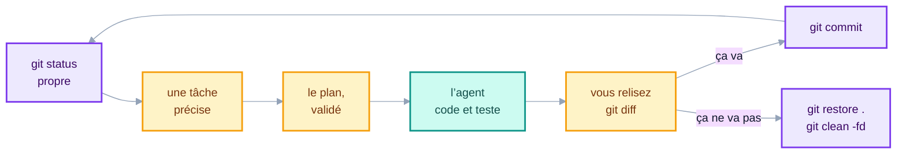
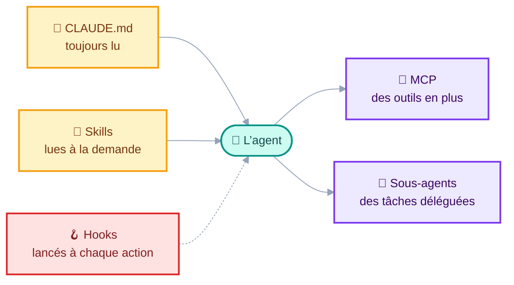

<CourseCover :sprint="4" :seance="14" />

# Coder avec un agent

## Aller vite, sans perdre la main

<div class="pt-4 op-75">Développement Web · ISMIN 3A</div>

<div class="pt-10 text-sm op-75">
📱 <b>gaetanmaisse.github.io/ismin-web-2026-tps</b>
</div>

---
layout: section
---

# 1. Du chat à l’agent

---

# Trois façons de coder avec l’IA

<div class="flex items-center gap-3 pt-2 pb-3 text-xs op-75">
<span>Vous gardez la main</span>
<div class="flex-1 h-1.5 rounded" style="background: linear-gradient(90deg, #f59e0b, #0d9488);"></div>
<span>L’IA fait plus de choses seule&nbsp;→</span>
</div>

<div class="grid grid-cols-3 gap-4 text-sm">
<div class="p-3 border border-amber-500 border-opacity-60 rounded">

**💬 Le chat**

<div class="text-xs op-75">Le Chat, ChatGPT, Claude, dans le navigateur</div>

<div class="pt-2"><b>L’IA fait seule</b>&nbsp;: elle répond à une question.</div>

<div class="pt-1"><b>Vous contrôlez</b>&nbsp;: chaque copier-coller, chaque fichier.</div>

</div>
<div class="p-3 border border-gray-500 border-opacity-40 rounded">

**✏️ L’éditeur**

<div class="text-xs op-75">Copilot, Continue, dans VS Code</div>

<div class="pt-2"><b>L’IA fait seule</b>&nbsp;: elle complète, ou modifie le fichier ouvert.</div>

<div class="pt-1"><b>Vous contrôlez</b>&nbsp;: chaque suggestion que vous acceptez.</div>

</div>
<div class="p-3 border border-teal-600 border-opacity-70 rounded">

**🤖 L’agent**

<div class="text-xs op-75">Claude Code, le mode agent de Copilot, la CLI de Mistral</div>

<div class="pt-2"><b>L’IA fait seule</b>&nbsp;: il lit le dépôt, modifie plusieurs fichiers, lance des commandes et les tests.</div>

<div class="pt-1"><b>Vous contrôlez</b>&nbsp;: le plan, les commandes, le diff.</div>

</div>
</div>

<div class="pt-5 text-sm">

Plus l’IA fait de choses seule, plus il faut de méthode&nbsp;: c’est le sujet de cette séance.

</div>

<div class="pt-2 text-xs op-75">
Claude Code est payant. Le mode agent de Copilot est gratuit pour les étudiants, avec le GitHub Student Developer Pack. Les principes de cette séance valent pour tous les agents.
</div>

---

# Un agent, c’est une boucle

```mermaid {scale: 0.58}
%%{init: {'theme':'base','themeVariables':{'fontFamily':'Roboto, ui-sans-serif, sans-serif','fontSize':'14px','lineColor':'#94a3b8','primaryTextColor':'#0f172a'}}}%%
flowchart LR
  P["🧑 Votre demande"] --> L["📖 Il lit<br/>les fichiers"]
  L --> PL["🗺️ Il propose<br/>un plan"]
  PL --> M["✏️ Il modifie<br/>le code"]
  M --> R["▶️ Il lance les tests,<br/>le typecheck"]
  R -->|"échec"| M
  R -->|"tout passe"| F["✅ Il vous rend<br/>la main"]
  classDef you fill:#fef3c7,stroke:#f59e0b,stroke-width:2px,color:#78350f
  classDef ag fill:#ccfbf1,stroke:#0d9488,stroke-width:2px,color:#134e4a
  classDef ok fill:#dcfce7,stroke:#16a34a,stroke-width:2px,color:#14532d
  class P you
  class L,PL,M,R ag
  class F ok
```



<div class="grid grid-cols-2 gap-8 pt-6 text-sm">
<div>

L’agent enchaîne seul les allers-retours que vous faisiez à la main avec le chat&nbsp;: lire, modifier, lancer, lire l’erreur, recommencer.

Tant que les tests échouent, il corrige et relance. C’est sa force, et son danger&nbsp;: il s’arrête quand tout passe, pas quand c’est juste.

</div>
<div>

<div class="p-3 bg-blue-500 bg-opacity-10 rounded">

**Vous intervenez à trois moments**&nbsp;:

1. vous validez **le plan**&nbsp;;
2. vous autorisez **les commandes**&nbsp;;
3. vous relisez **le diff**, avant de commiter.

</div>
</div>
</div>

<div class="mt-4 p-3 border border-gray-500 border-opacity-30 rounded text-xs grid grid-cols-2 gap-x-6 gap-y-1">
<div class="col-span-2 font-bold text-sm pb-1">Le vocabulaire de la séance</div>
<div><b>Une demande</b>, <i>prompt</i>&nbsp;: ce que vous lui écrivez.</div>
<div><b>Le contexte</b>, <i>context window</i>&nbsp;: tout ce qu’il a lu et dit depuis le début de la session. Sa taille est limitée.</div>
<div><b>Le plan</b>, <i>plan mode</i>&nbsp;: il propose, sans rien modifier.</div>
<div><b>Le diff</b>&nbsp;: les lignes qu’il a ajoutées ou supprimées, avec <code>git diff</code>.</div>
<div><b>Un token</b>&nbsp;: un morceau de mot. La taille du contexte et le prix se comptent en tokens.</div>
<div><b>Un plugin</b>&nbsp;: une extension qui change son comportement, ou lui ajoute des outils.</div>
</div>

---

# Plausible n’est pas juste

<div class="text-sm op-75 -mt-2 mb-3">Des propositions typiques des assistants, dont trois vues en préparant ce cours&nbsp;:</div>

<div class="grid grid-cols-3 gap-3 text-sm">
<div class="p-3 border border-gray-500 border-opacity-30 rounded">

**`react-router-dom`**

Le paquet n’existe plus depuis React Router 8. L’IA a appris sur d’anciennes versions.

</div>
<div class="p-3 border border-gray-500 border-opacity-30 rounded">

**`FormEvent`**

Marqué obsolète dans les types de React 19. Le bon type&nbsp;: `SubmitEvent`.

</div>
<div class="p-3 border border-gray-500 border-opacity-30 rounded">

**`origin: '*'`**

Pour «&nbsp;corriger&nbsp;» une erreur CORS. Ça marche, et ça ouvre l’API à n’importe quel site.

</div>
<div class="p-3 border border-teal-600 border-opacity-60 rounded bg-teal-500 bg-opacity-5">

**`--skip-seed`** <span class="text-xs op-60">vu</span>

Une option de `prisma migrate reset` qui n’existe plus dans Prisma 7&nbsp;: la commande échoue.

</div>
<div class="p-3 border border-teal-600 border-opacity-60 rounded bg-teal-500 bg-opacity-5">

**`npx prisma` dans l’image** <span class="text-xs op-60">vu</span>

La CLI n’y était plus&nbsp;: `npx` a téléchargé une préversion de Prisma 8, qui a échoué.

</div>
<div class="p-3 border border-teal-600 border-opacity-60 rounded bg-teal-500 bg-opacity-5">

**`command:` sans `sh -c`** <span class="text-xs op-60">vu</span>

Dans `compose.yaml`, le seed ne tournait pas, et tout semblait vert&nbsp;: un catalogue vide, sans erreur.

</div>
</div>

<div class="pt-4 text-sm">

**Le point commun**&nbsp;: du code qui a l’air juste, écrit avec assurance. C’est vous qui vérifiez.

</div>

---
layout: section
---

# 2. Travailler avec un agent

---

# Le fichier d’instructions&nbsp;: `CLAUDE.md`

<div class="grid grid-cols-5 gap-6 pt-2">
<div class="col-span-3">

```markdown
# ModelZoo

## La stack
- api/ : NestJS 12, Prisma 7, SQLite.
- web/ : React 19, Vite, TanStack Query, React Router 8.
- Node 26. Tout s'importe de `react-router`.

## Les commandes
- `npm test` et `npm run typecheck`, dans api/ et dans web/
- `npm run start:dev` dans api/, `npm run dev` dans web/

## Les règles
- Ne jamais modifier un test pour le faire passer.
- Pas de nouvelle dépendance sans me demander.
- Ne jamais lire ni modifier `.env`.
- Une tâche à la fois. Dans le doute, demander.
```

</div>
<div class="col-span-2 text-sm">

L’agent le lit **au début de chaque session**. C’est votre projet, résumé pour lui&nbsp;: ce qu’il ne peut pas deviner.

<v-clicks>

- **Les versions** l’empêchent de ressortir des API périmées.
- **Les commandes** lui donnent le moyen de se vérifier.
- **Les règles** posent ce qu’il n’a pas le droit de faire.

</v-clicks>

<div class="pt-4 op-75">
<code>CLAUDE.md</code> pour Claude Code, <code>AGENTS.md</code> pour la plupart des autres. Si les deux membres du binôme utilisent des agents différents&nbsp;: tout dans <code>AGENTS.md</code>, et dans <code>CLAUDE.md</code> une seule ligne, <code>@AGENTS.md</code>, qui l’importe.

Vous en avez un dans chaque TP&nbsp;: c’est lui qui transformait l’assistant en tuteur. <code>/init</code> en propose un premier jet, à relire.
</div>
</div>
</div>

---

# Une bonne demande

<div class="grid grid-cols-2 gap-6 pt-2">
<div>

<div class="text-sm font-bold pb-1">❌ Trop vague</div>

```text
Ajoute la suppression des modèles.
```

<div class="text-sm pt-2">

L’agent devine&nbsp;: où mettre le bouton, qui a le droit, quoi faire après. Il devinera mal, et vous le découvrirez dans le diff.

</div>

<div class="mt-4 p-3 bg-blue-500 bg-opacity-10 rounded text-sm">

**Une bonne demande dit**&nbsp;: où, quoi, les contraintes, et à quoi on reconnaît que c’est fini, *definition of done*.

</div>
</div>
<div>

<div class="text-sm font-bold pb-1">✅ Précise</div>

```text
Dans web/ : un bouton « Supprimer » sur la page
d'un modèle.
- Visible seulement pour un admin : le rôle est
  dans le payload du token.
- DELETE /models/:id avec le token. L'API répond
  204, ou 403 pour un non-admin.
- Après la suppression : retour au catalogue.
- Un test dans ModelPage.test.tsx. Ne modifie
  pas les tests existants.

Propose d'abord un plan, sans écrire de code.
```

</div>
</div>

---

# Le plan d’abord

<div class="grid grid-cols-2 gap-8 pt-2">
<div>

**Dans Claude Code&nbsp;: le *plan mode***, avec `Shift+Tab`. L’agent lit le code et propose un plan, sans rien modifier.

<div class="pt-4 text-sm">

Un plan se corrige en une phrase&nbsp;; du code, en une heure.

</div>

<div class="pt-4 text-sm">

Ce qu’on vérifie dans le plan&nbsp;:

- les fichiers qu’il compte toucher, et pourquoi&nbsp;;
- ce qu’il compte installer&nbsp;;
- ce qu’il a compris de travers.

</div>
</div>
<div>

<div class="p-4 bg-blue-500 bg-opacity-10 rounded text-sm">

**Les décisions vous appartiennent.** L’agent propose une architecture, un découpage, une bibliothèque&nbsp;: c’est vous qui tranchez, et qui savez dire pourquoi.

</div>

<div class="pt-4 text-sm">

Une bonne question à lui poser avant de coder&nbsp;:

```text
Quelles questions te poses-tu avant de commencer ?
Qu'est-ce qui est ambigu dans ma demande ?
```

</div>
</div>
</div>

---

# Lui donner un moyen de se vérifier

<div class="grid grid-cols-2 gap-8 pt-2">
<div>

Un agent qui peut lancer les tests **corrige ses propres erreurs**. Sans tests, il vous affirme que «&nbsp;ça marche&nbsp;».

```text
Fais passer les tests de ModelPage.test.tsx,
sans modifier les tests.
Lance npm test et npm run typecheck avant
de me rendre la main.
```

</div>
<div class="text-sm">

<v-clicks>

- **Les tests deviennent son cahier des charges**&nbsp;: ils disent ce qui est attendu, et quand c’est fini.
- **Dans les TP, ils étaient fournis.** Dans un vrai projet, et dans le vôtre, il n’y en a souvent aucun au départ&nbsp;: c’est à vous de les faire écrire, et de les relire. Slide suivante.
- **La vérification de bout en bout**&nbsp;: `docker compose up`, puis un vrai clic dans le navigateur. Un test vert ne prouve pas que l’application démarre.

</v-clicks>

</div>
</div>

---

# Pas de tests&nbsp;? Commencez par là



<div class="grid grid-cols-2 gap-8 pt-4">
<div>

```text
Il n'y a pas encore de tests pour la page
d'un modèle. Écris d'abord les tests de la
suppression : le bouton visible pour un admin
seulement, le DELETE envoyé avec le token,
le message affiché en cas de 403.
Ne touche pas au code. Lance les tests :
ils doivent échouer.
```

</div>
<div class="text-sm">

<v-clicks>

- **Le test d’abord, et il doit échouer.** Un test qui passe avant que le code existe ne teste rien.
- **Le piège&nbsp;: le code et ses tests écrits ensemble.** Les tests décrivent alors ce que fait le code, bugs compris&nbsp;: l’agent corrige sa propre copie.
- **Cassez le code exprès**, une ligne commentée, une condition inversée&nbsp;: si aucun test ne rougit, ils ne protègent rien.
- **Avant de modifier du code existant**, faites-lui écrire des tests qui figent ce qu’il fait aujourd’hui, et qui passent. Vous saurez s’il casse quelque chose.

</v-clicks>

</div>
</div>

---

# Relire tout le diff

<div class="grid grid-cols-2 gap-8 pt-2">
<div>

Un agent modifie dix fichiers en une minute. `git diff` montre tout, ligne par ligne.

<div class="pt-4 text-sm">

Les questions à se poser sur chaque fichier&nbsp;:

- Pourquoi ce fichier a-t-il changé&nbsp;?
- Est-ce que je sais expliquer chaque ligne&nbsp;?
- Un test a-t-il été modifié, ou supprimé&nbsp;?
- Une dépendance a-t-elle été ajoutée&nbsp;?
- Reste-t-il du code mort, ou des `console.log`&nbsp;?

</div>
</div>
<div>

<div class="text-sm">

Vous ne comprenez pas une ligne&nbsp;? Demandez-lui&nbsp;:

```text
Explique-moi ce que fait cette fonction,
et pourquoi tu l'as écrite comme ça.
```

</div>

<div class="pt-2 text-sm op-75">
Et vérifiez sa réponse dans la doc officielle&nbsp;: il est aussi sûr de lui quand il se trompe.
</div>
</div>
</div>

---

# Le cycle, tâche après tâche



<div class="grid grid-cols-3 gap-4 pt-4 text-sm">
<div>

**Un commit avant chaque tâche.** Si l’agent part dans le décor, `git restore .` annule ses modifications, et `git clean -fd` supprime les fichiers qu’il a créés. Dans Claude Code, `Esc` deux fois, ou `/rewind`, revient en arrière.

</div>
<div>

**Une tâche par session.** `/clear` vide le contexte entre deux tâches&nbsp;: encombré par la tâche d’avant, il donne de moins bonnes réponses.

</div>
<div>

**`Esc` l’interrompt** dès qu’il part dans la mauvaise direction. Inutile d’attendre la fin pour corriger.

</div>
</div>

---
layout: section
---

# 3. Ce qui peut mal tourner

---

# Quatre dérives à reconnaître

<div class="grid grid-cols-2 gap-3 pt-1 text-sm">
<div class="p-3 border border-gray-500 border-opacity-30 rounded">

**🧪 Il modifie les tests pour qu’ils passent**

Un test échoue&nbsp;? Il change l’assertion, ou supprime le test. Tout est vert, et rien ne marche.

<div class="pt-2 op-75">C’est pour ça que les <code>AGENTS.md</code> des TP l’interdisent en toutes lettres.</div>

</div>
<div class="p-3 border border-gray-500 border-opacity-30 rounded">

**📦 Il en fait trop**

Il élargit la tâche, installe une bibliothèque, réécrit ce qui marchait, «&nbsp;améliore&nbsp;» le style de fichiers que vous ne lui aviez pas demandé de toucher.

<div class="pt-2 op-75">Le remède&nbsp;: une tâche précise, un diff relu. Ou un plugin comme <a href="https://www.dsebastien.net/ponytail-ai/" target="_blank">Ponytail</a>, qui lui fait chercher d’abord ce qui existe déjà.</div>

</div>
<div class="p-3 border border-gray-500 border-opacity-30 rounded">

**🔁 Il tourne en rond**

La même erreur, trois correctifs différents, et un code de plus en plus compliqué.

<div class="pt-2 op-75">Au troisième essai, reprenez la main&nbsp;: lisez l’erreur vous-même, ou repartez d’un contexte vide.</div>

</div>
<div class="p-3 border border-gray-500 border-opacity-30 rounded">

**💥 Il lance une commande dangereuse**

`rm -rf`, `git push --force`, `prisma migrate reset`.

<div class="pt-2 op-75">Vécu en préparant ce cours&nbsp;: Prisma 7 détecte les agents, et refuse de lancer <code>migrate reset</code> sans l’accord d’un humain.</div>

</div>
</div>

---

# Secrets, permissions, paquets inventés

<div class="grid grid-cols-3 gap-4 pt-2 text-sm">
<div class="p-4 border border-gray-500 border-opacity-30 rounded">

**🔑 Les secrets**

L’agent lit tout le dépôt, `.env` compris, et ce qu’il lit part chez son fournisseur.

Ne lui donnez jamais un vrai secret, ni des données personnelles.

</div>
<div class="p-4 border border-gray-500 border-opacity-30 rounded">

**🚦 Les permissions**

Validez chaque commande au début. N’autorisez pas tout d’avance&nbsp;: c’est vous qui répondez de ce qui s’exécute sur votre machine.

</div>
<div class="p-4 border border-gray-500 border-opacity-30 rounded">

**📦 Les paquets inventés**

L’IA invente des noms de paquets, et des attaquants publient des paquets malveillants sous ces noms-là.

Vérifiez sur npm qu’un paquet existe, et qu’il est maintenu, avant de l’installer.

</div>
</div>

<div class="pt-6 text-sm">

Dans Claude Code, les interdits se règlent une fois pour toutes, dans `.claude/settings.json`&nbsp;:

```json
{
  "permissions": {
    "deny": ["Read(./.env)", "Bash(git push:*)"]
  }
}
```

</div>

---
layout: section
---

# 4. Fonctionnement avancé

---

# Le contexte, une ressource limitée

<div class="grid grid-cols-2 gap-8 pt-2">
<div>

Tout ce que l’agent lit, écrit et lance s’accumule dans son contexte, *context window*. Quand il se remplit, les premiers échanges sont résumés ou perdus, et ses réponses se dégradent.

```text
/context    ce qui occupe le contexte, et combien
/compact    résumer la session, pour faire de la place
/clear      repartir de zéro, entre deux tâches
```

</div>
<div class="text-sm">

<v-clicks>

- **Un gros fichier de logs collé**, et la moitié du contexte y passe. Collez l’erreur, pas les 2 000 lignes autour.
- **Une longue session** qui a tout essayé&nbsp;: un `/clear` et une demande propre vont plus vite qu’un dixième correctif.
- **Un `CLAUDE.md` court**&nbsp;: il est relu à chaque session, et occupe le contexte en permanence.

</v-clicks>

</div>
</div>

---

# Autour de l’agent

<div class="grid grid-cols-5 gap-6 pt-2">
<div class="col-span-3">



</div>
<div class="col-span-2 text-sm">

Au-delà du `CLAUDE.md`, un agent se configure&nbsp;:

- **ce qu’il sait**&nbsp;: les *skills*&nbsp;;
- **ce qui se passe malgré lui**&nbsp;: les *hooks*&nbsp;;
- **ce qu’il peut faire**&nbsp;: les serveurs MCP&nbsp;;
- **à qui il délègue**&nbsp;: les sous-agents.

<div class="pt-3 op-75">
Les exemples sont ceux de Claude Code. Les autres agents ont des équivalents, sous d’autres noms&nbsp;; MCP, lui, est un standard commun.
</div>
</div>
</div>

---

# Les *skills*&nbsp;: un savoir-faire à la demande

<div class="grid grid-cols-5 gap-6 pt-2">
<div class="col-span-3">

```markdown
---
name: nouvelle-route
description: Ajouter une route à l'API NestJS
  de ModelZoo, avec son DTO et ses tests.
---

1. Le DTO dans `dto/`, avec class-validator.
2. La route dans le controller, documentée
   pour Swagger.
3. Le service : jamais de Prisma dans le
   controller.
4. Un test e2e dans `test/`, cas d'erreur
   compris : 400, 401, 404.
```

<div class="text-xs op-75 pt-1">.claude/skills/nouvelle-route/SKILL.md</div>

</div>
<div class="col-span-2 text-sm">

Le `CLAUDE.md` est lu **à chaque session**. Une *skill* n’est lue **que quand la tâche s’y prête**&nbsp;: l’agent voit la description, et charge le reste si besoin.

<v-clicks>

- **Pour les procédures** qui reviennent&nbsp;: ajouter une route, une page, une migration.
- **Le contexte reste léger**&nbsp;: dix skills ne coûtent que dix descriptions.
- **Un *plugin*** rassemble des skills, des hooks et des commandes, installés en une fois avec `/plugin`. Ponytail en est un.

</v-clicks>

</div>
</div>

---

# Les *hooks*&nbsp;: des règles qui s’exécutent

<div class="grid grid-cols-2 gap-8 pt-2">
<div>

```json
{
  "hooks": {
    "PostToolUse": [{
      "matcher": "Edit|Write",
      "hooks": [{
        "type": "command",
        "command": "cd web && npm run typecheck"
      }]
    }]
  }
}
```

<div class="text-xs op-75 pt-1">.claude/settings.json&nbsp;: le typecheck après chaque modification de fichier.</div>

</div>
<div class="text-sm">

**Une règle du `CLAUDE.md` est une demande**&nbsp;: l’agent peut l’oublier. **Un *hook* est un script**, lancé par l’outil à chaque événement, que l’agent le veuille ou non.

<v-clicks>

- **Après une modification**, *PostToolUse*&nbsp;: lancer le typecheck, le formateur. L’agent voit le résultat, et corrige.
- **Avant une commande**, *PreToolUse*&nbsp;: refuser `git push --force`, ou toute lecture de `.env`.
- **À la fin**, *Stop*&nbsp;: lancer les tests, et l’empêcher de s’arrêter tant qu’ils échouent.

</v-clicks>

<v-click>

<div class="mt-3 p-3 bg-red-500 bg-opacity-10 rounded">

Un hook est un script qui tourne sur votre machine, à chaque action. Celui d’un plugin aussi&nbsp;: lisez-le avant de l’installer.

</div>

</v-click>
</div>
</div>

---

# MCP&nbsp;: brancher des outils

<div class="grid grid-cols-2 gap-8 pt-2">
<div>

**MCP**, *Model Context Protocol*&nbsp;: un standard pour donner des outils à un agent. On ajoute un serveur MCP, et l’agent se sert de ses outils.

```sh
claude mcp add playwright -- npx @playwright/mcp@latest
```

<div class="text-sm pt-2">

Avec Playwright, l’agent **ouvre le navigateur**, clique, remplit un formulaire, lit la console. Il vérifie lui-même que la page marche, au-delà des tests.

</div>
</div>
<div class="text-sm">

D’autres serveurs courants&nbsp;: **GitHub** (les issues, les pull requests), **une base de données** (lire les tables), **la documentation** à jour d’une bibliothèque.

<v-click>

<div class="mt-4 p-3 bg-red-500 bg-opacity-10 rounded">

**Deux risques.** Un serveur MCP est un programme qui tourne avec vos droits. Et ce qu’il ramène, une page web, une issue, peut contenir des instructions cachées, que l’agent risque de suivre&nbsp;: c’est l’injection de prompt, *prompt injection*.

</div>

</v-click>
</div>
</div>

---

# Déléguer, et travailler en parallèle

<div class="grid grid-cols-3 gap-4 pt-2 text-sm">
<div class="p-4 border border-gray-500 border-opacity-30 rounded">

**👥 Les sous-agents**

L’agent confie une tâche à un autre agent, avec son propre contexte&nbsp;: chercher dans le code, relire un diff. Il ne récupère que la conclusion.

<div class="pt-2 op-75">
Les vôtres se définissent dans <code>.claude/agents/</code>&nbsp;: par exemple un relecteur, qui cherche les tests modifiés et les dépendances ajoutées.
</div>

</div>
<div class="p-4 border border-gray-500 border-opacity-30 rounded">

**🌳 Plusieurs tâches à la fois**

Un `git worktree` par tâche&nbsp;: un dossier, une branche, un agent. Les agents ne se marchent pas dessus.

```sh
git worktree add ../suppr
```

<div class="pt-2 op-75">
Autant de diffs à relire. Deux en parallèle, c’est déjà beaucoup.
</div>

</div>
<div class="p-4 border border-gray-500 border-opacity-30 rounded">

**⚙️ Sans interface**

`claude -p` lance l’agent dans un script, sans conversation.

```sh
claude -p "Liste les tests
modifiés dans le diff."
```

<div class="pt-2 op-75">
Dans une CI, il peut relire chaque pull request. Ses remarques, elles, restent à vérifier.
</div>

</div>
</div>

---

# L’essentiel, sur une slide

<div class="grid grid-cols-3 gap-4 pt-2 text-sm">
<div class="p-4 border border-gray-500 border-opacity-30 rounded">

**Avant**

- un `CLAUDE.md`&nbsp;: la stack, les versions, les commandes, les règles
- un `git status` propre
- une tâche précise, avec sa *definition of done*
- le plan, relu et corrigé

</div>
<div class="p-4 border border-gray-500 border-opacity-30 rounded">

**Pendant**

- des tests, écrits d’abord s’il n’y en a pas, pour qu’il se vérifie
- chaque commande validée
- `Esc` dès qu’il dérive
- au troisième essai raté, reprendre la main

</div>
<div class="p-4 border border-gray-500 border-opacity-30 rounded">

**Après**

- tout le diff, relu
- aucun test modifié en douce
- chaque ligne, expliquable
- un commit par tâche, ou `git restore` et `git clean`

</div>
</div>

<div class="mt-6 p-4 bg-blue-500 bg-opacity-10 rounded text-sm text-center">

**L’agent écrit le code. Vous prenez les décisions, et vous en répondez.**

</div>
