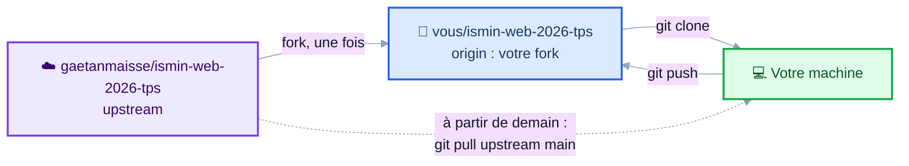
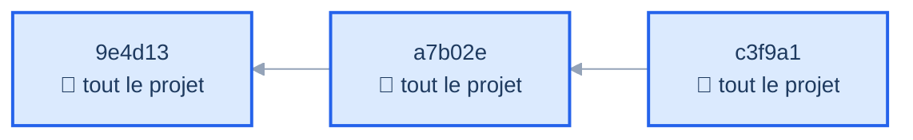
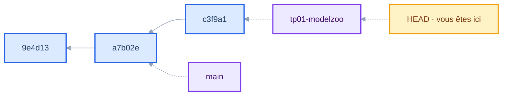
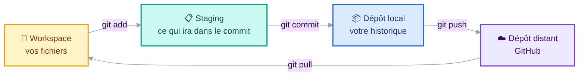
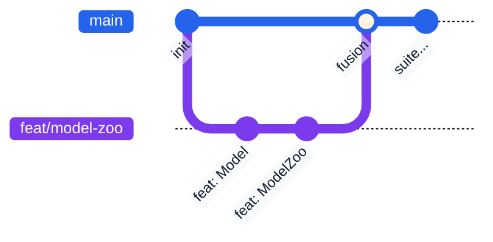

# Développement Web

<div class="op-75">Full-Stack TypeScript, DevOps &amp; AI-Assisted Coding</div>

<div class="pt-1 text-sm op-60">Séance 1 : Git &amp; TypeScript</div>

<div class="pt-10 text-5xl">🤗</div>

<div class="text-2xl font-medium pt-1">huggingface.co</div>

<div class="pt-2 text-sm op-75">
Le catalogue où le monde entier publie ses modèles d'IA.<br/>
Plus de <b>3 millions de modèles</b>, partagés par <b>18 millions de développeurs</b>.
</div>

<v-click>

<div class="pt-5 mx-auto max-w-2xl p-3 rounded bg-amber-500 bg-opacity-10 border-l-4 border-amber-500 text-left text-sm">
📰 <b>3 septembre 2026</b> : Nvidia annonce son rachat pour <b>12,9 milliards de dollars</b>.
<span class="op-75">Clôture attendue en 2027, sous réserve des autorisations réglementaires.</span>
</div>

</v-click>

<v-click>

<div class="pt-5 text-lg">
<b>On va en reconstruire une version. Et dans quatre semaines, la vôtre sera en ligne.</b>
</div>

</v-click>

<div class="pt-8 text-sm op-60">
📱 Les slides sont en ligne, suivez sur votre écran :
<b>gaetanmaisse.github.io/ismin-web-2026-tps</b>
</div>

<!--
🔴 NE PAS RESTER SUR LA SLIDE : ouvrir huggingface.co au vidéoprojecteur.
Montrer la liste, un filtre par tâche, la fiche d'un modèle (Mistral-7B).
« Qui a déjà téléchargé un modèle là-dessus ? »

Cette slide est à l'écran pendant qu'ils s'installent : le titre et l'URL
des slides font leur travail tout seuls. On enchaîne sur l'accroche dès
que la salle est calme.

L'actu tombe à pic : elle a onze jours, ils l'ont vue passer. Deux usages :

1. Ça donne du poids au fil rouge : « le catalogue qu'on va construire
   cet après-midi, Nvidia vient de l'acheter 13 milliards ».

2. Ça amorce la souveraineté sans faire la leçon : le dépôt central des
   modèles ouverts passe sous le contrôle du fabricant de puces qui domine
   le marché. Une question à leur poser, pas une réponse à leur donner,
   et ça éclaire pourquoi ce cours s'outille chez Mistral.

Ne pas s'étendre : 3 minutes pour toute la slide, démo comprise.
⚠️ Dire « annoncé », pas « racheté » : l'opération n'est pas encore conclue.

⏱ MINUTAGE PRÉVU (minutes depuis le début)
  +00  Accroche : Hugging Face en direct
  +03  Qui je suis (1 min), puis sondage « et vous ? » (3 min)
  +07  ▶ Terminal ouvert : on vérifie les machines
  +12  Cadrage : les 4 semaines et la règle d'or
  +25  Git : le modèle (photo, pointeur, 4 espaces), la pratique, la démo
  +43  TP Git (fork, clone, branche, commit, push)
  +68  CM TypeScript
  +88  PAUSE (15 min)
  +103 CM boîte à outils (dont les méthodes de tableau)
  +118 TP ModelZoo (types PUIS classe)
  +152 Commit et push : leur travail est sauvegardé
  +155 Correction : comparer les approches
  +165 Fin

⚠️ SI VOUS ÊTES EN RETARD, coupez dans cet ordre :
  1. « Deux conséquences qui surprennent »
  2. « Le raccourci de constructeur »
  3. « Interfaces : décrire une forme »
Ne coupez JAMAIS le TP ModelZoo.

Les 3 dernières slides sont des ANNEXES : ne pas les présenter,
elles servent de référence aux étudiants pendant le TP.

Relevé automatique : Ctrl+Shift+R pour remettre à zéro MAINTENANT,
Ctrl+Shift+T en fin de séance pour télécharger le CSV.
-->

---
layout: two-cols
layoutClass: gap-12
---

# Gaëtan Maisse

<div class="pt-6">
  
</div>

<div class="pt-6 text-sm op-75">
<b>@gaetanmaisse</b><br/>
GitHub · LinkedIn<br/>
<span class="op-75">Écrivez-moi si vous êtes bloqués, c'est fait pour ça.</span>
</div>

::right::

<div class="pt-16 flex flex-col gap-5">

<div>
<div class="font-bold">🎓 Mines Saint-Étienne, EI11</div>
<div class="op-75 text-sm">J'étais assis où vous êtes</div>
</div>

<div>
<div class="font-bold">👨‍💻 CTO et cofondateur de Yetty</div>
<div class="op-75 text-sm">TypeScript au quotidien, du front au déploiement</div>
</div>

<div>
<div class="font-bold">📚 Ex core team de Storybook</div>
<div class="op-75 text-sm">Open source utilisé par des dizaines de milliers de projets. Avant : Gravitee</div>
</div>

<div>
<div class="font-bold">👨‍🏫 Ce cours depuis dix ans</div>
<div class="op-75 text-sm">Il change tous les ans, comme le métier</div>
</div>

<div>
<div class="font-bold">🍺 🥃 🔨 ⛰️ Le reste du temps</div>
<div class="op-75 text-sm">Bières, rhums, rénovation, montagne</div>
</div>

</div>

<!--
1 minute, pas plus. Trois points qui portent devant eux :

- « j'étais assis où vous êtes » : vous n'êtes pas un prof d'université
- Storybook : de l'open source qu'ils croiseront vraiment, ça donne du
  poids à ce que vous direz sur les conventions de code et les PR
- « le cours change tous les ans » : vous êtes un praticien, pas un
  support figé

La dernière ligne est là pour vous rendre abordable, pas pour meubler.
-->

---
layout: center
---

# 🧑‍🎓 Et vous ?

<div class="pt-4 text-xl">

<v-clicks>

- Qui a déjà écrit du **JavaScript** ?
- Du **HTML / CSS** ?
- Qui a déjà fait tourner un **serveur** ?
- Qui a déjà utilisé **Git** en équipe ?
- Qui code déjà avec une **IA** ? Laquelle ?

</v-clicks>

</div>

<v-click>

<div class="mt-10 p-4 rounded bg-blue-500 bg-opacity-10">
Aucune de ces réponses n'est un prérequis. <b>Le cours part de zéro sur le web.</b>
</div>

</v-click>

<!--
Sondage à main levée, 3 minutes, mais À FAIRE : ça calibre tout le reste
et ça dédramatise pour ceux qui n'ont jamais touché au web.

Poser les questions UNE PAR UNE et compter à voix haute. Le silence
après une question est une information, pas un échec.

⚠️ La dernière question n'est pas décorative : elle DÉCIDE de l'outillage IA
du sprint 2. Si une majorité a déjà Copilot, inutile d'imposer Continue.dev.
Noter les chiffres dans le RETEX, et annoncer à voix haute ce qu'on en fait :
« personne n'a fait de React, on prendra le temps en semaine 2 ».
-->

---
layout: center
---

# Avant tout : ouvrez votre terminal

<div class="pt-6 text-left max-w-md mx-auto">

```sh
node --version
git --version
```

</div>

<div class="pt-8">

✅ `v26.` quelque chose et un numéro pour Git → parfait

🔴 Une erreur, ou pas la 26 ? **Levez la main maintenant.**

</div>

<div class="pt-8 text-sm op-75">
On règle ça pendant que je parle du programme, pas à 15 h quand il faudra coder.
</div>

<!--
⏱ +5. Moment clé : ils ouvrent leur machine dans les 5 premières minutes.
Deux bénéfices : la séance devient physique tout de suite, et vous
identifiez les machines cassées AVANT le TP.

Repérer les mains levées, y aller pendant les slides suivantes.
Compter combien : ça va dans le RETEX.
-->

---

# Comment on va travailler

<div class="grid grid-cols-2 gap-8 pt-4">
<div>

### En séance

- Posez des questions **dès** que ce n'est pas clair
- Il n'y a pas de question bête
- On alterne : un peu de cours, puis on code

</div>
<div>

### Entre les séances

- Rien à rendre, rien à réviser
- Trois séances par semaine, lundi / mardi / mercredi
- Ce qu'on écrit un jour sert le lendemain

</div>
</div>

<div class="mt-8 p-4 bg-blue-500 bg-opacity-10 rounded text-sm">
💡 Ne vous fatiguez pas les yeux sur votre écran quand je présente : les slides sont en ligne, vous les relirez.
</div>

<v-click>

<div class="mt-4 p-4 rounded border-l-4 border-blue-500 bg-blue-500 bg-opacity-5">
<b>À 17 h aujourd'hui</b>, vous aurez un dépôt Git à votre nom avec une branche poussée,
et une classe TypeScript qui fait passer onze tests.
</div>

</v-click>

---
layout: center
---

# Quatre semaines, quatre sprints

<div class="grid grid-cols-4 gap-4 pt-8 text-sm">

<div class="p-4 border border-gray-500 border-opacity-30 rounded">
<div class="text-xs op-60 font-mono">SEMAINE 1</div>
<div class="font-bold pt-1">Fondations & serveur</div>
<div class="pt-2 op-75">TypeScript, NestJS, connexion base de données</div>
</div>

<div class="p-4 border border-gray-500 border-opacity-30 rounded">
<div class="text-xs op-60 font-mono">SEMAINE 2</div>
<div class="font-bold pt-1">Sécurité & interface</div>
<div class="pt-2 op-75">Authentification, React</div>
</div>

<div class="p-4 border border-gray-500 border-opacity-30 rounded">
<div class="text-xs op-60 font-mono">SEMAINE 3</div>
<div class="font-bold pt-1">Fusion & qualité</div>
<div class="pt-2 op-75">Front ↔ back, tests automatisés</div>
</div>

<div class="p-4 border border-gray-500 border-opacity-30 rounded">
<div class="text-xs op-60 font-mono">SEMAINE 4</div>
<div class="font-bold pt-1">DevOps & production</div>
<div class="pt-2 op-75">Docker, CI/CD, déploiement</div>
</div>

</div>

<div class="pt-10 text-center op-75">
Chaque semaine se termine par une <b>revue</b> : on montre ce qui tourne.
</div>

<!--
Insister sur la continuité : ce n'est pas 12 exercices indépendants,
c'est UNE application qu'on fait grandir.
-->

---

# L'IA dans ce cours

Vous avez le droit (et même l'obligation) d'utiliser un assistant.

<v-clicks>

<div class="pt-4">

**Aujourd'hui** : celui que vous voulez, dans le navigateur. Rien à installer.
Vous n'aurez pas tous le même, et c'est tant mieux : on comparera leurs réponses.

**Plus tard** : intégré à l'éditeur, puis un agent en ligne de commande sur les séances DevOps.

</div>

<div class="mt-8 p-5 bg-amber-500 bg-opacity-10 rounded border-l-4 border-amber-500">

### ⚠️ La règle d'or

Pendant les TP, **je passe et je vous demande d'expliquer votre code**.

Si vous ne savez pas expliquer une partie, **je la supprime**.

</div>

</v-clicks>

<v-click>

<div class="pt-6 text-sm op-75">
Ce n'est pas une menace, c'est le métier : en entreprise, c'est vous qui passez en revue le code, qui le corrigez à 3 h du matin, et qui en répondez.
</div>

</v-click>

<!--
Moment important. Le dire calmement mais clairement, et surtout :
LE FAIRE DÈS LE PREMIER TP, sinon la règle ne vaut rien.

Ne citer aucun assistant en particulier ici : le sondage d'ouverture
vous a dit ce qu'ils ont, et l'outillage du sprint 2 en découlera.

L'IA écrit vite du code plausible ET faux : on en verra des exemples
toute la semaine.
-->

---
layout: section
---

# 1. Git

<div class="op-75 pt-2">Le socle du semestre, et un critère de votre note</div>

---

# Le workflow du cours

<div class="pt-2">

Vous ne poussez pas sur mon dépôt : vous travaillez sur **votre copie**.

</div>



<div class="pt-4 text-sm op-75">
<b>Aujourd'hui</b> : forkez, clonez, committez, poussez. Tout se passe chez vous.<br/>
<b>Dès demain</b> : une commande de plus pour récupérer le TP du jour depuis mon dépôt.
</div>

<!--
Ne PAS faire configurer upstream aujourd'hui : ils n'en ont pas besoin
avant demain matin, et la journée est déjà chargée. On l'ajoute en
ouverture de la séance 2, au moment où ça leur sert vraiment.

Le schéma le montre en pointillés pour qu'ils sachent que ça arrive.
-->

---

# Un commit est une photo, pas une différence



<v-clicks>

- Chaque commit enregistre **l'état complet** du projet, pas les lignes modifiées
- Il porte une empreinte (`c3f9a1`) et **pointe vers son parent**. L'historique est une chaîne.
- Git vous *affiche* des différences, mais il ne les *stocke* pas

</v-clicks>

<v-click>

<div class="pt-4 text-sm op-75">
C'est ce qui rend le changement de branche instantané : Git ne rejoue rien, il restaure une photo.
</div>

</v-click>

<!--
LA slide qui fait comprendre Git. 2 minutes.
Insister : photo, pas diff. Tout le reste en découle.
-->

---

# Une branche n'est qu'un pointeur



<v-clicks>

- Une branche, c'est **un nom qui pointe vers un commit**. Rien d'autre, 40 octets sur le disque.
- La créer ne copie aucun fichier : c'est pour ça que c'est instantané
- `HEAD` dit sur quelle branche vous êtes. `git switch` ne fait que le déplacer.

</v-clicks>

<v-click>

<div class="pt-4 p-3 bg-blue-500 bg-opacity-10 rounded text-sm">
Vous venez du C++ : une branche est <b>littéralement un pointeur</b>. Commiter fait avancer le pointeur d'un cran.
</div>

</v-click>

---

# Les quatre espaces de Git



<v-click>

<div class="pt-6">

La différence avec ce que vous connaissez : **commiter n'envoie rien à personne.**
Votre historique est local tant que vous ne poussez pas.

</div>

</v-click>

---

# Les branches



<v-clicks>

- Une **branche** par fonctionnalité : on ne travaille jamais directement sur `main`
- On y travaille tranquillement, puis on la **fusionne** dans `main`
- `main` doit **toujours** rester dans un état qui fonctionne

</v-clicks>

<v-click>

<div class="pt-6 text-sm op-75">
En équipe, cette fusion se demande par une <b>pull request</b>, et c'est là qu'on relit le code d'un collègue. Vous en ferez sur le projet final, en binôme.
</div>

</v-click>

<!--
Cette semaine ils sont seuls sur leur fork : une PR à soi-même serait
du théâtre. On garde le CONCEPT en une phrase, et l'exercice attend
d'avoir un vrai relecteur, sur le projet.

Le réflexe utile en solo, c'est `git diff` avant de commiter.
-->

---

# Écrire un message de commit

<div class="grid grid-cols-2 gap-6 pt-2">
<div>

### ❌ Ce qu'on voit trop

```
update
fix
ça marche
wip
truc
```

</div>
<div>

### ✅ La convention du cours

```
<type>(<portée>): <description>
```

```
feat(zoo): add getModelsByTask
fix(zoo): handle duplicate ids
docs: update README
test(zoo): cover empty catalog
```

</div>
</div>

<v-click>

<div class="pt-8 text-sm">

Types courants : `feat` (fonctionnalité), `fix` (correction), `docs`, `test`, `refactor`, `chore`.

**Pourquoi c'est noté** : dans six mois, votre historique est la seule documentation qui reste vraie.

</div>

</v-click>

---

# Savoir où on en est

<div class="grid grid-cols-2 gap-6 pt-2">
<div>

### `git status`

```sh
$ git status
On branch tp01-modelzoo
Changes not staged for commit:
  modified:   src/model-zoo.ts

Untracked files:
  src/scratch.ts
```

<div class="text-sm op-75 pt-2">
La commande à taper <b>entre chaque autre commande</b>. Elle vous dit toujours quoi faire ensuite.
</div>

</div>
<div>

### `git log`

```sh
$ git log --oneline --graph --all
* c3f9a1 (HEAD -> tp01-modelzoo)
|         feat(tp01): add ModelZoo
* a7b02e (main) chore: setup
* 9e4d13 init
```

<div class="text-sm op-75 pt-2">
<code>--graph --all</code> dessine la forme réelle de l'historique : le schéma des pointeurs, en vrai.
</div>

</div>
</div>

<v-click>

<div class="pt-6 text-sm op-75">
Ces deux commandes ne modifient <b>jamais</b> rien. Tapez-les sans crainte, aussi souvent que vous voulez.
</div>

</v-click>

---

# Au secours, j'ai fait une bêtise

| La situation | La commande |
|---|---|
| J'ai modifié un fichier et je veux revenir en arrière | `git restore <fichier>` |
| J'ai fait `git add` par erreur | `git restore --staged <fichier>` |
| Mon message de commit est raté | `git commit --amend` |
| J'ai commité trop tôt, je veux garder mes modifications | `git reset --soft HEAD~1` |
| Je veux voir ce que j'ai modifié | `git diff` |
| Je ne sais plus où j'en suis | `git status`, puis `git log --oneline` |

<v-click>

<div class="pt-4 p-3 bg-amber-500 bg-opacity-10 rounded text-sm">
⚠️ <code>git reset --hard</code> existe et <b>détruit vos modifications sans filet</b>. Ne le tapez pas « pour voir ».
</div>

</v-click>

<v-click>

<div class="pt-3 text-sm op-75">
Bonne nouvelle : tant que vous avez <b>commité</b>, presque rien n'est irrécupérable. C'est la meilleure raison de commiter souvent.
</div>

</v-click>

<!--
Slide de survie. La plus utile du bloc en pratique : c'est ce qui
transforme un blocage de 10 minutes en 10 secondes.

Leur dire de la garder ouverte pendant le TP.
-->

---
layout: center
---

# Je le fais, vous regardez, puis vous le refaites

<div class="pt-4 text-left max-w-3xl mx-auto">

```sh
# 1. Forker le dépôt du cours (sur GitHub, un bouton)
# 2. Récupérer ma copie
git clone git@github.com:MOI/ismin-web-2026-tps.git
cd ismin-web-2026-tps

# 3. Travailler sur une branche
git switch -c tp01-modelzoo

# 4. Relire ce qu'on s'apprête à enregistrer, PUIS enregistrer
git diff
git add . && git commit -m "feat(tp01): implement ModelZoo"
git push -u origin tp01-modelzoo
```

</div>

<!--
🔴 DÉMONSTRATION EN DIRECT, pas une slide qu'on lit.

Faire les 5 étapes au vidéoprojecteur, en commentant. Ils regardent,
ils ne tapent pas encore : ils referont tout seuls juste après.

Git se REGARDE, il ne se lit pas. 6 minutes suffisent.
Taper `git status` entre CHAQUE étape, sans commenter : c'est le
réflexe qu'on installe par répétition, pas par explication.

Le modèle mental est posé, cette démo le met en mouvement. Enchaîner
directement sur le TP : ils refont exactement ça, seuls.
-->

---
layout: section
---

# TP · Git

<div class="op-75 pt-2">35 minutes · <code>tp01/README.md</code>, étape 1</div>

<div class="pt-8 text-sm">

1. **Forkez** le dépôt du cours sur GitHub
2. **Clonez** votre fork
3. Créez la branche `tp01-modelzoo`
4. Vérifiez votre environnement : `node --version` → doit afficher `v26.x`

</div>

<div class="pt-8 text-sm op-75">
🖐 Bloqué ? Levez la main.
</div>

<!--
⏱ On doit être à +43. Si on déborde ici, c'est le CM types utiles
(après la pause) qu'on raccourcit, pas le TP ModelZoo.

Circuler. Les blocages classiques : Git non configuré (user.name/user.email),
authentification GitHub (token vs mot de passe), et ceux qui clonent
MON dépôt au lieu de leur fork.
-->

---
layout: section
---

# 2. TypeScript

<div class="op-75 pt-2">Le langage du semestre</div>

---

# Le paysage

<div class="grid grid-cols-3 gap-4 pt-6">

<div class="p-4 border border-gray-500 border-opacity-30 rounded">
<div class="text-3xl">🟨</div>
<div class="font-bold pt-2">JavaScript</div>
<div class="pt-2 text-sm op-75">Le langage. Créé en 1995 pour animer des pages web.</div>
</div>

<div class="p-4 border border-gray-500 border-opacity-30 rounded">
<div class="text-3xl">🟩</div>
<div class="font-bold pt-2">Node.js</div>
<div class="pt-2 text-sm op-75">Le moteur JavaScript de Chrome, sorti du navigateur. Permet d'écrire des serveurs.</div>
</div>

<div class="p-4 border border-gray-500 border-opacity-30 rounded">
<div class="text-3xl">🟦</div>
<div class="font-bold pt-2">TypeScript</div>
<div class="pt-2 text-sm op-75">JavaScript + un système de types. Créé par Microsoft en 2012.</div>
</div>

</div>

<v-click>

<div class="pt-10 text-center">

**Le même langage sur le serveur et dans le navigateur.**
C'est ce qui rend possible un cours full-stack en quatre semaines.

</div>

</v-click>

---

# À vous : ouvrez la console de votre navigateur

<div class="text-sm op-75 mb-3">
Clic droit → « Inspecter » → onglet <b>Console</b>. Tapez ces lignes, une par une.
</div>

```js
""  == 0

"0" == 0

""  == "0"

1 < 3 < 2

const model = { name: "Mistral-7B", parameters: 7.2 };
model.paramaters * 2
```

<v-click>

<div class="pt-4 p-4 bg-amber-500 bg-opacity-10 rounded text-sm">

`true`, `true`, **`false`** : l'égalité n'est même pas transitive.
`1 < 3 < 2` est `true`… et le reste pour n'importe quelles valeurs.
Et la faute de frappe sur `paramaters` donne `NaN`, **sans la moindre erreur**.

</div>

</v-click>

<!--
🔴 NE PAS COMMENTER LA SLIDE : les faire taper. 3 minutes.
Ils le voient sur LEUR écran, et ils repartent en sachant que
cette console existe : ça leur servira tout le semestre.

Demander à voix haute ce qu'ils obtiennent AVANT de cliquer.
-->

---

# Ce qu'on vient de voir

```js
""  == 0            // true  😬
"0" == 0            // true
""  == "0"          // false  → l'égalité n'est même pas transitive

1 < 3 < 2           // true  … et vrai pour n'importe quelles valeurs

const model = { name: "Mistral-7B", parameters: 7.2 };
model.paramaters * 2;   // NaN : aucune erreur, aucun avertissement
```

<v-clicks>

- Rien de tout cela ne plante : le programme continue, avec des valeurs fausses
- Sur trente lignes c'est agaçant. Sur cent mille, c'est une soirée perdue à chercher d'où vient un `NaN`

<div class="p-3 bg-blue-500 bg-opacity-10 rounded">

**Première règle de survie : toujours `===`, jamais `==`.**
Le triple égal compare sans convertir. `"" === 0` vaut `false`, comme il se doit.

</div>

</v-clicks>

<!-- 🖼 Emplacement meme « this is weird » :  -->

<!--
Le 1 < 3 < 2 leur parle : le même piège existe en C++ (bool comparé à int).
Le `paramaters` mal orthographié est LE bug que tout le monde a écrit.
Historiquement : JS a été conçu en 10 jours en 1995 pour animer des pages,
puis on lui a demandé de porter des applications de millions de lignes.
-->

---

# TypeScript attrape les trois

```ts twoslash
// @errors: 2367 2365 2551
"" == 0;

const x = 5;
1 < x < 3;

const model = { name: "Mistral-7B", parameters: 7.2 };
model.paramaters;
```

<div class="pt-4 text-sm op-75">
Signalé <b>dans l'éditeur</b>, avant même d'enregistrer le fichier, et bien avant l'utilisateur.
</div>

---

# Un sur-ensemble typé de JavaScript

<div class="grid grid-cols-3 gap-4 pt-6">

<div class="p-4 border border-gray-500 border-opacity-30 rounded">
<div class="font-bold">Syntaxe</div>
<div class="pt-2 text-sm op-75">Tout JavaScript valide est du TypeScript valide. Renommer un <code>.js</code> en <code>.ts</code> suffit à démarrer.</div>
</div>

<div class="p-4 border border-gray-500 border-opacity-30 rounded">
<div class="font-bold">Types</div>
<div class="pt-2 text-sm op-75">Une couche de règles sur ce qu'on a le droit de faire de chaque valeur. C'est le seul ajout.</div>
</div>

<div class="p-4 border border-gray-500 border-opacity-30 rounded">
<div class="font-bold">Exécution</div>
<div class="pt-2 text-sm op-75"><b>Inchangée.</b> TypeScript ne modifie jamais le comportement de votre programme.</div>
</div>

</div>

<v-click>

<div class="mt-8 p-4 bg-blue-500 bg-opacity-10 rounded">

Autrement dit : **TypeScript, c'est le moteur d'exécution de JavaScript, plus un vérificateur à la compilation.**
Rien de plus. Aucune bibliothèque supplémentaire, aucun surcoût à l'exécution.

</div>

</v-click>

---
layout: two-cols
layoutClass: gap-4
---

# Typage nominal vs structurel

**C++ : nominal**

```cpp
struct Model {
  std::string name;
};

struct Dataset {   // mêmes champs…
  std::string name;
};

void show(Model m);

Dataset d;
show(d);  // ❌ refusé
```

Un objet **est** d'un type parce qu'il le **déclare**.

::right::

<div class="pt-13">

**TypeScript : structurel**

```ts
interface Model {
  name: string;
}

const anything = {
  name: "Mistral-7B",
  parameters: 7.2,
};

const m: Model = anything; // ✅ accepté
```

Un objet **est** d'un type parce qu'il en a la **forme**.

<div class="pt-4 text-sm op-75">
🦆 <b>Duck typing</b> : « if it looks like a duck and quacks like a duck, it's a duck »
</div>

<!-- 🖼 Emplacement du canard 2025 :  -->

</div>

<!--
LE changement de modèle mental pour un public C++.
Le compilateur ne demande pas « de quel type te déclares-tu ? »
mais « as-tu ce qu'il faut ? ».

Corollaire utile : pas besoin de déclarer qu'on implémente une interface.
-->

---

# Ce qui va vous surprendre : les types disparaissent

<div class="grid grid-cols-2 gap-6 pt-2">
<div>

**Ce que vous écrivez** : `model.ts`

```ts
interface Model {
  name: string;
  parameters: number;
}

const m: Model = load();
```

</div>
<div>

**Ce qui s'exécute** : `model.js`

```js
const m = load();
```

</div>
</div>

<v-click>

<div class="mt-6 p-4 bg-amber-500 bg-opacity-10 rounded border-l-4 border-amber-500">

`tsc` ne compile pas vers du binaire : il **transpile** vers du JavaScript et **efface les types**.
Ils n'existent qu'au moment de la compilation. À l'exécution, il n'en reste rien.

</div>

</v-click>

<v-click>

<div class="mt-4 text-sm op-75">
👉 Conséquence : quand une donnée vient de <b>l'extérieur</b> (un fichier, le réseau, un formulaire) le type ne garantit <b>rien</b>.<br/>
Il faudra la valider à l'exécution. On verra comment dès demain.
</div>

</v-click>

<!--
Slide clé. Un dev C++ s'attend à ce que les types soient « réels ».
Ça évite le contresens classique et ça amorce class-validator en séance 2.
-->

---

# Deux conséquences qui surprennent

<v-clicks>

<div>

### 1. `tsc` produit du JavaScript **même en cas d'erreur de type**

```sh
$ npx tsc
model.ts:7:1 - error TS2551: Property 'paramaters' does not exist…

$ ls
model.ts   model.js     # ← le fichier est bien là
```

Contrairement à un compilateur C++, une erreur de type n'empêche pas la production du résultat.
C'est un **avertissement**, pas un veto. (On peut l'interdire avec `noEmitOnError`.)

</div>

<div>

### 2. Le programme s'exécute **exactement** de la même façon

TypeScript ne change jamais le comportement à l'exécution en fonction des types qu'il a déduits.
`4 / []` vaut `Infinity` en JavaScript ; TypeScript refuse de le compiler, mais si vous forcez, ça vaut toujours `Infinity`.

</div>

</v-clicks>

<v-click>

<div class="pt-4 text-sm op-75">
Ces deux points font de TypeScript un outil qu'on peut adopter progressivement sur du code existant, sans rien casser.
</div>

</v-click>

<!--
Point pratique : ils vont voir des erreurs rouges dans le terminal ET un
fichier .js généré. Sans cette slide, ils croient que rien n'a été produit.
-->

---

# Le compilateur et sa configuration

<div class="grid grid-cols-2 gap-6">
<div>

`tsconfig.json`

```json
{
  "compilerOptions": {
    "target": "ES2022",
    "strict": true,
    "noUncheckedIndexedAccess": true
  }
}
```

</div>
<div>

```sh
# Vérifier les types sans rien produire
npx tsc --noEmit

# Transpiler vers du JS
npx tsc
```

</div>
</div>

<v-click>

<div class="pt-6">

### `strict: true`, non négociable

Sans ce réglage, TypeScript accepte `null` partout et laisse passer des `any` implicites : autant écrire du JavaScript. **Tous les projets du cours l'activent.**

</div>

</v-click>

---
layout: section
---

# 3. La boîte à outils

<div class="op-75 pt-2">Ce dont vous aurez besoin dans 10 minutes</div>

<!--
⏱ On reprend ici après la pause. On doit être à +103.
Noter l'écart réel dans le RETEX.
-->

---

# Le piège de `var`

```js
function varTest() {
  var x = "Hello";
  if (true) {
    var x = 71;
    console.log(x);
  }
  console.log(x);
}
```

<v-click>

<div class="pt-4 p-4 bg-amber-500 bg-opacity-10 rounded">

`71` … puis **`71`** à nouveau.

La portée de `var` est la **fonction**, pas le bloc. Le second `x` n'est pas une nouvelle variable : c'est la même, écrasée.

</div>

</v-click>

<v-click>

<div class="pt-4 text-center text-lg">

👉 **N'utilisez jamais `var`. Utilisez `let` et `const`.**

</div>

</v-click>

<!--
Faire voter la salle AVANT de cliquer. Ça réveille, et le C++ leur fait
attendre une portée de bloc : la surprise est garantie.
-->

---

# `let`, `const`, et l'inférence

```ts {1-6|8-13|15-17|all}
// let : portée de bloc, comme en C++
let total = 0;
if (true) {
  let total = 71;      // une nouvelle variable, vraiment
}
// total vaut toujours 0

// const : interdit la réaffectation…
const name = "Mistral-7B";
name = "autre";        // ❌ erreur
// … mais PAS la mutation
const models = [];
models.push(model);    // ✅ parfaitement légal

// Les types sont le plus souvent inférés
const org = "mistralai";     // string, inutile de l'écrire
const sizes = [7, 24];       // number[]
```

<div class="pt-2 text-sm op-75">
Par défaut : <code>const</code>. On passe à <code>let</code> seulement quand on a besoin de réaffecter.
</div>

---

# Les types de base

<div class="grid grid-cols-2 gap-8 pt-4">
<div>

### Primitifs

```ts
string
number      // pas de int/float
boolean
bigint
null
undefined
symbol
```

**Un seul type numérique**, pas de `int` ni de `float`.
`bigint` et `symbol` existent, vous ne les croiserez pas cette semaine.

</div>
<div>

### Fournis par TypeScript

```ts
any         // à proscrire
unknown     // le any prudent
void        // ne renvoie rien
never       // ne revient jamais

Readonly<T> // T, en lecture seule
Partial<T>  // T, tout optionnel
```

<div class="text-sm op-75 pt-2">
<code>Readonly</code> et <code>Partial</code> transforment un type existant. On en reparlera.
</div>

</div>
</div>

---

# Deux syntaxes dont vous aurez besoin tout de suite

<div class="grid grid-cols-2 gap-6 pt-2">
<div>

### Template strings

```ts
const org = "mistralai";

`Modèle de ${org}`
// "Modèle de mistralai"

`1 + 1 = ${1 + 1}`
// "1 + 1 = 2"

`Les retours à la ligne
 fonctionnent aussi`
```

Avec des **backticks**, pas des guillemets.

</div>
<div>

### Modules

```ts
// model.ts
export interface Model { … }
export type Task = …

// model-zoo.ts
import type { Model, Task }
  from "./model.js";

export class ModelZoo { … }
```

Un fichier = un module. On importe ce dont on a besoin.

</div>
</div>

<v-click>

<div class="pt-6 text-sm op-75">
⚠️ Deux surprises dans les imports du TP : <code>import <b>type</b></code> précise qu'on n'importe qu'un type (il sera effacé à la compilation) et l'extension s'écrit <code>.js</code> même si le fichier est un <code>.ts</code>, parce qu'on désigne le fichier <i>produit</i>.
</div>

</v-click>

<!--
Les modules sont indispensables : le TP les utilise dès la première ligne.
L'extension .js dans un import TS est LA question qui revient toujours.
-->

---

# Interfaces : décrire une forme

```ts
interface Model {
  id: string;
  name: string;
  parameters: number;
  license?: string;      // le ? rend la propriété optionnelle
}

function describe(model: Model): string {
  return `${model.name} : ${model.parameters} milliards de paramètres`;
}

// Duck typing : aucune déclaration d'implémentation nécessaire
describe({ id: "…", name: "Mistral-7B", parameters: 7.2 });   // ✅
```

<div class="pt-4 text-sm op-75">
<code>interface</code> décrit la <b>forme</b> d'un objet. Le mot-clé <code>type</code> fait à peu près la même chose, avec en plus les unions : c'est la slide suivante.
</div>

---

# Unions : exactement ces valeurs-là

```ts
type Licence =
  | "apache-2.0"
  | "mit"
  | "llama-3"
  | "propriétaire";

const l1: Licence = "mit";           // ✅
const l2: Licence = "MIT";           // ❌ erreur à la compilation
const l3: Licence = "gpl-3.0";       // ❌ erreur à la compilation
```

<v-click>

<div class="pt-6">

Ni une énumération, ni une chaîne libre : **la liste exacte des valeurs autorisées**.
L'éditeur vous les propose en autocomplétion, et le compilateur refuse tout le reste.

**Au TP** : le champ `task` de vos modèles demande exactement ce type de déclaration.

</div>

</v-click>

---

# `unknown` plutôt que `any`

```ts
// any : « fais-moi confiance » : le compilateur se tait, les bugs passent
let data: any = JSON.parse(raw);
data.whatever.deeply.nested;   // compile. Explose à l'exécution.

// unknown : « je ne sais pas encore » : il faut vérifier avant d'utiliser
let data: unknown = JSON.parse(raw);
data.name;                      // ❌ refusé, et c'est heureux
```

<v-click>

<div class="pt-6 p-4 bg-blue-500 bg-opacity-10 rounded">

Chaque `any` que vous écrivez est un morceau de code où vous renoncez au bénéfice de TypeScript.
Dans ce cours, considérez-le comme interdit.

</div>

</v-click>

---

# Les classes, version TypeScript

<div class="grid grid-cols-2 gap-4 pt-2">
<div>

**C++**

```cpp
class ModelZoo {
 private:
  std::map<std::string, Model> models;

 public:
  void addModel(Model m);
  int getTotal() const;
};
```

Déclaration et implémentation séparées.

</div>
<div>

**TypeScript**

```ts
class ModelZoo {
  private readonly models = new Map<string, Model>();

  addModel(model: Model): void {
    this.models.set(model.id, model);
  }

  getTotal(): number {
    return this.models.size;
  }
}
```

Un seul fichier, `this` explicite.

</div>
</div>

<v-click>

<div class="pt-4 text-sm op-75">
Pas de fichier d'en-tête, pas de destructeur, pas de gestion mémoire. <code>private</code> et <code>readonly</code> sont vérifiés à la compilation… et effacés à l'exécution.
</div>

</v-click>

---

# Le raccourci de constructeur

<div class="grid grid-cols-2 gap-4 pt-2">
<div>

**Ce que vous écririez naturellement**

```ts
class Model {
  id: string;
  name: string;

  constructor(id: string, name: string) {
    this.id = id;
    this.name = name;
  }
}
```

</div>
<div>

**Le raccourci TypeScript**

```ts
class Model {
  constructor(
    public readonly id: string,
    public readonly name: string,
  ) {}
}
```

Strictement équivalent.

</div>
</div>

<v-click>

<div class="pt-8">

Un modificateur (`public`, `private`, `readonly`) devant un paramètre de constructeur **déclare et initialise** l'attribut d'un coup.

Vous le retrouverez partout dès demain : c'est ainsi que NestJS reçoit ses dépendances.

</div>

</v-click>

<!--
Sucre syntaxique spécifique à TypeScript (ça n'existe pas en JS).
Ils vont le voir dans TOUS les services NestJS en séance 2, autant
qu'ils le reconnaissent.
-->

---

# Génériques : vos templates

<div class="grid grid-cols-2 gap-6 pt-2">
<div>

**C++**

```cpp
std::vector<Model> models;
std::map<std::string, Model> zoo;
```

</div>
<div>

**TypeScript**

```ts
const models: Array<Model> = [];
const zoo: Map<string, Model> = new Map();
```

</div>
</div>

<v-click>

<div class="pt-8">

Même idée, même syntaxe. `Array<Model>` s'écrit aussi `Model[]`, c'est identique.

</div>

</v-click>

<v-click>

<div class="pt-6">

### `Map`, dont vous aurez besoin

```ts
const zoo = new Map<string, Model>();
zoo.set(model.id, model);     // ajouter ou remplacer
zoo.get("mistralai/…");       // Model | undefined
zoo.size;                     // nombre d'entrées
[...zoo.values()];            // toutes les valeurs, dans un tableau
```

</div>

</v-click>

---

# Les méthodes de tableau

<div class="pt-4">

En JavaScript, on ne parcourt pas un tableau avec une boucle `for` : **on enchaîne des méthodes**.

</div>

<div class="pt-6 text-center text-2xl font-mono op-75">
.some() &nbsp; .every() &nbsp; .filter() &nbsp; .map() &nbsp; .join() &nbsp; .reduce()
</div>

<div class="pt-8 text-sm op-75">
Chacune prend une <b>fonction</b> en paramètre et l'applique à chaque élément. Aucune ne modifie le tableau d'origine : elles en <b>renvoient un nouveau</b>.
</div>

<!--
🔴 Section essentielle pour un public C/C++ : leur réflexe sera la boucle for.
Ils ont besoin de filter dans 10 minutes pour getModelsOf et getModelsByTask.

Rythme rapide : une slide par méthode, 30 à 45 secondes chacune.
La slide « les enchaîner » est celle qui compte le plus.
-->

---

# Le jeu de données

```ts
type Task = "text-generation" | "translation" | "speech-to-text";

interface Model {
  name: string;
  org: string;
  task: Task;
  downloads: number;
}

const models: Model[] = [
  { name: "Mistral-7B",       org: "mistralai", task: "text-generation", downloads: 1_420_000 },
  { name: "whisper-large-v3", org: "openai",    task: "speech-to-text",  downloads: 4_100_000 },
  { name: "opus-mt-en-fr",    org: "Helsinki",  task: "translation",     downloads: 1_250_000 },
  { name: "Devstral-Small",   org: "mistralai", task: "text-generation", downloads:   310_000 },
];
```

<div class="pt-3 text-sm op-75">
On garde ce tableau pour les six slides qui suivent.
</div>

---

# `.some()` et `.every()` : répondre par oui ou non

<div class="pt-2 text-sm op-75">Les deux renvoient un <b>booléen</b>, jamais un tableau.</div>

```ts
// .some() : vrai si AU MOINS UN élément satisfait la condition
models.some((m) => m.org === "openai")          // true
models.some((m) => m.downloads > 9_000_000)     // false

// .every() : vrai si TOUS les éléments la satisfont
models.every((m) => m.downloads > 0)            // true
models.every((m) => m.org === "mistralai")      // false
```

<v-click>

<div class="pt-6 text-sm op-75">
Utiles pour valider : « est-ce que tous les modèles ont un nom ? », « y a-t-il au moins un modèle de traduction ? »
</div>

</v-click>

---

# `.filter()` : garder certains éléments

<div class="pt-2 text-sm op-75">Renvoie un <b>nouveau tableau</b> avec les éléments pour lesquels la fonction renvoie <code>true</code>.</div>

```ts
models.filter((m) => m.org === "mistralai")
// [ { name: "Mistral-7B",     org: "mistralai", … },
//   { name: "Devstral-Small", org: "mistralai", … } ]

models.filter((m) => m.downloads > 2_000_000)
// [ { name: "whisper-large-v3", org: "openai", … } ]

models.filter((m) => m.task === "image-classification")
// []   ← aucun résultat, mais bien un tableau
```

<v-click>

<div class="pt-4 p-3 bg-blue-500 bg-opacity-10 rounded text-sm">
C'est exactement ce dont vous aurez besoin dans dix minutes pour <code>getModelsOf</code> et <code>getModelsByTask</code>.
</div>

</v-click>

---

# `.map()` : transformer chaque élément

<div class="pt-2 text-sm op-75">Renvoie un nouveau tableau de <b>même longueur</b>, où chaque élément a été transformé.</div>

```ts
models.map((m) => m.name)
// [ "Mistral-7B", "whisper-large-v3", "opus-mt-en-fr", "Devstral-Small" ]

models.map((m) => m.downloads / 1_000_000)
// [ 1.42, 4.1, 1.25, 0.31 ]

models.map((m) => ({ nom: m.name, éditeur: m.org }))
// [ { nom: "Mistral-7B", éditeur: "mistralai" }, … ]
```

<v-click>

<div class="pt-4 text-sm op-75">
⚠️ <code>filter</code> garde ou jette, <code>map</code> transforme. <code>map</code> ne réduit <b>jamais</b> le nombre d'éléments.
</div>

</v-click>

---

# Les enchaîner

<div class="pt-2 text-sm op-75">Chaque méthode renvoie un tableau, donc on peut appeler la suivante dessus.</div>

```ts {1-2|4-6|8-11|all}
models.filter((m) => m.org === "mistralai")
// [ { name: "Mistral-7B", … }, { name: "Devstral-Small", … } ]

models.filter((m) => m.org === "mistralai")
     .map((m) => m.name)
// [ "Mistral-7B", "Devstral-Small" ]

models.filter((m) => m.org === "mistralai")
     .map((m) => m.name)
     .join(", ")
// "Mistral-7B, Devstral-Small"       ← .join() produit une chaîne
```

<v-click>

<div class="pt-4">

Ça se lit comme une phrase : **garde ceux de mistralai, prends leur nom, colle-les avec des virgules.**
La même chose en boucle `for` prendrait dix lignes et une variable temporaire.

</div>

</v-click>

<!--
🔴 LA slide de la section. Dérouler le surlignage étape par étape,
en lisant à voix haute la phrase à chaque fois.

C'est là que le style fonctionnel prend son sens pour eux.
-->

---

# `.reduce()` : tout replier en une seule valeur

<div class="pt-2 text-sm op-75">La plus puissante, et la seule qui ne renvoie pas forcément un tableau.</div>

```ts {1-5|7-13|all}
// Un accumulateur, une valeur de départ, et on replie
models.reduce((total, m) => total + m.downloads, 0)
//             ↑ accumulé  ↑ élément courant     ↑ départ
// 7_080_000

// Le résultat peut être un objet : ici, un total par organisation
models.reduce((parOrg, m) => ({
  ...parOrg,
  [m.org]: (parOrg[m.org] ?? 0) + m.downloads,
}), {} as Record<string, number>)
// { mistralai: 1_730_000, openai: 4_100_000, Helsinki: 1_250_000 }
```

<v-click>

<div class="pt-4 text-sm op-75">
Si <code>reduce</code> vous paraît obscur au début, c'est normal. Commencez par la version « somme », le reste viendra.
</div>

</v-click>

---

# Et `forEach` ?

<div class="grid grid-cols-2 gap-6 pt-4">
<div>

### Il existe…

```ts
models.forEach((m) => {
  console.log(m.name);
});
```

Il applique la fonction à chaque élément et **ne renvoie rien**.

</div>
<div>

### …mais il ne sert qu'aux effets de bord

```ts
// ❌ ne marche pas : forEach ne renvoie rien
const noms = models.forEach((m) => m.name);
// noms === undefined

// ✅
const noms = models.map((m) => m.name);
```

</div>
</div>

<v-click>

<div class="pt-6 p-3 bg-amber-500 bg-opacity-10 rounded">
La règle : si vous <b>voulez un résultat</b>, utilisez <code>map</code>, <code>filter</code> ou <code>reduce</code>. <code>forEach</code> ne sert qu'à afficher ou à déclencher quelque chose.
</div>

</v-click>

---

# À vous

<div class="text-sm op-75 mb-2">Le code est exécutable ici : modifiez-le et relancez.</div>

```ts {monaco-run}
const models = [
  { name: "Mistral-7B", org: "mistralai", downloads: 1420000 },
  { name: "whisper-large-v3", org: "openai", downloads: 4100000 },
  { name: "Devstral-Small", org: "mistralai", downloads: 310000 },
];

console.log(models.filter((m) => m.org === "mistralai").map((m) => m.name));
console.log(models.reduce((total, m) => total + m.downloads, 0));
console.log(models.find((m) => m.downloads > 4000000)?.name);
```

<div class="pt-2 text-sm op-75">
<code>.find()</code> est le cousin de <code>.filter()</code> : il renvoie <b>le premier</b> élément trouvé, ou <code>undefined</code>.
</div>

<!--
2 minutes. Leur faire proposer une transformation à voix haute et la
taper en direct. Le « ?. » après find mérite une phrase : find peut
ne rien trouver.
-->

---

# Lire un test : parce que c'est votre énoncé

```ts
describe("ModelZoo", () => {           // un groupe de tests
  let zoo: ModelZoo;

  beforeEach(() => {                   // exécuté avant CHAQUE test
    zoo = new ModelZoo();
  });

  it("ajoute un modèle au catalogue", () => {    // un test = un comportement
    zoo.addModel(mistral);

    expect(zoo.getTotalNumberOfModels()).toBe(1);
    //     ↑ ce qu'on obtient        ↑ ce qu'on attend
  });
});
```

<v-click>

<div class="pt-4">

Les assertions les plus fréquentes : `toBe` (égalité stricte), `toEqual` (égalité en profondeur, pour les objets et tableaux), `toHaveLength`, `toBeUndefined`.

**Le nom du test dit ce qui est attendu.** Lisez-les avant de coder : ils sont la spécification.

</div>

</v-click>

<!--
Slide indispensable : on leur donne 11 tests comme énoncé, encore
faut-il qu'ils sachent les lire. On approfondira en séance 9.
-->

---
layout: section
---

# TP · ModelZoo

<div class="op-75 pt-2">34 minutes · <code>tp01/README.md</code>, étapes 2 à 4</div>

---

# On vous donne les tests. C'est tout.

<div class="text-sm pt-2">

`src/` contient **un seul fichier** : `model-zoo.test.ts`. Il importe deux fichiers qui n'existent pas.

</div>

```
error TS2307: Cannot find module './model.js'
error TS2307: Cannot find module './model-zoo.js'
```

<div class="grid grid-cols-2 gap-6 pt-8 text-sm">
<div class="p-4 border border-gray-500 border-opacity-30 rounded">

**① `src/model.ts`**

Les types du domaine.

</div>
<div class="p-4 border border-gray-500 border-opacity-30 rounded">

**② `src/model-zoo.ts`**

La classe `ModelZoo`.

</div>
</div>

<div class="pt-8">

Tout ce qu'il vous faut est **dans les tests**. Lisez-les en entier avant d'écrire une ligne.

</div>

<!--
⏱ On doit être à +118.

Rien n'est fourni à part les tests : c'est volontaire, et c'est l'exercice.
Lire une spec et en déduire les types, c'est exactement le travail de la
séance 2 avec les tests e2e.

NE PAS écrire Model ni Task au tableau. Les laisser chercher : c'est là
que la séance se joue. Le README rappelle les 4 valeurs de Task (les tests
n'en utilisent que 3) et le contrat des 6 méthodes, pour ceux qui calent.

Circuler beaucoup pendant les 10 premières minutes. Le blocage typique :
ils écrivent `task: string` au lieu d'une union. Ne pas corriger tout de
suite, demander « et si j'écris "text-gen" ? ».

Le test « remplace un modèle déjà présent » départage tableau et Map.
Ne pas donner la réponse non plus.
-->

---

# L'exercice IA du jour

<div class="pt-4">

Quand le compilateur vous renvoie une erreur que vous ne comprenez pas :

</div>

<div class="grid grid-cols-3 gap-4 pt-6 text-sm">

<div class="p-4 border border-gray-500 border-opacity-30 rounded">
<div class="font-mono text-xs op-60">1</div>
<div class="font-bold pt-1">Demandez</div>
<div class="pt-2 op-75">Collez l'erreur dans Le Chat, demandez une explication.</div>
</div>

<div class="p-4 border border-gray-500 border-opacity-30 rounded">
<div class="font-mono text-xs op-60">2</div>
<div class="font-bold pt-1">Vérifiez</div>
<div class="pt-2 op-75">Cherchez la même notion dans la doc officielle TypeScript.</div>
</div>

<div class="p-4 border border-gray-500 border-opacity-30 rounded">
<div class="font-mono text-xs op-60">3</div>
<div class="font-bold pt-1">Comparez</div>
<div class="pt-2 op-75">L'explication tenait-elle ? Sur quoi a-t-elle dérapé ?</div>
</div>

</div>

<div class="pt-8 text-center op-75">
Vous n'avez pas tous le même assistant ? <b>Tant mieux.</b> Posez-lui la même question qu'à votre voisin et comparez.<br/>
On en reparle en fin de séance : <b>qui a pris son IA en flagrant délit d'erreur ?</b>
</div>

<!--
C'est le premier pas de la progression : cette semaine on fait EXPLIQUER,
on ne fait pas GÉNÉRER. Ramasser les cas intéressants pour le RETEX.
-->

---

# Si vous terminez en avance

<div class="text-sm op-75 mb-3">Aucune n'a de solution évidente. Écrivez le test avant l'implémentation.</div>

<v-clicks>

<div class="text-sm">

**1. L'URL typée.** Écrivez `huggingFaceUrl(model)`, qui renvoie l'adresse de la fiche du modèle.
Contrainte : son **type de retour** doit rendre impossible de renvoyer `"https://example.com"`. Le compilateur doit refuser, pas un test.

</div>

<div class="text-sm">

**2. Le catalogue inviolable.** Un appelant peut-il corrompre votre catalogue **depuis l'extérieur**, sans passer par `addModel` ?
Trouvez comment, écrivez le test qui le démontre, puis rendez-le impossible.

</div>

<div class="text-sm">

**3. Regrouper.** Ajoutez `groupByTask()` qui renvoie les modèles rangés par tâche.
Contraintes : **un seul parcours** du tableau, et **aucun `any`** dans la signature.

</div>

<div class="text-sm">

**4. ⭐ Le catalogue générique.** Transformez `ModelZoo` en un `Catalogue<T>` réutilisable pour n'importe quelle entité, pas seulement des modèles.
Que devez-vous **exiger** de `T` pour que `getById` fonctionne encore ?

</div>

</v-clicks>

<!--
Ces extras servent à occuper ceux qui ont fini, pas à être bouclés.
Aucune ne donne sa réponse : elles posent un objectif et une contrainte
vérifiable.

Repères si quelqu'un cale :
  1. les template literal types savent décrire une forme de chaîne
  2. deux failles possibles, selon leur implémentation : soit getAllModels
     renvoie la structure interne elle-même, soit il en renvoie une copie
     mais les OBJETS restent partagés (zoo.getAllModels()[0].downloads = -1).
     La seconde est la plus intéressante, et la plus dure à voir.
  3. reduce, avec un objet comme accumulateur
  4. une contrainte de type générique — c'est la marche la plus haute,
     personne n'est censé la finir en séance
-->

---
layout: center
class: text-center
---

# Pour finir le TP

<div class="pt-6 text-left max-w-md mx-auto">

```sh
git add .
git commit -m "feat(tp01): implement ModelZoo"
git push -u origin tp01-modelzoo
```

</div>

<div class="pt-6 op-75">

Avant de commiter, **relisez votre diff** : <code>git diff</code>.

</div>

<div class="pt-8 text-sm op-75">
Relire son propre code avant de l'enregistrer : le réflexe qui vous distinguera.
</div>

<!--
🔴 Faire commiter et pousser AVANT de lancer la correction : leur travail
est sauvegardé, et ceux qui montreront leur code au vidéoprojecteur
pourront le faire depuis leur dépôt.

2 minutes, circuler pour vérifier que les push passent.
-->

---

# Correction : comparons vos solutions

<div class="grid grid-cols-2 gap-6 pt-4">
<div>

### Approche A : un tableau

```ts
private models: Model[] = [];

addModel(model: Model): void {
  // et le doublon, on en fait quoi ?
}
```

</div>
<div>

### Approche B : une `Map`

```ts
private models = new Map<string, Model>();

addModel(model: Model): void {
  this.models.set(model.id, model);
}
```

</div>
</div>

<v-click>

<div class="pt-8">

Le test *« remplace un modèle déjà présent »* départage les deux : avec un tableau, il faut
chercher puis remplacer à la main ; avec une `Map`, `set` écrase la clé et c'est fini.

**Aucune des deux n'est fausse.** L'une demande plus de code que l'autre : c'est ça, une décision de conception.

</div>

</v-click>

<!--
🔴 NE PAS DONNER LA SOLUTION : faire venir 2 ou 3 étudiants montrer LEUR addModel.
Les comparer devant tout le monde. Ils repartent avec une décision de conception,
pas avec une correction recopiée.

Demander aussi : « qui a pris son IA en flagrant délit ? » : récolter pour le RETEX.
-->
---
layout: center
class: text-center
---

# Demain

## Séance 2 : NestJS

<div class="pt-4 text-left max-w-lg mx-auto text-sm">

```
GET /models?task=text-generation
```

```json
[{ "id": "mistral-7b-instruct-v0-3",
   "org": "mistralai", "parameters": 7.2 }]
```

</div>

<div class="pt-6 text-lg">
<b>Ça</b>, à partir du code que vous venez d'écrire.
</div>

<div class="pt-8 op-75 text-sm">
Au programme : le modèle client / serveur, l'asynchronisme,<br/>
et pourquoi il faut valider tout ce qui vient de l'extérieur.
</div>

<div class="pt-8 text-sm op-60">
Slides : gaetanmaisse.github.io/ismin-web-2026-tps<br/>
TPs : github.com/gaetanmaisse/ismin-web-2026-tps
</div>

<!--
🔴 Si l'API de démonstration tourne sur votre machine : basculer sur le
navigateur et montrer la vraie réponse JSON, 10 secondes. Un cliffhanger
coûte 30 secondes et se rentabilise le lendemain.

⏱ Fin prévue à +165. AVANT DE PARTIR :
  1. Ctrl+Shift+T → télécharger le CSV de minutage
  2. Remplir docs/RETEX-seance-01.md dans la demi-heure
  3. ./publier-tp.sh corrige 01 && ./publier-tp.sh sujet 02
-->

<!--
⏱ Fin prévue à +165.

AVANT DE PARTIR : Ctrl+Shift+T pour télécharger le CSV de minutage,
puis remplir RETEX-seance-01.md dans la demi-heure.
-->
---
layout: section
---

# Annexes

<div class="op-75 pt-2">Slides de référence, à consulter pendant le TP, pas présentées</div>

---
layout: center
class: text-center
---

# Pour aller plus loin

<div class="pt-6 text-left max-w-3xl mx-auto">

Le **handbook officiel** est court, bien écrit, et fait référence :

- [TypeScript for the New Programmer](https://www.typescriptlang.org/docs/handbook/typescript-from-scratch.html), d'où viennent JavaScript et TypeScript
- [TypeScript in 5 minutes](https://www.typescriptlang.org/docs/handbook/typescript-tooling-in-5-minutes.html) : l'outillage, en pratique
- [Le Playground](https://www.typescriptlang.org/play) : écrire du TS et voir le JS produit, côte à côte

</div>

<div class="pt-8 op-75 text-sm">
Le Playground est le meilleur endroit pour vérifier une réponse de l'IA en dix secondes.
</div>

---

# Annexe · Méthodes de tableau, l'aide-mémoire

<div class="text-sm op-75 mb-2">À garder sous les yeux pendant le TP.</div>

| Méthode | Renvoie | Exemple |
|---|---|---|
| `.filter(fn)` | un nouveau tableau des éléments retenus | `models.filter(m => m.parameters > 10)` |
| `.map(fn)` | un nouveau tableau transformé | `models.map(m => m.name)` |
| `.find(fn)` | le premier élément trouvé, ou `undefined` | `models.find(m => m.org === "openai")` |
| `.some(fn)` | `true` si **au moins un** satisfait | `models.some(m => m.parameters > 100)` |
| `.every(fn)` | `true` si **tous** satisfont | `models.every(m => m.downloads > 0)` |
| `.sort(fn)` | le tableau trié **sur place** ⚠️ | `[...models].sort((a, b) => b.downloads - a.downloads)` |
| `.join(sep)` | une chaîne | `models.map(m => m.name).join(", ")` |
| `.reduce(fn, init)` | une valeur accumulée | `models.reduce((sum, m) => sum + m.downloads, 0)` |

<div class="pt-3 text-sm op-75">
⚠️ <code>.sort()</code> modifie le tableau d'origine, d'où la copie <code>[...models]</code> avant de trier.
</div>

---

# Annexe · Bibliothèques utiles

<div class="grid grid-cols-2 gap-6 pt-4 text-sm">
<div>

**Manipulation de données**
`lodash` : utilitaires tableaux et objets

**Dates**
`day.js`, `date-fns` : parce que l'objet `Date` natif est pénible

**Requêtes HTTP**
`axios`, ou `fetch` intégré

</div>
<div>

**Validation de données**
`class-validator`, `zod` : on s'en sert dès demain

**Tests**
`vitest`, `jest`, `playwright`

**Outillage**
`eslint`, `prettier`, `tsx`

</div>
</div>

<div class="pt-8 text-sm op-75">
Avant d'ajouter une dépendance : regardez sa date de dernière publication, son nombre de mainteneurs et sa taille. Chaque dépendance est une dette.
</div>

