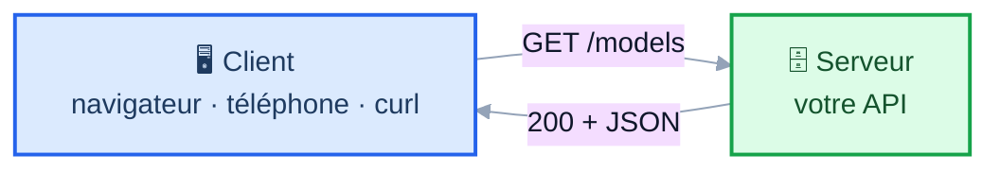
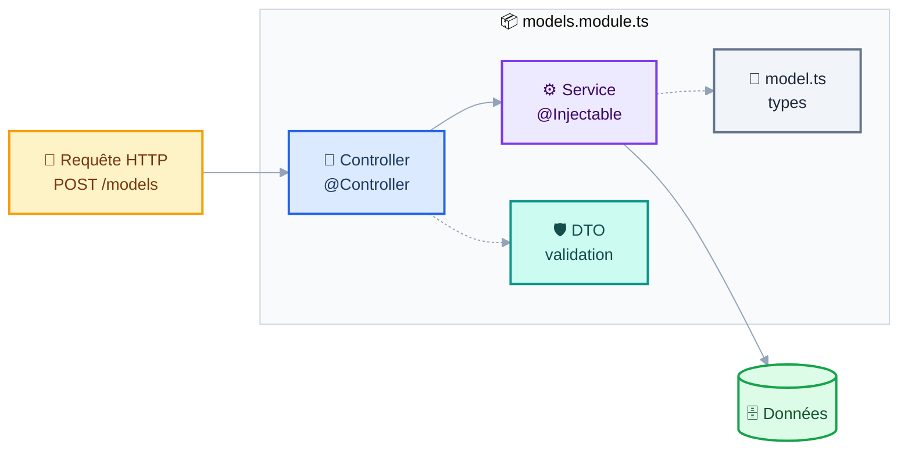
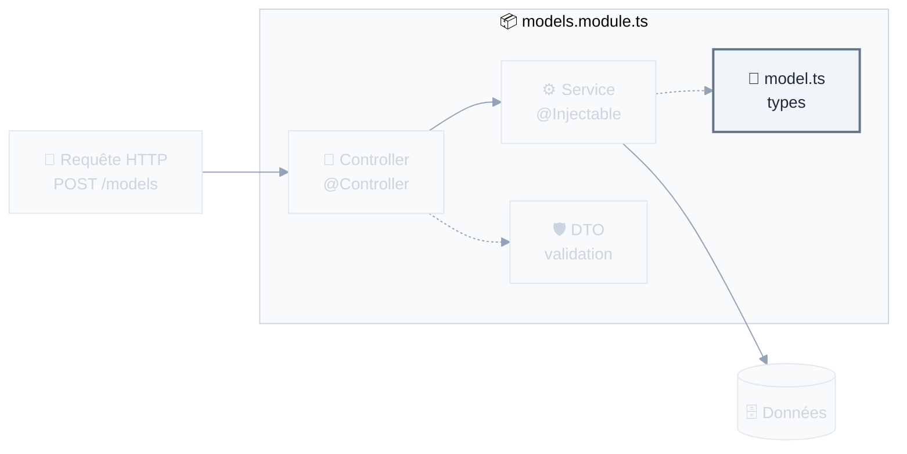
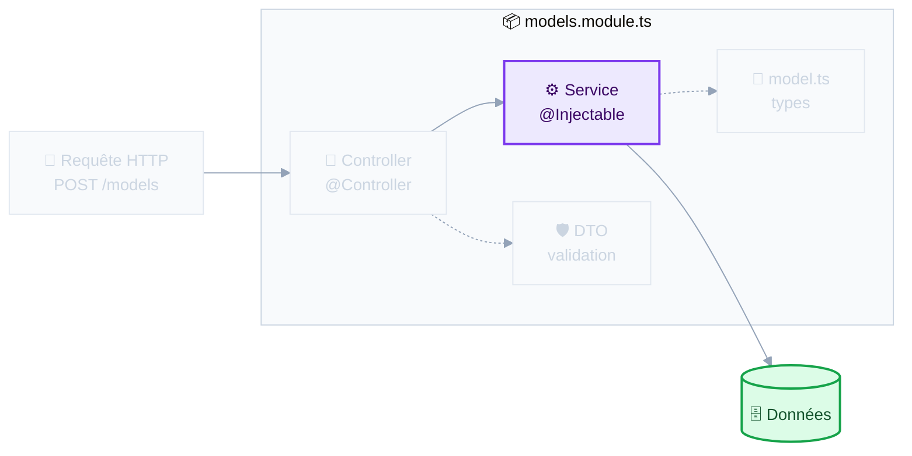
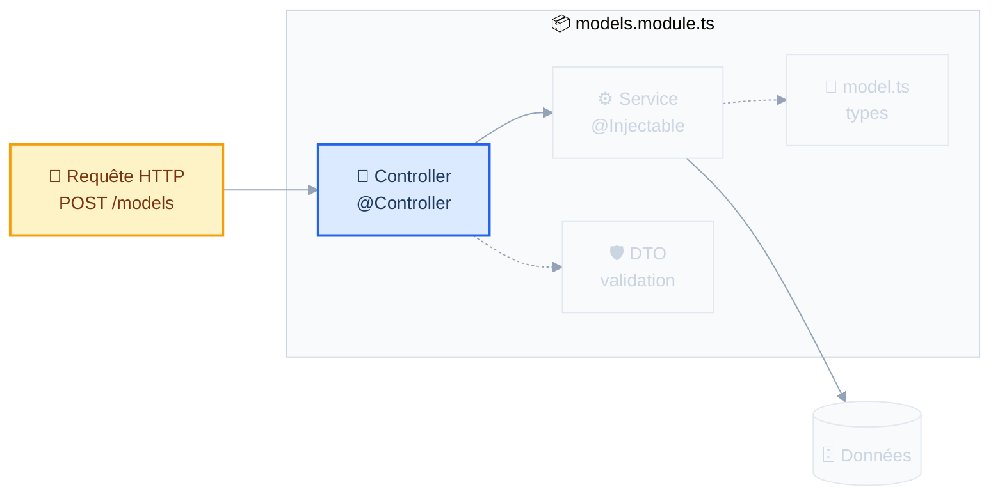
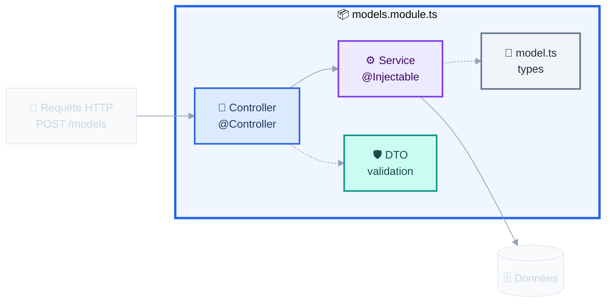
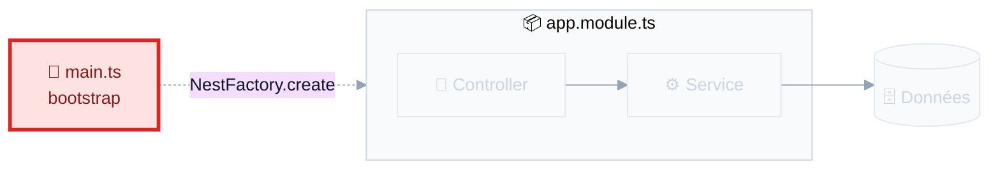
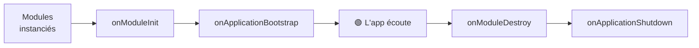

# NestJS

## API REST & asynchronisme

<div class="pt-4 op-75">Séance 2 : Sprint 1, Fondations & serveur</div>

<div class="pt-10 text-sm op-75">
📱 <b>gaetanmaisse.github.io/ismin-web-2026-tps</b>
</div>

<!--
⏱ MINUTAGE PRÉVU (minutes depuis le début)
  +00  Reprise : ça ne vit que dans votre terminal
  +03  Le web : client/serveur, JSON
  +13  REST : verbes et codes de statut
  +23  Node & npm
  +31  ▶ MAINS SUR LE CLAVIER : upstream, récupérer le TP, installer, démarrer
  +38  Nest : pourquoi, et ce que génère la CLI
  +46  L'architecture, brique par brique
  +66  TP partie 1 : GET /models
  +90  PAUSE (15 min)
  +105 Cycle de vie + service synchrone → asynchrone
  +115 Asynchronisme
  +130 Validation des entrées
  +138 TP partie 2
  +158 Correction
  +165 Fin

⚠️ SÉANCE DENSE EN CM : c'est la nature de la séance framework.
SI EN RETARD, coupez dans cet ordre :
  1. « Les codes de statut » (annexe, ils l'ont en référence)
  2. « Dépendances et types TypeScript »
  3. « Un contrôleur, plusieurs routes »
  4. Le bonus Hugging Face du TP
Ne coupez JAMAIS : le module, main.ts, le cycle de vie, la validation.

Ctrl+Shift+R pour remettre le relevé à zéro MAINTENANT.
-->

---
layout: center
---

# Hier, vous avez écrit ça

```ts
const zoo = new ModelZoo();
zoo.addModel(mistral);
zoo.getModelsOf("mistralai");
```

<v-click>

<div class="pt-8 text-lg">

Le problème : **ça ne vit que dans votre terminal.**

</div>

</v-click>

<v-click>

<div class="pt-6 op-75">
Aujourd'hui, on rend ce catalogue interrogeable depuis n'importe où :<br/>
un navigateur, un téléphone, une autre application.
</div>

</v-click>

<!--
Reprendre le fil. 3 minutes. Rappeler que tp02 contient un point de
départ qui marche : personne n'est bloqué par le TP d'hier.
-->

---
layout: section
---

# 1. Le web, en dix minutes

<div class="op-75 pt-2">On ne suppose rien</div>

---

# Client et serveur



<v-clicks>

- Le **client** demande, le **serveur** répond. Toujours dans cet ordre : le serveur ne parle jamais en premier.
- Une requête, c'est une **méthode** (`GET`) et un **chemin** (`/models`) ; la réponse, c'est un **code de statut** (`200`) et des **données**.
- Le serveur ne renvoie plus des pages HTML mais des **données**, au client de les afficher.

</v-clicks>

<v-click>

<div class="pt-4 text-sm op-75">
L'analogie qui marche : le serveur est une <b>fonction distante</b>. Vous l'appelez avec des arguments, elle retourne un résultat.
</div>

</v-click>

<!--
Le détail d'une requête HTTP brute est en annexe si quelqu'un demande.
-->

---

# JSON

Le format d'échange du web. C'est juste du texte.

```json
{
  "id": "mistral-7b-instruct-v0-3",
  "name": "Mistral-7B-Instruct-v0.3",
  "parameters": 7.2,
  "task": "text-generation",
  "open": true
}
```

<v-clicks>

- Types disponibles : chaîne, nombre, booléen, `null`, tableau, objet. **C'est tout.**
- Pas de date, pas de commentaire, pas de `undefined`
- En JavaScript : `JSON.parse(texte)` pour lire, `JSON.stringify(objet)` pour écrire

</v-clicks>

<v-click>

<div class="pt-4 p-3 bg-amber-500 bg-opacity-10 rounded text-sm">
⚠️ Ce qui sort de <code>JSON.parse</code> est de type <code>unknown</code> pour une bonne raison : c'est du texte venu de l'extérieur, rien ne garantit sa forme. <b>On y revient en fin de séance.</b>
</div>

</v-click>

---
layout: section
---

# 2. REST

---

# Une convention : des ressources, des verbes

Des **noms au pluriel**, manipulés par des **verbes** HTTP.

<div class="pt-2">

| Verbe | Chemin | Ce que ça fait |
|---|---|---|
| `GET` | `/models` | Lister les modèles |
| `GET` | `/models/:id` | Récupérer un modèle précis |
| `POST` | `/models` | Créer un modèle (corps de requête) |
| `PUT` / `PATCH` | `/models/:id` | Remplacer / modifier |
| `DELETE` | `/models/:id` | Supprimer |

</div>

<v-click>

<div class="pt-4 text-sm op-75">
On filtre avec des paramètres de requête : <code>GET /models<b>?org=mistralai&task=translation</b></code><br/>
Jamais de verbe dans l'URL : <code>/getModels</code> ou <code>/models/delete</code> ne sont pas du REST.
</div>

</v-click>

---

# Les codes de statut

<div class="grid grid-cols-2 gap-6 pt-2 text-sm">
<div>

### ✅ Ça s'est bien passé

| | |
|---|---|
| `200` | OK |
| `201` | Créé (après un `POST`) |
| `204` | OK, rien à renvoyer (`DELETE`) |

### 🤷 Le client s'est trompé

| | |
|---|---|
| `400` | Requête invalide |
| `401` | Pas authentifié |
| `403` | Authentifié mais pas autorisé |
| `404` | Introuvable |

</div>
<div>

### 💥 Le serveur s'est trompé

| | |
|---|---|
| `500` | Erreur interne |
| `503` | Service indisponible |

<div class="pt-6 op-75">

La règle : **4xx, c'est la faute du client. 5xx, c'est la vôtre.**

Un `500` dans vos logs est toujours un bug à corriger.

</div>

</div>
</div>

<!--
Sacrifiable si retard : ils l'ont en annexe. Le message qui compte
est le 4xx/5xx.
-->

---
layout: section
---

# 3. Node et npm

<div class="op-75 pt-2">Vous venez du C/C++ : il n'y a pas d'équivalent</div>

---

# npm : le gestionnaire de paquets

<div class="grid grid-cols-2 gap-6 pt-2">
<div>

```sh
npm init            # crée package.json
npm install         # installe tout
npm install axios   # ajoute une dépendance
npm install -D jest # ajoute une dépendance de dev

npm run start       # lance un script
npm run test
```

</div>
<div>

<div class="text-sm">

**`dependencies`** : nécessaires pour que l'application **tourne** (NestJS, class-validator…)

**`devDependencies`** : nécessaires seulement pour **développer** : tests, compilateur, linter. Absentes en production.

</div>

</div>
</div>

<v-clicks>

- `node_modules/` contient les paquets téléchargés. **Il ne se commite jamais** : il se reconstruit avec `npm install`.
- `package-lock.json`, lui, **se commite** : il fige les versions exactes, pour que votre machine et celle du serveur installent rigoureusement la même chose.

</v-clicks>

---

# `package.json` : la carte d'identité du projet

```json {2-4|6-11|13-20|all}
{
  "name": "tp02-modelzoo-api",
  "private": true,
  "engines": { "node": ">=26.0.0 <27.0.0" },

  "scripts": {
    "start:dev": "nest start --watch",
    "build": "nest build",
    "test": "jest --config ./test/jest-e2e.json",
    "typecheck": "tsc --noEmit"
  },

  "dependencies": {
    "@nestjs/common": "^11.0.1",
    "class-validator": "^0.14.1"
  },
  "devDependencies": {
    "typescript": "^5.7.3",
    "jest": "^29.7.0"
  }
}
```

<div class="pt-2 text-sm op-75">
Les <b>scripts</b> sont des raccourcis : plutôt que de retenir une commande longue, on tape <code>npm run test</code>.
</div>

---
layout: center
---

# ▶ Mains sur le clavier

<div class="pt-4 text-left max-w-3xl mx-auto">

```sh
# Une seule fois : déclarer mon dépôt comme source des TPs
git remote add upstream git@github.com:gaetanmaisse/ismin-web-2026-tps.git

# À chaque séance : récupérer le TP du jour
git pull upstream main

cd tp02 && npm install
npm run start:dev
```

</div>

<div class="pt-8">

Puis ouvrez **http://localhost:3000/models** dans votre navigateur.

</div>

<v-click>

<div class="pt-6 op-75">
Une erreur ? C'est normal : la route n'existe pas encore.<br/>
Mais le serveur, lui, <b>tourne</b>.
</div>

</v-click>

<!--
⏱ +31. Moment de respiration au milieu du CM, et vérification que
le npm install passe pour tout le monde AVANT le TP.

🔴 C'est ICI qu'on configure upstream, pas hier : ils en ont besoin
maintenant, pour de vrai, et la notion s'ancre au moment où elle sert.
Le faire au vidéoprojecteur, puis les laisser suivre.

Circuler pendant l'installation. Repérer les mains levées.
-->

---
layout: section
---

# 4. NestJS

---

# Pourquoi un framework ?

<div class="grid grid-cols-2 gap-6 pt-2">
<div>

**Node tout nu**

```ts
import http from "node:http";

http.createServer((req, res) => {
  if (req.url === "/models"
      && req.method === "GET") {
    res.writeHead(200, {
      "Content-Type": "application/json"
    });
    res.end(JSON.stringify(models));
  }
  // … et 40 routes comme ça
}).listen(3000);
```

</div>
<div>

**Avec NestJS**

```ts
@Controller("models")
export class ModelsController {
  @Get()
  findAll(): Model[] {
    return this.service.findAll();
  }
}
```

</div>
</div>

<v-clicks>

- Nest s'appuie sur **Express** et lui ajoute : structure, injection de dépendances, validation, gestion des erreurs
- Vous écrivez **la logique métier**, pas la plomberie

</v-clicks>

<v-click>

<div class="pt-4 text-sm op-75">
Et pourquoi pas Express seul ? Parce qu'à cinq routes on s'en sort, à cinquante on réinvente mal ce que Nest fournit. Le coût, c'est d'apprendre ses conventions.
</div>

</v-click>

---

# Ce que génère `nest new`

<div class="grid grid-cols-2 gap-6 pt-2">
<div>

```
├── package.json
├── nest-cli.json
├── tsconfig.json
├── src
│   ├── main.ts
│   ├── app.module.ts
│   ├── app.controller.ts
│   ├── app.service.ts
│   └── app.controller.spec.ts
└── test
    ├── app.e2e-spec.ts
    └── jest-e2e.json
```

</div>
<div>

<div class="text-sm pt-4">

<v-clicks>

- **`src/main.ts`** : le point d'entrée, qui démarre le serveur
- **`*.module.ts`** : les boîtes qui déclarent ce qui va ensemble
- **`*.controller.ts`** : les routes HTTP
- **`*.service.ts`** : la logique métier
- **`*.spec.ts`** : les tests, à côté du code testé

</v-clicks>

</div>

</div>
</div>

<v-click>

<div class="pt-6 text-sm op-75">
Une convention forte : <b>un fichier = une responsabilité</b>, et le nom du fichier dit laquelle. Vous retrouverez cette structure dans tous les projets Nest.
</div>

</v-click>

---

# L'architecture, vue d'ensemble



<div class="pt-4">

Cinq pièces. On va les prendre **une par une**, dans l'ordre où on les écrit.

</div>

<!--
🔴 Ce schéma va revenir 5 fois, avec la pièce du moment mise en avant.
C'est le fil conducteur de la section : ils doivent toujours savoir
« où on est ».
-->

---

# ① Les types : du TypeScript ordinaire



```ts
export type Task = "text-generation" | "translation" | "speech-to-text";

export interface Model {
  id: string;
  name: string;
  task: Task;
  parameters: number;
}
```

<div class="pt-3 text-sm op-75">
Rien de spécifique à Nest ici : ce sont les interfaces et types de la séance 1. Vos données se modélisent en TypeScript pur.
</div>

---

# ② Le service : la logique métier



**Ce qu'on met dans un service :**

<v-clicks>

- la **logique métier** : calculs, règles, filtrage, tri
- la **gestion du stockage** : lecture et écriture des données
- les **appels à des services externes** : autres API, envoi de mails

</v-clicks>

<v-click>

<div class="pt-3 p-3 bg-blue-500 bg-opacity-10 rounded text-sm">
Ce qu'on n'y met <b>jamais</b> : quoi que ce soit qui parle d'HTTP. Un service ne connaît ni requête, ni code de statut. Il doit être testable sans serveur.
</div>

</v-click>

---

# ② Le service : le code

```ts {3-4|5|7-10|12-14|all}
import { Injectable } from '@nestjs/common';

@Injectable()                       // ← "Nest may provide this class"
export class ModelsService {
  private readonly models = new Map<string, Model>();

  create(model: Model): Model {
    this.models.set(model.id, model);
    return model;
  }

  findAll(): Model[] {
    return [...this.models.values()];
  }
}
```

<div class="pt-3 text-sm op-75">
<code>@Injectable()</code> ne fait rien de magique : il marque la classe comme <i>fournissable</i> par l'injection de dépendances. Sans lui, Nest refusera de la construire.
</div>

<v-click>

<div class="pt-2 text-sm op-75">
💡 Pour signaler une erreur, un service ou un contrôleur <b>lève une exception</b> : <code>NotFoundException</code> devient un 404, <code>BadRequestException</code> un 400. Nest se charge de la traduction.
</div>

</v-click>

---

# ③ Le contrôleur : traduire HTTP ↔ métier



```ts {1-3|5-8|all}
@Controller("models")           // every route starts with /models
export class ModelsController {
  constructor(private readonly modelsService: ModelsService) {}

  @Get()                        // GET /models
  findAll(): Model[] {
    return this.modelsService.findAll();
  }
}
```

<div class="pt-2 text-sm op-75">
Un objet retourné devient du <b>JSON automatiquement</b>, avec un <code>200</code>. Aucune sérialisation à écrire.
</div>

---

# ③ Un contrôleur, plusieurs routes

```ts {1-6|8-9|all}
@Controller("models")
export class ModelsController {
  @Get()          findAll()  { … }    // GET    /models
  @Post()         create()   { … }    // POST   /models   ← même chemin
  @Get(":id")     findOne()  { … }    // GET    /models/:id
  @Delete(":id")  remove()   { … }    // DELETE /models/:id  ← même chemin
}

// Récupérer le paramètre d'URL, et signaler une erreur
findOne(@Param("id") id: string): Model {
  const model = this.modelsService.findOne(id);
  if (!model) throw new NotFoundException(`Model ${id} not found`);
  return model;
}
```

<v-clicks>

- C'est le couple **(verbe, chemin)** qui détermine la méthode appelée, pas le chemin seul
- `NotFoundException` devient un **404**, `BadRequestException` un **400** : Nest traduit vos exceptions en réponses HTTP

</v-clicks>

---

# ③ Les décorateurs

Le `@` vous intrigue ? C'est une **annotation** qui attache des métadonnées.

```ts
@Controller("models")   // this class handles the /models routes
@Get(":id")             // this method answers GET /models/:id
@Param("id")            // inject the :id segment of the URL here
@Query("org")           // inject the ?org= query parameter here
@Body()                 // inject the JSON request body here
```

<v-click>

<div class="pt-6">

Au démarrage, NestJS lit ces métadonnées et construit la table de routage.
Vous **décrivez** ce que vous voulez, le framework **câble**.

</div>

</v-click>

<v-click>

<div class="pt-4 text-sm op-75">
Si vous avez fait du C++ moderne, c'est l'esprit des attributs <code>[[nodiscard]]</code> : une information pour l'outillage, attachée au code.
</div>

</v-click>

---

# ③ L'injection de dépendances

```ts {2|all}
export class ModelsController {
  constructor(private readonly modelsService: ModelsService) {}
  //           ↑ you NEVER write `new ModelsService()`
}
```

<v-clicks>

- Vous **déclarez** ce dont vous avez besoin, Nest vous le **fournit**
- Fonctionne pour les contrôleurs **et** pour les services entre eux
- Une seule instance de `ModelsService` est partagée par toute l'application
- En test, on peut fournir un faux service à la place, sans changer une ligne du contrôleur

</v-clicks>

<v-click>

<div class="pt-4 p-3 bg-blue-500 bg-opacity-10 rounded text-sm">
C'est le raccourci de constructeur vu hier : <code>private readonly</code> devant un paramètre <b>déclare et initialise</b> l'attribut. Vous le verrez dans tous les fichiers Nest.
</div>

</v-click>

---

# ④ Le module : ce qui relie tout



```ts
import { Module } from '@nestjs/common';

@Module({
  controllers: [ModelsController],   // this module's routes
  providers: [ModelsService],        // its injectable classes
  exports: [ModelsService],          // what other modules may reuse
})
export class ModelsModule {}         // empty class: everything is in the decorator
```

<div class="pt-3 p-3 bg-amber-500 bg-opacity-10 rounded text-sm">
⚠️ <b>Le piège n°1 du TP</b> : un contrôleur oublié dans <code>controllers</code> ne sera <b>jamais</b> appelé. Vos routes répondront 404 sans le moindre message d'erreur. Si une route reste introuvable, vérifiez le module avant tout le reste.
</div>

---

# ⑤ `main.ts` : le démarrage



```ts
import { NestFactory } from '@nestjs/core';
import { AppModule } from './app.module';

async function bootstrap() {
  const app = await NestFactory.create(AppModule);   // the root module
  await app.listen(process.env.PORT ?? 3000);        // the port to listen on
}
void bootstrap();
```

<div class="pt-3 text-sm op-75">
C'est ici qu'on branchera la <b>validation globale</b> en fin de séance, et c'est ici que le port viendra d'une variable d'environnement quand on déploiera (séance 12).
</div>

---

# Lancer l'application

```sh
npm run start          # démarre l'application
npm run start:dev      # démarre + redémarre à chaque modification  ← celui du TP
npm run start:debug    # idem, avec un débogueur attachable
npm run test           # lance les tests
npm run build          # compile vers dist/
```

<v-click>

<div class="pt-8">

Gardez **deux terminaux ouverts** pendant tout le TP : un pour `start:dev`, un pour `test:watch`.
Vous verrez vos erreurs apparaître sans jamais avoir à relancer quoi que ce soit.

</div>

</v-click>

---

# Interroger son API : Bruno

<div class="grid grid-cols-2 gap-6 pt-2">
<div>

<div class="text-sm">

Un client HTTP libre, hors ligne, sans compte.

- Composer des requêtes `GET`, `POST`, `DELETE`
- Modifier en-têtes, corps, paramètres
- Regrouper les requêtes en **collections**
- Définir des **environnements** (local, production)

</div>

<div class="pt-4 p-3 bg-blue-500 bg-opacity-10 rounded text-sm">
Ses collections sont de <b>simples fichiers texte</b> : elles se versionnent avec le code. Une collection prête à l'emploi est fournie dans <code>tp02/bruno/</code>.
</div>

</div>
<div>

```
tp02/bruno/
├── bruno.json
├── environments/
│   └── local.bru
├── 01-list-models.bru
├── 02-get-one-model.bru
├── 03-create-model.bru
└── 06-filter-by-org.bru
```

<div class="pt-4 text-sm op-75">
Alternative sans rien installer : l'extension <b>REST Client</b> de VS Code, ou <code>curl</code> en ligne de commande (voir les annexes).
</div>

</div>
</div>

<!--
🔴 DÉMO EN DIRECT, 3 minutes : ouvrir Bruno, charger tp02/bruno,
sélectionner l'environnement local, lancer « 01-list-models ».
Montrer la réponse, le code de statut, le temps de réponse.

Puis modifier le corps de « 03-create-model » et relancer.
-->

---
layout: section
---

# TP · partie 1

<div class="op-75 pt-2">24 minutes · <code>tp02/README.md</code>, étapes 1 à 3</div>

<div class="pt-8 text-sm">

1. Lire le projet : où est le contrôleur, où est le service ?
2. `GET /models`
3. `GET /models/:id`, avec un 404 si le modèle est inconnu

</div>

<div class="pt-8 text-sm op-75">
🖐 Bloqué ? Levez la main.
</div>

<!--
⏱ +66.

Amorçage en Randori (8 min) : lire le projet ensemble, écrire findAll
dans le service puis la route dans le contrôleur. Puis ils continuent seuls.

Blocages classiques :
- contrôleur absent de `controllers` → 404 muet (la slide du module le dit)
- @Get(':id') qui ne capture pas le « / » de l'identifiant
-->

---
layout: center
class: text-center
---

# ⏸ Pause

## 15 minutes

<!--
⏱ On doit être à +90. Noter l'écart réel.
-->

---
layout: section
---

# 5. Le cycle de vie

---

# Nest vous prévient aux moments clés



```ts {1|3-8|all}
import { Injectable, OnModuleInit } from '@nestjs/common';

@Injectable()
export class ModelsService implements OnModuleInit {
  async onModuleInit(): Promise<void> {
    // The right moment to load data, open a connection…
    await this.loadCatalogue();
  }
}
```

<div class="pt-3 text-sm op-75">
Pourquoi pas dans le constructeur ? Parce qu'un constructeur ne peut pas être <code>async</code>. <code>onModuleInit</code>, si, et Nest l'attend avant de démarrer le serveur.
</div>

<!--
Indispensable : le bonus A du TP repose entièrement là-dessus.
On s'en resservira en séance 3 pour la connexion à la base.
-->

---

# Un service qui devient asynchrone

<div class="grid grid-cols-2 gap-4 pt-2">
<div>

**Aujourd'hui : tout en mémoire**

```ts
export class ModelsService {
  create(model: Model): Model {
    …
  }

  findAll(): Model[] {
    …
  }

  findOne(id: string): Model | undefined {
    …
  }
}
```

</div>
<div>

**Demain, avec une base de données**

```ts
export class ModelsService {
  create(model: Model): Promise<Model> {
    …
  }

  findAll(): Promise<Model[]> {
    …
  }

  findOne(id: string): Promise<Model | null> {
    …
  }
}
```

</div>
</div>

<v-click>

<div class="pt-6">

Dès qu'une seule opération devient asynchrone, **tout ce qui l'appelle le devient aussi**. C'est contagieux, et ça remonte jusqu'au contrôleur.

D'où la question suivante : c'est quoi, au juste, une opération asynchrone ?

</div>

</v-click>

---
layout: section
---

# 6. L'asynchronisme

---

# Node exécute votre code sur un seul thread

<div class="text-sm op-75 mb-4">
Pas de <code>pthread_create</code> ici. Une seule file d'exécution, donc <b>on ne bloque jamais</b>.
</div>

<v-clicks>

- Lire un fichier, appeler une API, interroger une base : tout cela **prend du temps**
- Pendant ce temps, le thread doit rester libre pour traiter les autres requêtes
- Donc : on ne dit pas « attends le résultat », on dit **« préviens-moi quand tu l'as »**

</v-clicks>

<v-click>

<div class="pt-8 p-4 bg-blue-500 bg-opacity-10 rounded">
Conséquence directe : une fonction qui fait des entrées/sorties ne renvoie pas un résultat, elle renvoie une <b>promesse</b> de résultat.
</div>

</v-click>

---

# Trois façons d'écrire la même chose

````md magic-move
```ts
// ① Callbacks : l'enfer de l'imbrication
readFile("models.json", (err, data) => {
  if (err) return handle(err);
  parse(data, (err, models) => {
    if (err) return handle(err);
    save(models, (err) => {
      if (err) return handle(err);
      console.log("done");
    });
  });
});
```

```ts
// ② Promises : on aplatit
readFile("models.json")
  .then((data) => parse(data))
  .then((models) => save(models))
  .then(() => console.log("done"))
  .catch(handle);
```

```ts
// ③ async/await : on lit comme du synchrone
try {
  const data = await readFile("models.json");
  const models = await parse(data);
  await save(models);
  console.log("done");
} catch (err) {
  handle(err);
}
```
````

<!--
Magic-move : le code se transforme, les lignes communes glissent.
C'est exactement la progression du bonus A du TP.
-->

---

# `async` / `await` en pratique

```ts {1-5|7-11|13-17|all}
// async devant une fonction : elle renvoie TOUJOURS une Promise
async function loadModels(): Promise<Model[]> {
  const raw = await readFile("models.json", "utf8");
  return JSON.parse(raw) as Model[];
}

// await ne s'utilise QUE dans une fonction async
const models = await loadModels();        // ✅ dans un async
function nope() {
  const models = await loadModels();      // ❌ erreur de compilation
}

// Plusieurs appels en parallèle : Promise.all
const [locaux, distants] = await Promise.all([
  loadModels(),
  fetchFromHuggingFace(),
]);
```

<div class="pt-2 text-sm op-75">
<code>Promise.all</code> lance tout en même temps et attend le dernier. En série, ce serait deux fois plus lent.
</div>

---

# À vous : dans quel ordre ?

```ts {monaco-run}
async function getModel(): Promise<string> {
  return "Mistral-7B";
}

console.log("avant");
getModel().then((name) => console.log(name));
console.log("après");
```

<!--
Faire voter AVANT d'exécuter. Réponse : avant / après / Mistral-7B.

C'est LE moment de comprendre que `then` ne bloque pas. Modifier en
direct pour tester leurs hypothèses.
-->

---
layout: section
---

# 7. Valider ce qui vient de l'extérieur

---

# Le problème

<div class="pt-2">

Souvenez-vous d'hier : **les types de TypeScript sont effacés à la compilation.**

</div>

```ts
@Post()
create(@Body() model: Model): Model {
  return this.modelsService.create(model);
}
```

<v-click>

<div class="pt-4 p-4 bg-amber-500 bg-opacity-10 rounded">

Ce `: Model` ne vérifie **rien** à l'exécution. Si un client envoie
`{"name": 42, "parameters": "beaucoup"}`, ça passe. Et ça casse plus loin, ailleurs, sans rapport apparent.

</div>

</v-click>

<v-click>

<div class="pt-6">
Le type dit ce que vous <i>espérez</i> recevoir. Il ne l'impose pas.
Pour l'imposer, il faut du code qui s'exécute.
</div>

</v-click>

---

# La solution : un DTO validé

<div class="text-sm op-75 mb-2">DTO = <i>Data Transfer Object</i> : la forme attendue d'une entrée.</div>

```ts {1-13|15-18|all}
export class CreateModelDto {
  @IsString()
  @Matches(/^[a-z0-9]+(-[a-z0-9]+)*$/, { message: "id must be a slug" })
  id!: string;

  @IsString()
  @IsNotEmpty()
  name!: string;

  @IsNumber()
  @Min(0)
  parameters!: number;
}

// In main.ts, once for the whole application
app.useGlobalPipes(
  new ValidationPipe({ whitelist: true, forbidNonWhitelisted: true }),
);
```

<v-click>

<div class="pt-3 text-sm op-75">
Une entrée invalide ne parvient jamais à votre service : Nest répond <b>400</b> avec le détail des erreurs.<br/>
<code>whitelist</code> supprime les champs non déclarés : un client ne peut pas glisser de propriété surprise.
</div>

</v-click>

---
layout: section
---

# TP · partie 2

<div class="op-75 pt-2">20 minutes · <code>tp02/README.md</code>, étapes 4 à 6</div>

<div class="pt-8 text-sm">

4. `POST /models` et `DELETE /models/:id`
5. Valider les entrées avec un DTO
6. Filtrer avec `?org=` et `?task=`

</div>

<div class="pt-6 text-sm op-75">
Bonus : charger le catalogue au démarrage (<code>OnModuleInit</code>), puis depuis l'API de Hugging Face
</div>

<!--
⏱ +138. C'est court : privilégier 4 et 5. Le 6 peut déborder
sur la correction, et les bonus sur la maison.
-->

---

# Correction : où avez-vous mis quoi ?

<div class="grid grid-cols-2 gap-6 pt-4">
<div>

### ❌ Logique dans le contrôleur

```ts
@Get()
findAll(@Query("org") org?: string) {
  const all = this.service.findAll();
  if (org) {
    return all.filter(m => m.org === org);
  }
  return all;
}
```

Le contrôleur fait du métier.

</div>
<div>

### ✅ Logique dans le service

```ts
@Get()
findAll(@Query("org") org?: string) {
  return this.service.findAll({ org });
}
```

Le contrôleur traduit, le service décide.

</div>
</div>

<v-click>

<div class="pt-8">

**Pourquoi ça compte :** demain, le service passe sur une base de données. Si le filtrage est dans le contrôleur, il faudra le réécrire, et il ne profitera jamais d'un index.

</div>

</v-click>

<!--
🔴 Faire venir 2 étudiants montrer leur findAll. Comparer.
Le critère n'est pas « ça marche » mais « où sera le changement demain ».
-->

---
layout: center
class: text-center
---

# Demain

## Séance 3 : La persistance

<div class="pt-6 op-75">
Redémarrez votre API maintenant : <b>tout a disparu.</b>
</div>

<div class="pt-6">
Demain, les données survivent : une vraie base, des migrations,<br/>
et un client typé de bout en bout.
</div>

<div class="pt-10 text-sm op-60">
Slides : gaetanmaisse.github.io/ismin-web-2026-tps
</div>

<!--
🔴 Le faire pour de vrai : Ctrl+C sur le serveur, relancer,
GET /models → vide. La frustration est le meilleur argument pour demain.

⏱ AVANT DE PARTIR :
  1. Ctrl+Shift+T → CSV de minutage
  2. docs/RETEX-seance-02.md
  3. ./publier-tp.sh corrige 02 && ./publier-tp.sh sujet 03
-->

---
layout: section
---

# Annexes

<div class="op-75 pt-2">Référence pendant le TP</div>

---

# Annexe · Une requête HTTP en détail

<div class="grid grid-cols-2 gap-6 pt-2">
<div>

**Ce que le client envoie**

```http
GET /models?task=translation HTTP/1.1
Host: api.exemple.fr
Accept: application/json
```

</div>
<div>

**Ce que le serveur répond**

```http
HTTP/1.1 200 OK
Content-Type: application/json

[
  { "id": "…", "name": "…" }
]
```

</div>
</div>

<div class="pt-8 text-sm op-75">
Une <b>ligne de requête</b> (méthode, chemin, version), des <b>en-têtes</b> (métadonnées), une ligne vide, puis le <b>corps</b> : présent seulement sur <code>POST</code>, <code>PUT</code> et <code>PATCH</code>.
</div>

---

# Annexe · Décorateurs NestJS courants

| Décorateur | Rôle | Exemple |
|---|---|---|
| `@Controller("models")` | Préfixe de routes | `/models` |
| `@Get()` `@Post()` `@Delete()` | Verbe HTTP | `@Get(":id")` |
| `@Param("id")` | Segment d'URL | `/models/**mistral-7b**` |
| `@Query("org")` | Paramètre de requête | `/models?**org=mistralai**` |
| `@Body()` | Corps JSON de la requête | `POST` avec un DTO |
| `@HttpCode(204)` | Forcer le code de statut | après un `DELETE` |
| `@Injectable()` | Classe fournie par l'injection | sur les services |
| `@Module({...})` | Déclare contrôleurs et fournisseurs | |

<div class="pt-4 text-sm op-75">
Exceptions prêtes à l'emploi : <code>NotFoundException</code> (404), <code>BadRequestException</code> (400), <code>ConflictException</code> (409).
</div>

---

# Annexe · Décorateurs de validation

```ts
@IsString()  @IsNumber()  @IsBoolean()  @IsInt()
@IsNotEmpty()                    // chaîne non vide
@IsOptional()                    // le champ peut être absent
@Min(0)  @Max(100)               // bornes numériques
@IsIn(["text-generation", "translation"])   // valeurs autorisées
@Matches(/^[\w-]+\/[\w.-]+$/)    // expression régulière
@IsArray()  @ValidateNested()    // objets imbriqués
```

<div class="pt-6 text-sm op-75">
Tous viennent de <code>class-validator</code>. La liste complète : <b>github.com/typestack/class-validator</b>
</div>

---

# Annexe · Interroger l'API sans Bruno

<div class="grid grid-cols-2 gap-6 pt-2 text-sm">
<div>

**En ligne de commande**

```sh
curl localhost:3000/models

curl -X POST localhost:3000/models \
  -H "Content-Type: application/json" \
  -d '{"id":"a/b","name":"B","parameters":7}'

curl -X DELETE localhost:3000/models/a%2Fb
```

</div>
<div>

**Dans l'éditeur**

Extension **REST Client** (VS Code) : un fichier `.http`

```http
GET http://localhost:3000/models

###

POST http://localhost:3000/models
Content-Type: application/json

{ "id": "a/b", "name": "B", "parameters": 7 }
```

</div>
</div>

<div class="pt-6 text-sm op-75">
💡 Nos identifiants sont des <b>slugs</b> sans caractère spécial, donc rien à encoder. Sachez tout de même que Hugging Face utilise réellement <code>organisation/nom</code> dans ses URLs : ce qui impose côté serveur un paramètre attrape-tout (<code>@Get('*id')</code>). C'est un cas particulier, pas la règle.
</div>

---

# Annexe · Dépendances et types TypeScript

Trois cas de figure quand vous installez un paquet :

<v-clicks>

<div>

**1. Les types sont livrés avec le paquet** : le cas le plus courant aujourd'hui (NestJS, Prisma, class-validator). Rien à faire.

</div>

<div>

**2. Les types sont dans un paquet séparé** : convention `@types/…` :

```sh
npm install -D @types/node @types/supertest
```

</div>

<div>

**3. Il n'existe pas de types** : la bibliothèque est en JavaScript pur. Vous les écrivez vous-même dans un fichier `typings.d.ts`, ou vous acceptez le `any` en l'isolant.

</div>

</v-clicks>

<div class="pt-6 text-sm op-75">
C'est pour ça que <code>@types/node</code> figure dans les <code>devDependencies</code> du TP : il décrit à TypeScript ce que Node fournit (<code>process</code>, <code>fs</code>…), sans rien ajouter à l'exécution.
</div>
