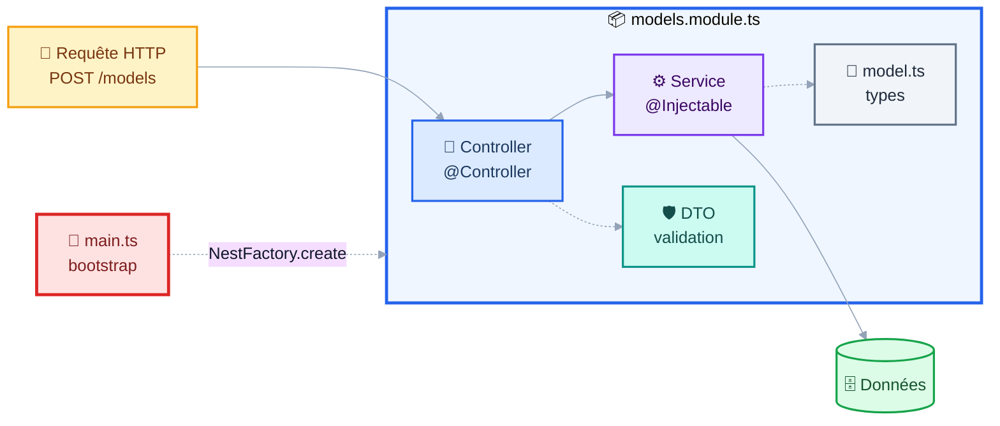
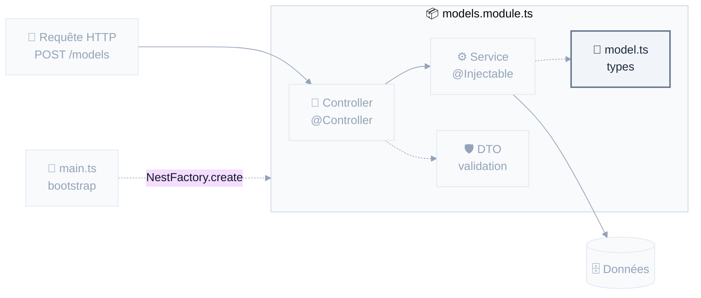
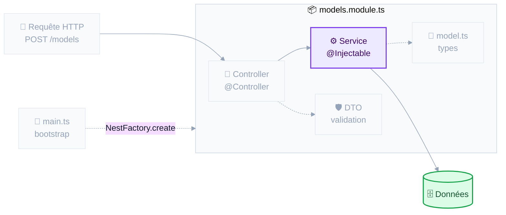
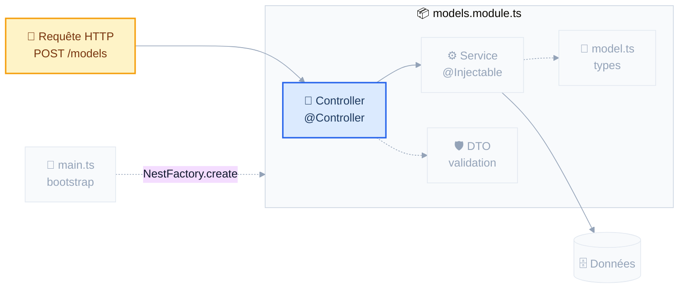
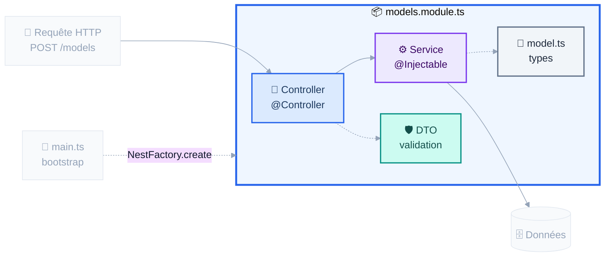
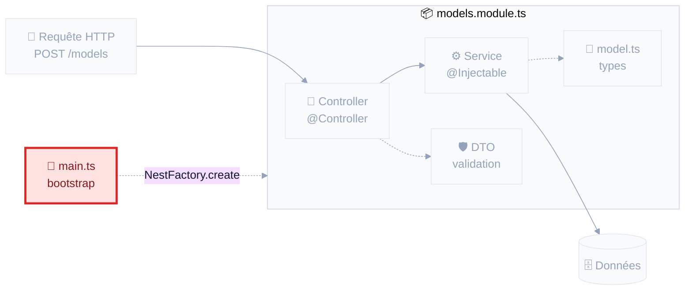
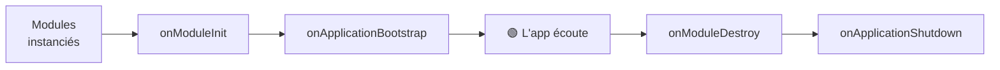
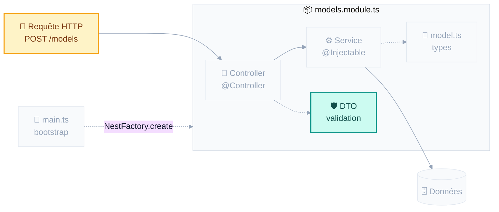

<CourseCover :sprint="1" :seance="2" />

# NestJS

## API REST & asynchronisme

<div class="pt-4 op-75">Séance 2&nbsp;: Sprint 1, Fondations & serveur</div>

<div class="pt-10 text-sm op-75">
📱 <b>gaetanmaisse.github.io/ismin-web-2026-tps</b>
</div>

<!--
⏱ MINUTAGE PRÉVU (minutes depuis le début)
  +00  Reprise : ça ne vit que dans votre terminal
  +03  Le web : JSON, puis REST
  +13  REST : verbes et codes de statut
  +23  Node & npm
  +31  ▶ MAINS SUR LE CLAVIER : upstream, récupérer le TP, installer, démarrer
  +38  Nest : pourquoi, et ce que génère la CLI
  +46  L'architecture, brique par brique
  +66  TP partie 1 : GET /models
  +90  PAUSE (15 min)
  +105 Asynchronisme : service synchrone → asynchrone, promesses
  +122 Cycle de vie
  +130 Validation des entrées
  +138 TP partie 2
  +158 Correction
  +165 Fin

⚠️ SÉANCE DENSE EN CM : c'est la nature de la séance framework.
SI EN RETARD, coupez dans cet ordre :
  1. « Un projet Nest, fichier par fichier » (le README a le même arbre)
  2. « 4xx, la faute du client. 5xx, la vôtre » (les cinq codes du TP sont dans le README)
  3. « Un contrôleur, plusieurs routes »
  4. Le bonus Hugging Face du TP
Ne coupez JAMAIS : le module, main.ts, le cycle de vie, la validation.

Ctrl+Shift+R pour remettre le relevé à zéro MAINTENANT.
-->

---
layout: center
---

# Hier, vous avez écrit ça

```ts
const zoo = new ModelZoo();
zoo.addModel(mistral);
zoo.getModelsOf('mistralai');
```

<v-click>

<div class="pt-8 text-lg">

Le problème&nbsp;: **ça ne vit que dans votre terminal.**

</div>

</v-click>

<v-click>

<div class="pt-6 op-75">
Aujourd’hui, on rend ce catalogue interrogeable depuis n’importe où&nbsp;:<br/>
un navigateur, un téléphone, une autre application.
</div>

</v-click>

<!--
Reprendre le fil. 3 minutes. Rappeler que tp02 embarque le corrigé du
TP1 comme base : ceux qui ont fini le remplacent par leurs fichiers,
les autres le gardent. Personne n'est bloqué par le TP d'hier.
-->

---
layout: section
---

# 1. Le web&nbsp;: JSON et REST

<div class="op-75 pt-2">On ne suppose rien</div>

---

# JSON&nbsp;: du texte, rien d’autre

Le format d’échange du web.

```json
{
  "id": "mistral-7b-instruct-v0-3",
  "name": "Mistral-7B-Instruct-v0.3",
  "parameters": 7.2,
  "task": "text-generation",
  "downloads": 1420000
}
```

<v-clicks>

- Types disponibles&nbsp;: chaîne, nombre, booléen, `null`, tableau, objet. **C’est tout.**
- Pas de date, pas de commentaire, pas de `undefined`
- En JavaScript&nbsp;: `JSON.parse(texte)` pour lire, `JSON.stringify(objet)` pour écrire

</v-clicks>

<v-click>

<div class="pt-4 p-3 bg-amber-500 bg-opacity-10 rounded text-sm">
⚠️ <code>JSON.parse</code> renvoie <code>any</code>&nbsp;: du texte venu de l’extérieur, sans garantie de forme. Traitez-le comme un <code>unknown</code>. <b>On y revient en fin de séance.</b>
</div>

</v-click>

---

# Une convention&nbsp;: des ressources, des verbes

Des **noms au pluriel**, manipulés par des **verbes** HTTP.

<div class="pt-2">

| Verbe | Chemin | Effet |
|---|---|---|
| `GET` | `/models` | Lister les modèles |
| `GET` | `/models/:id` | Lire un modèle |
| `POST` | `/models` | Créer un modèle, à partir du corps |
| `PUT` / `PATCH` | `/models/:id` | Remplacer / modifier |
| `DELETE` | `/models/:id` | Supprimer |

</div>

<v-click>

<div class="pt-4 text-sm op-75">
On filtre avec des paramètres de requête&nbsp;: <code>GET /models<b>?org=mistralai&task=translation</b></code><br/>
Jamais de verbe dans l’URL&nbsp;: <code>/getModels</code> ou <code>/models/delete</code> ne sont pas du REST.
</div>

</v-click>

---

# 4xx, la faute du client. 5xx, la vôtre

<div class="grid grid-cols-2 gap-6 pt-2 text-sm">
<div>

### ✅ Ça s’est bien passé

| | |
|---|---|
| `200` | OK |
| `201` | Créé (après un `POST`) |
| `204` | OK, rien à renvoyer (`DELETE`) |

### 🤷 Le client s’est trompé

| | |
|---|---|
| `400` | Requête invalide |
| `401` | Pas authentifié |
| `403` | Authentifié mais pas autorisé |
| `404` | Introuvable |

</div>
<div>

### 💥 Le serveur s’est trompé

| | |
|---|---|
| `500` | Erreur interne |
| `503` | Service indisponible |

<div class="pt-6 op-75">

Un `500` dans vos logs est toujours un bug à corriger. Un `4xx`, jamais.

</div>

</div>
</div>

<!--
Sacrifiable si retard : les cinq codes du TP sont dans le README.
Le message qui compte est le 4xx/5xx.
-->

---
layout: section
---

# 2. Node et npm

<div class="op-75 pt-2">L’outillage du projet</div>

---

# npm&nbsp;: le gestionnaire de paquets

<div class="grid grid-cols-2 gap-6 pt-2">
<div>

```sh
npm init            # crée package.json
npm install         # installe tout
npm install axios   # ajoute une dépendance
npm install -D jest # ajoute une dépendance de dev

npm run start       # lance un script
npm run test
```

</div>
<div>

<div class="text-sm">

**`dependencies`**&nbsp;: nécessaires pour que l’application **tourne** (NestJS, class-validator…)

**`devDependencies`**&nbsp;: nécessaires seulement pour **développer**&nbsp;: tests, compilateur, linter. Absentes en production.

</div>

</div>
</div>

<v-clicks>

- `node_modules/` contient les paquets téléchargés. **Il ne se commite jamais**&nbsp;: il se reconstruit avec `npm install`.
- `package-lock.json`, lui, **se commite**&nbsp;: il fige les versions exactes, pour que votre machine et le serveur installent exactement la même chose.

</v-clicks>

---

# `package.json`&nbsp;: la carte d’identité du projet

```json {2-4|6-11|13-20|all}
{
  "name": "tp02-modelzoo-api",
  "private": true,
  "engines": { "node": ">=26.0.0 <27.0.0" },

  "scripts": {
    "start:dev": "nest start --watch",
    "build": "nest build",
    "test": "jest --config ./test/jest-e2e.json",
    "typecheck": "tsc --noEmit"
  },

  "dependencies": {
    "@nestjs/common": "^11.0.1",
    "class-validator": "^0.14.1"
  },
  "devDependencies": {
    "typescript": "^5.7.3",
    "jest": "^29.7.0"
  }
}
```

<div class="pt-2 text-sm op-75">
Les <b>scripts</b> sont des raccourcis&nbsp;: plutôt que de retenir une commande longue, on tape <code>npm run test</code>.
</div>

---
layout: center
---

# ▶ Mains sur le clavier

<div class="pt-4 text-left max-w-3xl mx-auto">

```sh
# Une seule fois : déclarer le dépôt du cours comme source des TP
git remote add upstream https://github.com/gaetanmaisse/ismin-web-2026-tps.git

# À chaque séance : récupérer le TP du jour
git pull upstream main

cd tp02 && npm install
npm run start:dev
```

</div>

<div class="pt-8">

Puis ouvrez **http://localhost:3000/models** dans votre navigateur.

</div>

<v-click>

<div class="pt-6 op-75">
Une erreur&nbsp;? C’est normal&nbsp;: la route n’existe pas encore.<br/>
Mais le serveur, lui, <b>tourne</b>.
</div>

</v-click>

<!--
⏱ +31. Moment de respiration au milieu du CM, et vérification que
le npm install passe pour tout le monde AVANT le TP.

🔴 C'est ICI qu'on configure upstream, pas hier : ils en ont besoin
maintenant, pour de vrai, et la notion s'ancre au moment où elle sert.
Le faire au vidéoprojecteur, puis les laisser suivre.

Circuler pendant l'installation. Repérer les mains levées.
-->

---
layout: section
---

# 3. NestJS

<div class="op-75 pt-2">Cinq pièces et un fil</div>

---

# Pourquoi un framework&nbsp;?

<div class="grid grid-cols-2 gap-6 pt-2">
<div>

**Node tout nu**

```ts
import http from 'node:http';

http.createServer((req, res) => {
  if (req.url === '/models'
      && req.method === 'GET') {
    res.writeHead(200, {
      'Content-Type': 'application/json'
    });
    res.end(JSON.stringify(models));
  }
  // … et 40 routes comme ça
}).listen(3000);
```

</div>
<div>

**Avec NestJS**

```ts
@Controller('models')
export class ModelsController {
  @Get()
  findAll(): Model[] {
    return this.modelsService.findAll();
  }
}
```

</div>
</div>

<v-clicks>

- Nest s’appuie sur **Express** et lui ajoute&nbsp;: structure, injection de dépendances, validation, gestion des erreurs
- Vous écrivez **la logique métier**, pas la plomberie

</v-clicks>

<v-click>

<div class="pt-4 text-sm op-75">
Et pourquoi pas Express seul&nbsp;? Parce qu’à cinq routes on s’en sort, à cinquante on réinvente mal ce que Nest fournit. Le coût, c’est d’apprendre ses conventions.
</div>

</v-click>

---

# Un projet Nest, fichier par fichier

<div class="grid grid-cols-2 gap-6 pt-2">
<div>

```
tp02/
├── package.json
├── nest-cli.json
├── tsconfig.json
├── src
│   ├── main.ts
│   ├── app.module.ts
│   └── models
│       ├── model.ts
│       ├── model-zoo.ts
│       ├── models.module.ts
│       ├── models.controller.ts
│       ├── models.service.ts
│       └── dto/create-model.dto.ts
└── test
    └── models.e2e-spec.ts
```

</div>
<div>

<div class="text-sm pt-4">

<v-clicks>

- **`src/main.ts`**&nbsp;: le point d’entrée, qui démarre le serveur
- **`*.module.ts`**&nbsp;: les boîtes qui déclarent ce qui va ensemble
- **`*.controller.ts`**&nbsp;: les routes HTTP
- **`*.service.ts`**&nbsp;: la logique métier
- **`dto/`**&nbsp;: la forme attendue des entrées
- **`test/*.e2e-spec.ts`**&nbsp;: les tests, qui appellent l’API de bout en bout

</v-clicks>

</div>

</div>
</div>

<v-click>

<div class="pt-4 text-sm op-75">
Une convention forte&nbsp;: <b>un fichier = une responsabilité</b>, et le nom du fichier dit laquelle. <code>nest new</code> génère la même structure, vous la retrouverez dans tous les projets Nest.
</div>

</v-click>

---

# L’architecture, vue d’ensemble



<div class="pt-4">

Cinq pièces, **une par une**, dans l’ordre où on les écrit. Le DTO, la forme attendue d’une entrée, viendra en section 6.

</div>

<!--
🔴 Ce schéma revient en pleine page avant chaque pièce, celle du moment
allumée, les autres grisées : six fois en tout, DTO compris en section 6.
C'est le fil conducteur : ils doivent toujours savoir « où on est ».
Trois secondes par transition, pas plus.
-->

---

# Les décorateurs&nbsp;: la syntaxe à connaître

Tout ce qui suit est parsemé de `@`. C’est une **annotation** qui attache des métadonnées à une classe, une méthode ou un paramètre.

```ts
@Controller('models')   // cette classe répond aux routes /models
@Get(':id')             // cette méthode répond à GET /models/:id
@Param('id')            // injecte ici le segment :id de l'URL
@Query('org')           // injecte ici le paramètre ?org=
@Body()                 // injecte ici le corps JSON de la requête
```

<v-click>

<div class="pt-6">

Au démarrage, Nest lit ces métadonnées et construit la table de routage.
Vous **décrivez** ce que vous voulez, le framework **câble**.

</div>

</v-click>

<v-click>

<div class="pt-4 text-sm op-75">
Rien de magique&nbsp;: ce sont des fonctions ordinaires fournies par Nest, <code>import { Controller, Get } from '@nestjs/common'</code>.
</div>

</v-click>

---
layout: center
class: text-center
---

<div class="w-full flex justify-center">



</div>

<div class="pt-2 text-2xl font-bold">① Les types</div>

---

# ① Les types&nbsp;: du TypeScript ordinaire

```ts
export type Task = 'text-generation' | 'translation' | 'image-classification' | 'speech-to-text';

export interface Model {
  id: string;           // slug, unique dans le catalogue
  name: string;
  org: string;
  task: Task;
  parameters: number;   // en milliards
  downloads: number;
  license?: string;
}
```

<div class="pt-3 text-sm op-75">
Rien de spécifique à Nest ici&nbsp;: ce sont <b>vos types d’hier</b>, copiés tels quels dans <code>src/models/</code>. Vos données se modélisent en TypeScript pur.
</div>

---
layout: center
class: text-center
---

<div class="w-full flex justify-center">



</div>

<div class="pt-2 text-2xl font-bold">② Le service</div>

---

# ② Le service&nbsp;: la logique métier

**Ce qu’on met dans un service&nbsp;:**

<v-clicks>

- la **logique métier**&nbsp;: calculs, règles, filtrage, tri
- la **gestion du stockage**&nbsp;: lecture et écriture des données
- les **appels à des services externes**&nbsp;: autres API, envoi de mails

</v-clicks>

<v-click>

<div class="pt-3 p-3 bg-blue-500 bg-opacity-10 rounded text-sm">
Ce qu’on n’y met <b>jamais</b>&nbsp;: tout ce qui parle HTTP. Un service ne connaît ni requête, ni code de statut. Il doit être testable sans serveur.
</div>

</v-click>

---

# ② Le service, ligne par ligne

```ts {4-5|6|8-11|13-15|all}
import { Injectable } from '@nestjs/common';
import { ModelZoo } from './model-zoo';

@Injectable()                       // ← « Nest peut fournir cette classe »
export class ModelsService {
  private zoo = new ModelZoo();     // ← votre classe du TP1, intacte

  create(model: Model): Model {
    this.zoo.addModel(model);
    return model;
  }

  findAll(): Model[] {
    return this.zoo.getAllModels();
  }
}
```

<div class="pt-3 text-sm op-75">
<code>@Injectable()</code> dit à Nest qu’il peut construire et fournir cette classe. Sans lui, Nest refuse.
</div>

---
layout: center
class: text-center
---

<div class="w-full flex justify-center">



</div>

<div class="pt-2 text-2xl font-bold">③ Le contrôleur</div>

---

# ③ Le contrôleur&nbsp;: traduire HTTP ↔ métier

```ts {1-3|5-8|all}
@Controller('models')           // toutes les routes commencent par /models
export class ModelsController {
  constructor(private readonly modelsService: ModelsService) {}

  @Get()                        // GET /models
  findAll(): Model[] {
    return this.modelsService.findAll();
  }
}
```

<div class="pt-2 text-sm op-75">
Un objet retourné devient du <b>JSON automatiquement</b>, avec un <code>200</code>. Aucune sérialisation à écrire.
</div>

---

# ③ Un contrôleur, plusieurs routes

```ts {1-7|9-14|all}
@Controller('models')
export class ModelsController {
  @Get()          findAll()  { … }    // GET    /models
  @Post()         create()   { … }    // POST   /models   ← même chemin
  @Get(':id')     findOne()  { … }    // GET    /models/:id
  @Delete(':id')  remove()   { … }    // DELETE /models/:id  ← même chemin
}

// Récupérer le paramètre d'URL
findOne(@Param('id') id: string): Model {
  const model = this.modelsService.findOne(id);
  // model peut être undefined : à vous de renvoyer un 404 (README, étape 3)
  …
}
```

<v-clicks>

- C’est le couple **(verbe, chemin)** qui détermine la méthode appelée, pas le chemin seul
- `NotFoundException` devient un **404**, `BadRequestException` un **400**&nbsp;: Nest traduit vos exceptions en réponses HTTP

</v-clicks>

---

# ③ Vous n’écrivez jamais `new`

```ts {2|all}
export class ModelsController {
  constructor(private readonly modelsService: ModelsService) {}
  //           ↑ vous n'écrivez JAMAIS new ModelsService()
}
```

<v-clicks>

- C’est l’injection de dépendances&nbsp;: vous **déclarez** ce dont vous avez besoin, Nest vous le **fournit**
- Fonctionne pour les contrôleurs **et** pour les services entre eux
- Une seule instance de `ModelsService` est partagée par toute l’application
- En test, on peut fournir un faux service à la place, sans changer une ligne du contrôleur

</v-clicks>

<v-click>

<div class="pt-4 p-3 bg-blue-500 bg-opacity-10 rounded text-sm">
C’est le raccourci de constructeur vu hier&nbsp;: <code>private readonly</code> devant un paramètre <b>déclare et initialise</b> l’attribut. Vous le verrez dans tous les fichiers Nest.
</div>

</v-click>

---
layout: center
class: text-center
---

<div class="w-full flex justify-center">



</div>

<div class="pt-2 text-2xl font-bold">④ Le module</div>

---

# ④ Le module&nbsp;: ce qui relie tout

```ts
import { Module } from '@nestjs/common';

@Module({
  controllers: [ModelsController],   // les routes de ce module
  providers: [ModelsService],        // ses fournisseurs (providers), les classes injectables
  exports: [ModelsService],          // ce que d'autres modules peuvent réutiliser
})
export class ModelsModule {}         // classe vide : tout est dans le décorateur
```

<div class="pt-3 p-3 bg-amber-500 bg-opacity-10 rounded text-sm">
⚠️ <b>Le piège nº 1 du TP</b>&nbsp;: un contrôleur oublié dans <code>controllers</code> ne sera <b>jamais</b> appelé. Vos routes répondront 404 sans le moindre message d’erreur. Si une route reste introuvable, vérifiez le module avant tout le reste.
</div>

---
layout: center
class: text-center
---

<div class="w-full flex justify-center">



</div>

<div class="pt-2 text-2xl font-bold">⑤ Le démarrage</div>

---

# ⑤ `main.ts`&nbsp;: le démarrage

```ts
import { NestFactory } from '@nestjs/core';
import { AppModule } from './app.module';

async function bootstrap() {
  const app = await NestFactory.create(AppModule);   // le module racine
  await app.listen(process.env.PORT ?? 3000);        // le port d'écoute
}
void bootstrap();                                    // void : on lance, sans attendre
```

<div class="pt-3 text-sm op-75">
Deux rendez-vous ici&nbsp;: la <b>validation globale</b>, en fin de séance&nbsp;; le port lu dans une variable d’environnement, au déploiement (séance 12).
</div>

---

# Deux terminaux, tout le TP

```sh
npm run start          # démarre l'application
npm run start:dev      # démarre + redémarre à chaque modification  ← celui du TP
npm run test           # lance les tests une fois
npm run test:watch     # les relance à chaque modification            ← celui du TP
npm run typecheck      # vérifie les types sans rien produire
npm run build          # compile vers dist/
```

<v-click>

<div class="pt-8">

Gardez **deux terminaux ouverts** pendant tout le TP&nbsp;: un pour `start:dev`, un pour `test:watch`.
Vous verrez vos erreurs apparaître sans jamais avoir à relancer quoi que ce soit.

</div>

</v-click>

---

# Interroger son API&nbsp;: Bruno

<div class="grid grid-cols-2 gap-6 pt-2">
<div>

<div class="text-sm">

Un client HTTP libre, hors ligne, sans compte.

- Composer des requêtes `GET`, `POST`, `DELETE`
- Modifier en-têtes, corps, paramètres
- Regrouper les requêtes en **collections**
- Définir des **environnements** (local, production)

</div>

<div class="pt-4 p-3 bg-blue-500 bg-opacity-10 rounded text-sm">
Ses collections sont de <b>simples fichiers texte</b>&nbsp;: elles se versionnent avec le code. Une collection prête à l’emploi est fournie dans <code>tp02/bruno/</code>.
</div>

</div>
<div>

```
tp02/bruno/
├── bruno.json
├── environments/
│   └── local.bru
├── 01-list-models.bru
├── 02-create-model.bru
├── 03-get-one-model.bru
├── 04-filter-by-org.bru
├── 05-rejects-invalid-input.bru
└── 06-delete-model.bru
```

<div class="pt-4 text-sm op-75">
Alternative sans rien installer&nbsp;: l’extension <b>REST Client</b> de VS Code, ou <code>curl</code> en ligne de commande (voir les annexes).
</div>

</div>
</div>

<!--
🔴 DÉMO EN DIRECT, 3 minutes : ouvrir Bruno, charger tp02/bruno,
sélectionner l'environnement local, lancer « 01-list-models ».
Montrer la réponse, le code de statut, le temps de réponse.

Puis modifier le corps de « 02-create-model » et relancer.
-->

---
layout: section
---

# TP · partie 1

<div class="op-75 pt-2"><code>tp02/README.md</code>, étapes 0 à 3</div>

<div class="pt-8 text-sm inline-block text-left">

0. Copier votre `ModelZoo` du TP1 dans `src/models/`, ou garder le corrigé fourni
1. Lire le projet, puis câbler le module&nbsp;: il est livré vide
2. `GET /models`
3. `GET /models/:id`, avec un 404 si le modèle est inconnu

</div>

<div class="pt-8 text-sm op-75">
🖐 Bloqué&nbsp;? Levez la main.
</div>

<!--
⏱ +66.

Étape 0 : ceux qui n'ont pas fini le TP1 gardent les deux fichiers fournis,
identiques au corrigé publié hier soir. Les autres écrasent avec les leurs.

Amorçage en Randori (8 min) : lire le projet ensemble, écrire findAll
dans le service (une délégation au zoo) puis la route dans le contrôleur.
Puis ils continuent seuls.

Blocages classiques :
- module pas câblé : la suite de tests ne démarre pas, « Nest could not
  find ModelsService element » ; contrôleur déclaré sans son service :
  « Nest can't resolve dependencies » ; contrôleur oublié : 404 muet
- l'exception HTTP levée dans le service : c'est le contrôleur qui traduit
-->

---
layout: center
class: text-center
---

# ⏸ Pause

## 15 minutes

<!--
⏱ On doit être à +90. Noter l'écart réel.
-->

---
layout: section
---

# 4. L’asynchronisme

<div class="op-75 pt-2">Préviens-moi quand tu l’as</div>

---

# Un service qui devient asynchrone

<div class="grid grid-cols-2 gap-4 pt-2">
<div>

**Aujourd’hui&nbsp;: tout en mémoire**

```ts
export class ModelsService {
  create(model: Model): Model {
    …
  }

  findAll(): Model[] {
    …
  }

  findOne(id: string): Model | undefined {
    …
  }
}
```

</div>
<div>

**Demain, avec une base de données**

```ts
export class ModelsService {
  create(model: Model): Promise<Model> {
    …
  }

  findAll(): Promise<Model[]> {
    …
  }

  findOne(id: string): Promise<Model | null> {
    …
  }
}
```

</div>
</div>

<v-click>

<div class="pt-6">

Dès qu’une seule opération devient asynchrone, **tout ce qui l’appelle le devient aussi**. C’est contagieux, et ça remonte jusqu’au contrôleur.

D’où la question suivante&nbsp;: c’est quoi, au juste, une opération asynchrone&nbsp;?

</div>

</v-click>

---

# Node exécute votre code sur un seul thread

<div class="text-sm op-75 mb-4">
Pas de <code>pthread_create</code> ici. Une seule file d’exécution, donc <b>on ne bloque jamais</b>.
</div>

<v-clicks>

- Lire un fichier, appeler une API, interroger une base&nbsp;: tout cela **prend du temps**
- Pendant ce temps, le thread doit rester libre pour traiter les autres requêtes
- Donc&nbsp;: on ne dit pas « attends le résultat », on dit **« préviens-moi quand tu l’as »**

</v-clicks>

<v-click>

<div class="pt-8 p-4 bg-blue-500 bg-opacity-10 rounded">
Conséquence directe&nbsp;: une fonction qui fait des entrées/sorties ne renvoie pas un résultat, elle renvoie une <b>promesse</b> de résultat.
</div>

</v-click>

---

# Trois façons d’écrire la même chose

````md magic-move
```ts
// ① Callbacks : l'enfer de l'imbrication
readFile('models.json', (err, data) => {
  if (err) return handle(err);
  parse(data, (err, models) => {
    if (err) return handle(err);
    save(models, (err) => {
      if (err) return handle(err);
      console.log('done');
    });
  });
});
```

```ts
// ② Promises : on aplatit
readFile('models.json')
  .then((data) => parse(data))
  .then((models) => save(models))
  .then(() => console.log('done'))
  .catch(handle);
```

```ts
// ③ async/await : on lit comme du synchrone
try {
  const data = await readFile('models.json');
  const models = await parse(data);
  await save(models);
  console.log('done');
} catch (err) {
  handle(err);
}
```
````

<!--
Magic-move : le code se transforme, les lignes communes glissent.
C'est exactement la progression du bonus A du TP.
-->

---

# `async` / `await` en pratique

```ts {1-5|7-9,18-20|11-15|all}
// async devant une fonction : elle renvoie TOUJOURS une Promise
async function loadModels(): Promise<Model[]> {
  const raw = await readFile('models.json', 'utf8');
  return JSON.parse(raw);        // un fichier à nous : on lui fait confiance
}

// await ne s'utilise QUE dans une fonction async
async function main() {
  const models = await loadModels();              // ✅

  // Plusieurs appels en parallèle : Promise.all
  const [locaux, distants] = await Promise.all([
    loadModels(),
    fetchFromHuggingFace(),
  ]);
}

function nope() {
  const models = await loadModels();              // ❌ erreur de compilation
}
```

<div class="pt-2 text-sm op-75">
<code>Promise.all</code> lance tout en même temps et attend le dernier. En série, ce serait deux fois plus lent.
</div>

---

# À vous&nbsp;: dans quel ordre&nbsp;?

```ts {monaco-run}
async function getModel(): Promise<string> {
  return 'Mistral-7B';
}

console.log('avant');
getModel().then((name) => console.log(name));
console.log('après');
```

<!--
Faire voter AVANT d'exécuter. Réponse : avant / après / Mistral-7B.

C'est LE moment de comprendre que `then` ne bloque pas. Modifier en
direct pour tester leurs hypothèses.
-->

---
layout: section
---

# 5. Le cycle de vie

<div class="op-75 pt-2">Le bon moment pour charger</div>

---

# Nest vous prévient aux moments clés



```ts {1|3-10|all}
import { Injectable, OnModuleInit } from '@nestjs/common';

@Injectable()
// implements : « je fournis cette méthode », et Nest l'appelle au bon moment
export class ModelsService implements OnModuleInit {
  async onModuleInit(): Promise<void> {
    // le bon moment pour charger des données, ouvrir une connexion…
    await this.loadCatalogue();
  }
}
```

<div class="pt-3 text-sm op-75">
Pourquoi pas dans le constructeur&nbsp;? Parce qu’un constructeur ne peut pas être <code>async</code>. <code>onModuleInit</code>, si, et Nest l’attend avant de démarrer le serveur.
</div>

<!--
Indispensable : le bonus A du TP repose entièrement là-dessus.
On s'en resservira en séance 3 pour la connexion à la base.
-->

---
layout: section
---

# 6. Valider ce qui vient de l’extérieur

<div class="op-75 pt-2">Parce qu’un type n’impose rien</div>

---
layout: center
class: text-center
---

<div class="w-full flex justify-center">



</div>

<div class="pt-2 text-2xl font-bold">Le DTO&nbsp;: la pièce qui manquait</div>

---

# Un type n’impose rien

<div class="pt-2">

Souvenez-vous d’hier&nbsp;: **les types de TypeScript sont effacés à la compilation.**

</div>

```ts
@Post()
create(@Body() model: Model): Model {
  return this.modelsService.create(model);
}
```

<v-click>

<div class="pt-4 p-4 bg-amber-500 bg-opacity-10 rounded">

Ce `: Model` ne vérifie **rien** à l’exécution. Si un client envoie
`{"name": 42, "parameters": "beaucoup"}`, ça passe. Et ça casse plus loin, ailleurs, sans rapport apparent.

</div>

</v-click>

<v-click>

<div class="pt-6">
Le type dit ce que vous <i>espérez</i> recevoir. Il ne l’impose pas.
Pour l’imposer, il faut du code qui s’exécute.
</div>

</v-click>

---

# La solution&nbsp;: un DTO validé

<div class="text-sm op-75 mb-2">DTO = <i>Data Transfer Object</i>&nbsp;: la forme attendue d’une entrée. Ici pour les datasets du cours&nbsp;; celui des modèles, c’est l’étape 5 du TP.</div>

```ts {1-12|14-17|all}
export class CreateDatasetDto {
  @IsString()
  @IsNotEmpty()
  name!: string;          // le ! : « rempli par Nest, pas par moi »

  @IsInt()
  @Min(0)
  rows!: number;

  @IsIn(['cc0-1.0', 'cc-by-sa-4.0', 'odc-by'])
  licence!: string;
}

// Dans main.ts, une fois pour toute l'application
app.useGlobalPipes(
  new ValidationPipe({ whitelist: true, forbidNonWhitelisted: true }),
);
```

<v-click>

<div class="pt-3 text-sm op-75">
Une entrée invalide ne parvient jamais à votre service&nbsp;: Nest répond <b>400</b> avec le détail des erreurs.<br/>
<code>whitelist</code> retire les champs non déclarés, <code>forbidNonWhitelisted</code> va plus loin et refuse la requête&nbsp;: un client ne peut pas glisser de propriété surprise.
</div>

</v-click>

---
layout: section
---

# TP · partie 2

<div class="op-75 pt-2"><code>tp02/README.md</code>, étapes 4 à 6</div>

<div class="pt-8 text-sm inline-block text-left">

4. `POST /models` et `DELETE /models/:id`
5. Valider les entrées avec un DTO
6. Filtrer avec `?org=` et `?task=`

</div>

<div class="pt-6 text-sm op-75">
Bonus&nbsp;: charger le catalogue au démarrage (<code>OnModuleInit</code>), puis depuis l’API de Hugging Face
</div>

<!--
⏱ +138. C'est court : privilégier 4 et 5. Le 6 peut déborder
sur la correction, et les bonus sur la maison.
-->

---

# Correction&nbsp;: où avez-vous mis quoi&nbsp;?

<div class="grid grid-cols-2 gap-6 pt-4">
<div>

### ❌ Logique dans le contrôleur

```ts
@Get()
findAll(@Query('org') org?: string) {
  const all = this.modelsService.findAll();
  if (org) {
    return all.filter((m) => m.org === org);
  }
  return all;
}
```

Le contrôleur fait du métier.

</div>
<div>

### ✅ Logique dans le service

```ts
@Get()
findAll(@Query('org') org?: string) {
  return this.modelsService.findAll({ org });
}
```

Le contrôleur traduit, le service décide.

</div>
</div>

<v-click>

<div class="pt-8">

**Pourquoi ça compte&nbsp;:** demain, le service passe sur une base de données. Si le filtrage est dans le contrôleur, il faudra le réécrire, et il ne profitera jamais d’un index.

</div>

</v-click>

<!--
🔴 Faire venir 2 étudiants montrer leur findAll. Comparer.
Le critère n'est pas « ça marche » mais « où sera le changement demain ».
-->

---
layout: center
class: text-center
---

# Demain

## Séance 3&nbsp;: La persistance

<div class="pt-6 op-75">
Redémarrez votre API maintenant&nbsp;: <b>tout a disparu.</b>
</div>

<div class="pt-6">
Demain, les données survivent&nbsp;: une vraie base, des migrations,<br/>
et un client typé de bout en bout.
</div>

<div class="pt-10 text-sm op-60">
Slides&nbsp;: gaetanmaisse.github.io/ismin-web-2026-tps
</div>

<!--
🔴 Le faire pour de vrai : Ctrl+C sur le serveur, relancer,
GET /models → vide. La frustration est le meilleur argument pour demain.

⏱ AVANT DE PARTIR :
  1. Ctrl+Shift+T → CSV de minutage
  2. docs/RETEX-seance-02.md
  3. ./publier-tp.sh corrige 02 && ./publier-tp.sh sujet 03
-->

---
layout: section
---

# Annexes

<div class="op-75 pt-2">Référence pendant le TP</div>

---

# Annexe · Décorateurs NestJS courants

<div class="text-sm">

| Décorateur | Rôle | Exemple |
|---|---|---|
| `@Controller('models')` | Préfixe de routes | `/models` |
| `@Get()` `@Post()` `@Delete()` | Verbe HTTP | `@Get(':id')` |
| `@Param('id')` | Segment d’URL | `/models/mistral-7b` |
| `@Query('org')` | Paramètre de requête | `/models?org=mistralai` |
| `@Body()` | Corps JSON de la requête | `POST` avec un DTO |
| `@HttpCode(204)` | Forcer le code de statut | après un `DELETE` |
| `@Injectable()` | Fournisseur, construit et injecté par Nest | sur les services |
| `@Module({...})` | Déclare les contrôleurs et les fournisseurs | |

</div>

<div class="pt-4 text-sm op-75">
Exceptions prêtes à l’emploi&nbsp;: <code>NotFoundException</code> (404), <code>BadRequestException</code> (400), <code>ConflictException</code> (409).
</div>

---

# Annexe · Décorateurs de validation

```ts
@IsString()  @IsNumber()  @IsBoolean()  @IsInt()
@IsNotEmpty()                    // chaîne non vide
@IsOptional()                    // le champ peut être absent
@Min(0)  @Max(100)               // bornes numériques
@IsIn(['text-generation', 'translation'])   // valeurs autorisées
@Matches(/^v\d+\.\d+$/)          // expression régulière, ici un numéro de version
@IsArray()  @ValidateNested()    // objets imbriqués
```

<div class="pt-6 text-sm op-75">
Tous viennent de <code>class-validator</code>. La liste complète&nbsp;: <b>github.com/typestack/class-validator</b>
</div>

---

# Annexe · Interroger l’API sans Bruno

<div class="grid grid-cols-2 gap-6 pt-2 text-sm">
<div>

**En ligne de commande**

```sh
curl localhost:3000/models

curl -X POST localhost:3000/models \
  -H "Content-Type: application/json" \
  -d '{"id":"gemma-2-9b","name":"Gemma 2 9B",
       "org":"google","task":"text-generation",
       "parameters":9.2,"downloads":800000}'

curl -X DELETE localhost:3000/models/gemma-2-9b
```

</div>
<div>

**Dans l’éditeur**

Extension **REST Client** (VS Code)&nbsp;: un fichier `.http`

```http
GET http://localhost:3000/models

###

POST http://localhost:3000/models
Content-Type: application/json

{ "id": "gemma-2-9b", "name": "Gemma 2 9B",
  "org": "google", "task": "text-generation",
  "parameters": 9.2, "downloads": 800000 }
```

</div>
</div>

<div class="pt-6 text-sm op-75">
💡 Nos identifiants sont des <b>slugs</b> sans caractère spécial, donc rien à encoder. Sachez tout de même que Hugging Face utilise réellement <code>organisation/nom</code> dans ses URL, ce qui impose côté serveur un paramètre attrape-tout (<code>@Get('*id')</code>). C’est un cas particulier, pas la règle.
</div>
