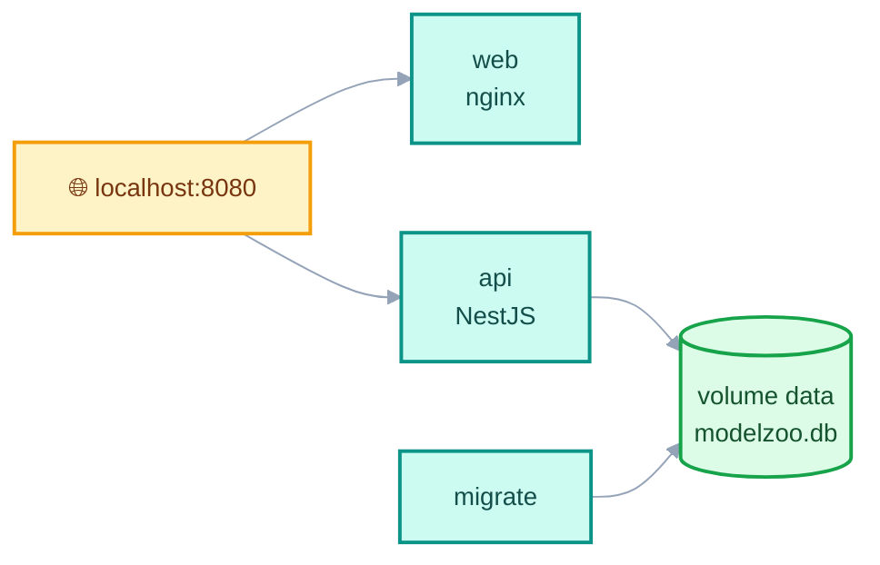
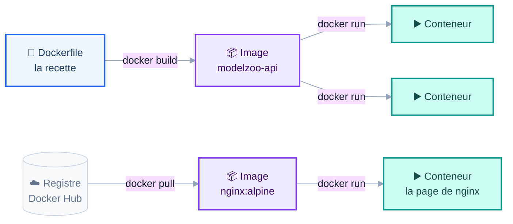
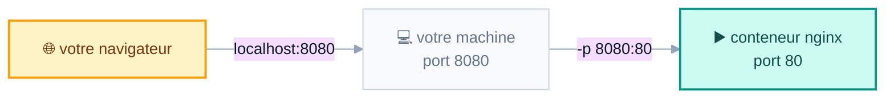
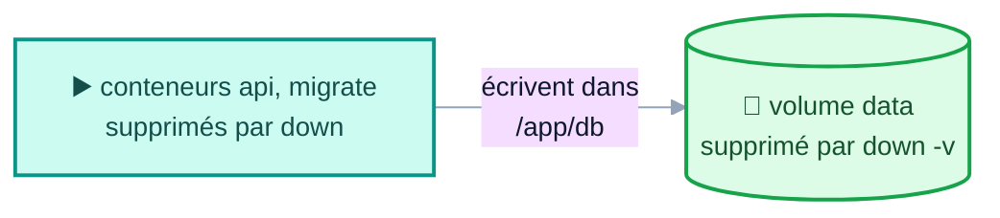
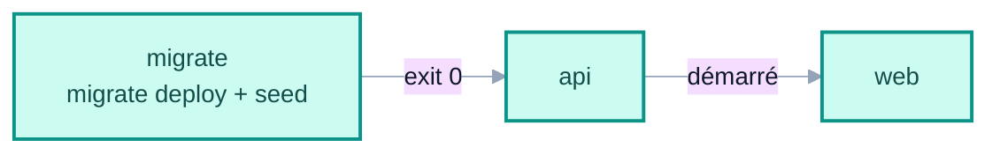
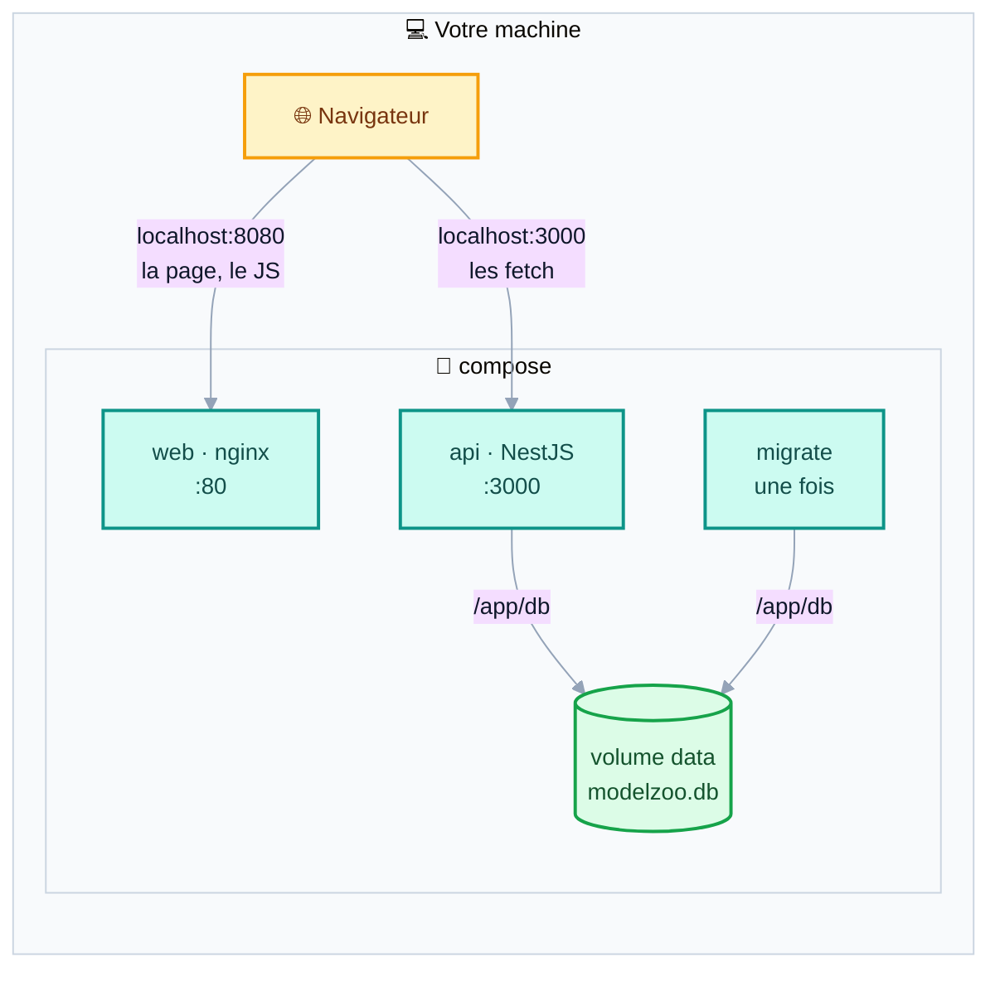
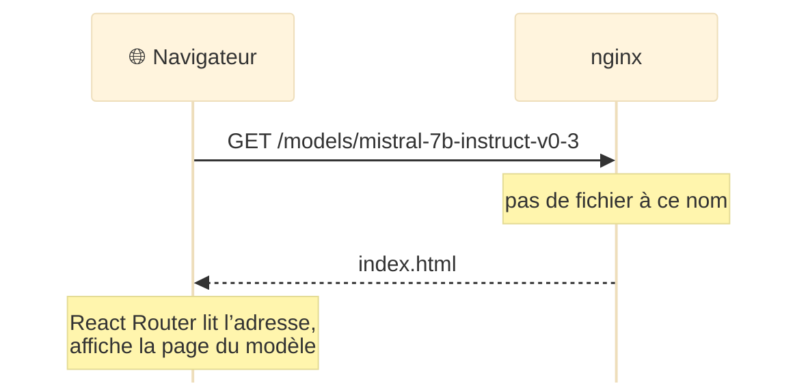

```mermaid {scale: 0.62}
%%{init: {'theme':'base','themeVariables':{'fontFamily':'Roboto, ui-sans-serif, sans-serif','fontSize':'14px','lineColor':'#94a3b8','primaryTextColor':'#0f172a','clusterBkg':'#f8fafc','clusterBorder':'#cbd5e1'}}}%%
flowchart LR
  A["build.args<br/>VITE_API_URL"] -->|"docker compose build"| B["vite build"]
  B --> C["dist/assets/index-3f2a.js<br/>fetch('http://localhost:3000/models')"]
  C -->|"nginx l’envoie"| D["🌐 le navigateur l’exécute"]
  class A req
  class B mute
  class C img
  class D box
  classDef img fill:#ede9fe,stroke:#7c3aed,stroke-width:2px,color:#3b0764
  classDef ctr fill:#ccfbf1,stroke:#0d9488,stroke-width:2px,color:#134e4a
  classDef db fill:#dcfce7,stroke:#16a34a,stroke-width:2px,color:#14532d
  classDef box fill:#eff6ff,stroke:#2563eb,stroke-width:2px,color:#1e3a5f
  classDef req fill:#fef3c7,stroke:#f59e0b,stroke-width:2px,color:#78350f
  classDef bad fill:#fee2e2,stroke:#dc2626,stroke-width:2px,color:#7f1d1d
  classDef mute fill:#f8fafc,stroke:#cbd5e1,stroke-width:1px,color:#64748b
```

<CourseCover :sprint="4" :seance="12" />

# Docker

## L’application en une seule commande

<div class="pt-4 op-75">Séance 12&nbsp;: Sprint 4, l’application complète</div>

<div class="pt-10 text-sm op-75">
📱 <b>gaetanmaisse.github.io/ismin-web-2026-tps</b>
</div>

---

# Le but de la journée

<div class="grid grid-cols-5 gap-6 pt-2">
<div class="col-span-3">

```sh
$ docker compose up --build
 ✔ Volume    tp10_data       Created
 ✔ Container tp10-migrate-1  Exited (0)
 ✔ Container tp10-api-1      Started
 ✔ Container tp10-web-1      Started
```

<div class="text-center text-sm op-60 py-2">↓ trois conteneurs, un volume</div>



</div>
<div class="col-span-2 text-sm">

**ModelZoo démarre d’une seule commande**, sur n’importe quelle machine qui a Docker. Plus besoin d’installer Node, de créer la base, ni d’ouvrir trois terminaux.

<div class="pt-4">

À la fin, vous aurez écrit&nbsp;:

- l’**image de l’API**, en deux étapes&nbsp;;
- le fichier **`compose.yaml`**&nbsp;: les migrations, l’API, le front, et le volume de la base&nbsp;;
- l’**image du front**, servie par nginx.

</div>

<div class="pt-4 op-75">
C’est le socle du projet&nbsp;: <code>docker compose up</code> à la racine démarre tout, base comprise.
</div>
</div>
</div>

---

# «&nbsp;Ça marche sur ma machine&nbsp;»

<div class="grid grid-cols-2 gap-8 pt-2">
<div>

Pour lancer ModelZoo aujourd’hui, il faut&nbsp;:

- Node **26**, pas 24, pas 22&nbsp;;
- une base, créée, migrée, peuplée&nbsp;;
- deux `.env`, avec les bonnes valeurs&nbsp;;
- trois terminaux, dans le bon ordre.

<div class="pt-4">

Le jour où je corrige votre projet, je clone votre dépôt sur une machine neuve. Il me manquera forcément quelque chose.

</div>
</div>
<div>

<div class="p-4 bg-blue-500 bg-opacity-10 rounded">

**Docker livre le programme avec tout ce dont il a besoin**&nbsp;: le système, Node, les dépendances, la configuration. Il tourne de la même façon chez vous, chez moi et sur un serveur.

</div>

<div class="pt-4 text-sm op-75">
La recette tient dans un fichier texte, versionné avec le code&nbsp;: la machine de votre binôme n’a plus d’importance.
</div>
</div>
</div>

---
layout: section
---

# 1. Images et conteneurs

---

# Une image, des conteneurs

<div class="grid grid-cols-2 gap-8 pt-2">
<div>

<div class="text-sm">

**Une image** est un modèle figé&nbsp;: un système de fichiers, et la commande à lancer. **Un conteneur** est une image qui tourne, isolée du reste. Comme un exécutable et ses processus&nbsp;: d’une image, on lance autant de conteneurs qu’on veut.

</div>

<div class="mt-3 p-3 bg-blue-500 bg-opacity-10 rounded text-sm">

**Le vocabulaire de la séance**

**Un conteneur**, *container*&nbsp;: une image qui tourne.<br/>
**Une couche**, *layer*&nbsp;: le résultat d’une instruction du Dockerfile, mis en cache.<br/>
**Une étape**, *stage*&nbsp;: un `FROM` du Dockerfile.<br/>
**Un registre**, *registry*&nbsp;: l’entrepôt où l’on publie et récupère les images, comme Docker Hub.<br/>
**Publier un port**, *publish*&nbsp;: rendre un port du conteneur joignable depuis votre machine.

<div class="pt-1 text-xs op-75">
La doc de Docker et ses messages d’erreur sont en anglais.
</div>

</div>
</div>
<div>

```sh
docker images            # les images sur la machine
docker ps                # les conteneurs qui tournent
docker ps -a             # … et ceux qui sont arrêtés
docker logs <nom>        # ce qu’un conteneur a affiché
docker stop <nom>        # l’arrêter
docker rm <nom>          # le supprimer
```

<div class="pt-2 text-sm op-75">
<code>node</code>, <code>nginx</code>, <code>postgres</code>&nbsp;: des images officielles, sur Docker Hub. Une image ne se modifie pas&nbsp;: on en construit une nouvelle.
</div>
</div>
</div>

---

# Un conteneur n’est pas une machine virtuelle

<div class="grid grid-cols-2 gap-8 pt-2">
<div>

<div class="grid grid-cols-2 gap-4 text-xs text-center">
<div>
<div class="font-bold pb-1 text-sm">Des machines virtuelles</div>
<div class="grid grid-cols-2 gap-1">
<div class="p-1 rounded border border-teal-500 bg-teal-500 bg-opacity-10">App</div>
<div class="p-1 rounded border border-teal-500 bg-teal-500 bg-opacity-10">App</div>
<div class="p-1 rounded border border-red-500 bg-red-500 bg-opacity-10">Linux<br/>+ son noyau</div>
<div class="p-1 rounded border border-red-500 bg-red-500 bg-opacity-10">Windows<br/>+ son noyau</div>
</div>
<div class="mt-1 p-1 rounded border border-gray-500 bg-gray-500 bg-opacity-10">Hyperviseur</div>
<div class="mt-1 p-1 rounded border border-gray-500 bg-gray-500 bg-opacity-20">La machine</div>
</div>
<div>
<div class="font-bold pb-1 text-sm">Des conteneurs</div>
<div class="grid grid-cols-3 gap-1">
<div class="p-1 rounded border border-teal-500 bg-teal-500 bg-opacity-10">App<br/>&nbsp;</div>
<div class="p-1 rounded border border-teal-500 bg-teal-500 bg-opacity-10">App<br/>&nbsp;</div>
<div class="p-1 rounded border border-teal-500 bg-teal-500 bg-opacity-10">App<br/>&nbsp;</div>
</div>
<div class="mt-1 p-1 rounded border border-blue-500 bg-blue-500 bg-opacity-10">Docker</div>
<div class="mt-1 p-1 rounded border border-orange-500 bg-orange-500 bg-opacity-10">Un seul noyau, partagé</div>
<div class="mt-1 p-1 rounded border border-gray-500 bg-gray-500 bg-opacity-20">La machine</div>
</div>
</div>

<div class="pt-4 text-sm">

**Une machine virtuelle**, *virtual machine* ou *VM*, embarque un système d’exploitation complet, noyau compris, *kernel*&nbsp;: elle démarre en quelques minutes et pèse des Go. **Un conteneur** n’est qu’un processus isolé par le noyau de la machine&nbsp;: il démarre en une seconde et pèse des Mo.

</div>

</div>
<div class="text-sm">

<div class="p-4 border border-gray-500 border-opacity-30 rounded">

**Et sur Mac ou Windows&nbsp;?**

Les conteneurs ont besoin d’un noyau Linux. Docker Desktop lance donc une petite machine virtuelle Linux, une seule, qui héberge tous vos conteneurs. Sous Windows, c’est WSL&nbsp;2 qui la fournit.

</div>

<div class="pt-4 op-75">
<code>Cannot connect to the Docker daemon</code>&nbsp;? Le démon, <i>daemon</i>, est le programme qui fait tourner vos conteneurs&nbsp;: Docker Desktop n’est pas lancé.
</div>
</div>
</div>

---

# Du Dockerfile au conteneur



<div class="grid grid-cols-3 gap-4 pt-4 text-sm">
<div>

**`docker build`**&nbsp;: construit une image à partir d’une recette. Celle de votre API, à l’étape 2.

</div>
<div>

**`docker pull`**&nbsp;: télécharge une image toute faite depuis le registre. `docker run` s’en charge tout seul la première fois.

</div>
<div>

**`docker run`**&nbsp;: lance un conteneur à partir d’une image. Autant de fois qu’on veut.

</div>
</div>

---

# Utiliser une image&nbsp;: nginx en une commande

```sh
docker run --rm -p 8080:80 nginx:alpine
```

<div class="grid grid-cols-2 gap-6 pt-4 text-sm">
<div>

- **`-p 8080:80`**&nbsp;: publier un port, *publish*. Le port **de votre machine**, puis le port **du conteneur**. Sans lui, nginx tourne, mais rien ne peut le joindre.
- `nginx:alpine`&nbsp;: le nom de l’image, puis son **tag**. `alpine`&nbsp;: une distribution Linux minimaliste.

</div>
<div>

- `--rm`&nbsp;: le conteneur est supprimé dès qu’il s’arrête.
- Ctrl+C l’arrête. Avec `-d`, *detached*, il tourne en arrière-plan&nbsp;: `docker stop` pour l’arrêter.

</div>
</div>

<div class="pt-2">



</div>

<div class="text-sm op-75">
Rien à installer&nbsp;: au premier lancement, Docker télécharge l’image. «&nbsp;Welcome to nginx!&nbsp;» s’affiche sur <code>localhost:8080</code>&nbsp;: c’est l’étape 1 du TP. nginx reviendra à l’étape 6, pour servir le front.
</div>

---
layout: section
---

# 2. Construire une image

---

# Le Dockerfile&nbsp;: la recette

<div class="grid grid-cols-5 gap-6 pt-2">
<div class="col-span-3">

```dockerfile
# api/Dockerfile, première version
FROM node:26-alpine                      # l’image de base, base image
WORKDIR /app                             # le dossier de travail
COPY package*.json prisma.config.ts ./   # les dépendances d’abord,
COPY prisma/schema.prisma ./prisma/      # avec le schéma Prisma
RUN npm ci                               # installées dans leur couche
COPY . .                                 # puis le reste du code
RUN npm run build                        # compilé dans dist/
CMD ["node", "dist/main.js"]             # lancé au démarrage
```

```sh
docker build -t modelzoo-api ./api
```

<div class="text-xs font-mono p-2 rounded bg-gray-500 bg-opacity-10 break-all">docker run --name modelzoo-api --env-file api/.env -p 3000:3000 modelzoo-api sh -c "npx prisma migrate deploy &amp;&amp; npm run db:seed &amp;&amp; node dist/main.js"</div>

<div class="text-xs op-75 pt-1">Une seule ligne, qui enchaîne les migrations, le seed et le serveur.</div>

</div>
<div class="col-span-2 text-sm">

<v-clicks>

- `RUN` s’exécute **pendant le build**, `CMD` **au démarrage** du conteneur.
- `npm ci` plutôt que `npm install`&nbsp;: il installe exactement les versions de `package-lock.json`, sans rien modifier.
- **Le schéma avant `npm ci`**&nbsp;: le `postinstall` lance `prisma generate`, qui en a besoin.
- `-t`&nbsp;: nomme l’image, son *tag*. `./api`&nbsp;: le **contexte**, *build context*, c’est-à-dire le dossier envoyé à Docker.
- `--env-file`&nbsp;: les variables du `.env`, transmises **au démarrage**, jamais copiées dans l’image.
- `node dist/main.js` plutôt que `npm run start:dev`&nbsp;: dans un conteneur, rien ne surveille vos fichiers.

</v-clicks>

</div>
</div>

---

# Les couches, et le cache

<div class="grid grid-cols-2 gap-8 pt-2">
<div>

Chaque instruction produit une **couche**, *layer*. Au build suivant, Docker réutilise les couches inchangées, et reconstruit tout ce qui suit la première couche modifiée.

<div class="text-sm pb-1">Vous modifiez un fichier de <code>src/</code>, puis vous reconstruisez&nbsp;:</div>

<div class="grid grid-cols-2 gap-3 text-xs font-mono">
<div>
<div class="font-sans font-bold text-sm pb-1">✅ Le bon ordre</div>
<div class="p-1 mb-1 rounded border border-green-600 bg-green-500 bg-opacity-10">FROM node:26-alpine &nbsp;✓</div>
<div class="p-1 mb-1 rounded border border-green-600 bg-green-500 bg-opacity-10">COPY package*.json, le schéma &nbsp;✓</div>
<div class="p-1 mb-1 rounded border border-green-600 bg-green-500 bg-opacity-10">RUN npm ci &nbsp;✓ cache</div>
<div class="p-1 mb-1 rounded border border-orange-500 bg-orange-500 bg-opacity-10">COPY . . &nbsp;↻</div>
<div class="p-1 mb-1 rounded border border-orange-500 bg-orange-500 bg-opacity-10">RUN npm run build &nbsp;↻</div>
</div>
<div>
<div class="font-sans font-bold text-sm pb-1">❌ Le mauvais ordre</div>
<div class="p-1 mb-1 rounded border border-green-600 bg-green-500 bg-opacity-10">FROM node:26-alpine &nbsp;✓</div>
<div class="p-1 mb-1 rounded border border-orange-500 bg-orange-500 bg-opacity-10">COPY . . &nbsp;↻</div>
<div class="p-1 mb-1 rounded border border-red-500 bg-red-500 bg-opacity-15">RUN npm ci &nbsp;↻ le plus long</div>
<div class="p-1 mb-1 rounded border border-orange-500 bg-orange-500 bg-opacity-10">RUN npm run build &nbsp;↻</div>
</div>
</div>

<div class="text-xs op-75 pt-1">✓ réutilisée depuis le cache&nbsp;; ↻ reconstruite. Dès qu’une couche change, elle et toutes les suivantes sont reconstruites.</div>

</div>
<div class="text-sm">

<div class="p-4 bg-red-500 bg-opacity-10 rounded">

**L’ordre compte.** Avec `COPY . .` avant `npm ci`, la moindre ligne de code modifiée relance l’installation de toutes les dépendances.

</div>

<div class="pt-4">

D’abord ce qui change rarement, ensuite ce qui change souvent.

</div>

<div class="pt-4 op-75">
Pour voir les couches&nbsp;: <code>docker history modelzoo-api</code>.
</div>
</div>
</div>

---

# `.dockerignore`&nbsp;: ce qui n’entre pas dans l’image

<div class="grid grid-cols-2 gap-8 pt-2">
<div>

```text
# api/.dockerignore
node_modules
dist
src/generated
.env
.env.*
!.env.example
*.db
*.db-journal
```

<div class="pt-2 text-sm">

Il fonctionne comme un `.gitignore`, appliqué au contexte de build&nbsp;: `COPY . .` ignore ces fichiers.

</div>
</div>
<div class="text-sm">

Rappel de l’audit, séance 6&nbsp;: **si** je récupère votre image, **alors** `cat .env` me donne le `JWT_SECRET`, et je fabrique un token admin.

<div class="pt-4">

- **`.env`**&nbsp;: les secrets n’ont rien à faire dans une image. On les fournit au démarrage.
- **`node_modules`**&nbsp;: il a été installé pour votre machine, et un module natif compilé pour macOS ne tourne pas sous Linux. L’image installe ses propres dépendances.
- **`*.db`**&nbsp;: votre base de développement reste sur votre machine. L’image crée la sienne.
- **`dist`, `src/generated`**&nbsp;: reconstruits dans l’image.

</div>
</div>
</div>

---

# Construire, puis ne garder que le résultat

<div class="text-xs text-center">
<div class="text-left text-sm font-bold pb-1">🔨 L’étape <code>build</code>&nbsp;: écartée à la fin</div>
<div class="grid items-center gap-2" style="grid-template-columns: 1fr auto 1fr auto 1fr auto 1fr;">
<div class="p-2 rounded border border-gray-400 bg-gray-500 bg-opacity-5 op-75">node:26-alpine</div><div class="op-50">→</div><div class="p-2 rounded border border-gray-400 bg-gray-500 bg-opacity-5 op-75">npm ci<br/>toutes les dépendances,<br/>prisma generate</div><div class="op-50">→</div><div class="p-2 rounded border border-gray-400 bg-gray-500 bg-opacity-5 op-75">nest build<br/>le client Prisma compris</div><div class="op-50">→</div><div class="p-2 rounded border border-amber-500 bg-amber-500 bg-opacity-15 font-bold">dist/</div>
</div>
<div class="grid items-center gap-2 py-1" style="grid-template-columns: 1fr auto 1fr auto 1fr auto 1fr;">
<div></div><div></div><div></div><div></div><div class="text-amber-600 font-mono">↙ COPY --from=build</div><div></div><div></div>
</div>
<div class="text-left text-sm font-bold pb-1">📦 L’image finale</div>
<div class="grid items-center gap-2" style="grid-template-columns: 1fr auto 1fr auto 1fr auto 1fr;">
<div class="p-2 rounded border border-violet-500 bg-violet-500 bg-opacity-10">node:26-alpine</div><div class="op-50">→</div><div class="p-2 rounded border border-violet-500 bg-violet-500 bg-opacity-10">npm ci --omit=dev<br/>npm rebuild better-sqlite3</div><div class="op-50">→</div><div class="p-2 rounded border border-amber-500 bg-amber-500 bg-opacity-15 font-bold">dist/</div><div class="op-50">→</div><div class="p-2 rounded border border-violet-500 bg-violet-500 bg-opacity-10">USER node<br/>CMD node dist/main.js</div>
</div>
</div>

<div class="grid grid-cols-2 gap-6 pt-2 text-sm">
<div>

Le compilateur, la CLI Nest, la CLI Prisma, `tsx`, les sources TypeScript&nbsp;: tout reste dans l’étape `build`. L’image finale ne contient que `dist/` et les dépendances de production.

</div>
<div>

| L’image de l’API | Taille |
|---|---|
| une seule étape | 1 284 Mo |
| deux étapes | **484 Mo** |

</div>
</div>

---

# Le build en deux étapes, *multi-stage*

<div class="grid grid-cols-5 gap-6 pt-2">
<div class="col-span-3">

```dockerfile
# Étape 1 : construire, avec tous les outils
FROM node:26-alpine AS build
WORKDIR /app
COPY package*.json prisma.config.ts ./
COPY prisma/schema.prisma ./prisma/
RUN npm ci
COPY . .
RUN npm run build

# Étape 2 : exécuter, avec le strict nécessaire
FROM node:26-alpine
WORKDIR /app
COPY package*.json ./
RUN npm ci --omit=dev --omit=optional --ignore-scripts \
 && npm rebuild better-sqlite3
COPY --from=build /app/dist ./dist
CMD ["node", "dist/main.js"]
```

</div>
<div class="col-span-2 text-sm">

<v-clicks>

- L’image finale correspond à **la dernière étape**, *stage*. `COPY --from=build` n’y copie que le résultat de l’étape 1, `dist/`, où le client Prisma généré est déjà compilé.
- `--omit=dev --omit=optional`&nbsp;: sans les outils de développement. La CLI Prisma est déclarée comme dépendance optionnelle&nbsp;: sans `--omit=optional`, elle resterait.
- `--ignore-scripts`&nbsp;: sans la CLI, le `prisma generate` du `postinstall` échouerait. Mais l’option saute aussi le script de `better-sqlite3`&nbsp;: `npm rebuild better-sqlite3` relance celui-là seulement.
- Sans CLI ni `tsx`, la commande de l’étape 2 ne fonctionne plus dans cette image&nbsp;: les migrations auront leur propre service, à l’étape 5.

</v-clicks>

</div>
</div>

---

# Où sont les données&nbsp;?

<div class="grid grid-cols-2 gap-8 pt-2">
<div>

<div class="text-xs text-center font-mono">
<div class="p-1 mb-1 rounded border border-orange-500 bg-orange-500 bg-opacity-15 font-bold">couche du conteneur, en écriture&nbsp;: dev.db, le modèle ajouté</div>
<div class="text-sm font-sans op-75 py-1">↑ ajoutée par <code>docker run</code>, supprimée par <code>docker rm</code></div>
<div class="p-1 mb-1 rounded border border-violet-500 bg-violet-500 bg-opacity-10">RUN npm run build</div>
<div class="p-1 mb-1 rounded border border-violet-500 bg-violet-500 bg-opacity-10">COPY . .</div>
<div class="p-1 mb-1 rounded border border-violet-500 bg-violet-500 bg-opacity-10">RUN npm ci</div>
<div class="p-1 mb-1 rounded border border-violet-500 bg-violet-500 bg-opacity-10">FROM node:26-alpine</div>
<div class="text-sm font-sans op-75 pt-1">l’image&nbsp;: des couches en lecture seule</div>
</div>

</div>
<div class="text-sm">

Un conteneur, c’est l’image, en lecture seule, plus **une couche qui lui est propre**, en écriture. Tout ce qu’il écrit atterrit dans cette couche&nbsp;: la base SQLite, comme le modèle que vous ajoutez.

<v-clicks>

- `docker rm`&nbsp;: la couche du conteneur disparaît, et vos données avec. L’image, elle, n’a pas bougé.
- Un nouveau conteneur repart de l’image&nbsp;: la base du seed, et rien d’autre.
- C’est l’étape 2 du TP&nbsp;: ajoutez un modèle, supprimez le conteneur, relancez. Il a disparu.

</v-clicks>

<v-click>

<div class="mt-4 p-3 bg-blue-500 bg-opacity-10 rounded">

La solution&nbsp;: **un volume**, un dossier qui vit en dehors du conteneur. C’est l’étape 4.

</div>

</v-click>
</div>
</div>

---
layout: section
---

# 3. `docker compose`

---

# `compose.yaml`&nbsp;: toute l’application, dans un fichier

<div class="grid grid-cols-5 gap-6 pt-2">
<div class="col-span-3">

```yaml
services:
  api:                    # étape 4
    build: ./api
    environment:
      DATABASE_URL: file:/app/db/modelzoo.db
      JWT_SECRET: dev-secret-change-me
      WEB_ORIGIN: http://localhost:8080
    ports:
      - "3000:3000"
    volumes:
      - data:/app/db

  migrate:                # étape 5
    # …

  web:                    # étape 6
    # …

volumes:
  data:
```

</div>
<div class="col-span-2 text-sm">

<v-clicks>

- Un **service** par conteneur&nbsp;: `migrate`, `api`, `web`.
- `build`&nbsp;: construire à partir du Dockerfile d’un dossier. `image`&nbsp;: partir d’une image toute faite, comme `nginx:alpine` à l’étape 1.
- `environment`&nbsp;: les variables d’environnement, à la place du `.env`.
- `ports`&nbsp;: uniquement pour ce que **votre navigateur** doit joindre. `migrate` n’en publie aucun&nbsp;: personne ne l’appelle.
- `volumes`&nbsp;: le dossier `/app/db` du conteneur est stocké dans le volume `data`.

</v-clicks>

<v-click>

```sh
docker compose up --build
docker compose ps -a
docker compose logs -f api
docker compose down
```

<div class="text-xs op-75">Construire puis lancer&nbsp;; l’état des services&nbsp;; suivre les logs de l’API&nbsp;; tout arrêter.</div>

</v-click>

</div>
</div>

---

# Les volumes&nbsp;: les données survivent

<div class="grid grid-cols-2 gap-8 pt-2">
<div>

Un conteneur supprimé emporte tout ce qu’il a écrit. Sans volume, la base repart du seed à chaque `docker compose down`.



```yaml
api:
  volumes:
    - data:/app/db

volumes:
  data:
```

<div class="text-xs op-75 pt-1">
<code>data:/app/db</code>&nbsp;: le nom du volume, puis le dossier du conteneur. <code>DATABASE_URL</code> pointe dans ce dossier&nbsp;: <code>file:/app/db/modelzoo.db</code>. Pourquoi un dossier dédié&nbsp;? Au premier lancement, le volume se remplit avec ce que l’image contient à cet emplacement, et <code>data/</code> contient déjà les JSON du seed.
</div>

</div>
<div class="text-sm">

Un **volume** est un dossier géré par Docker, en dehors du conteneur, et monté, *mounted*, à l’intérieur&nbsp;: tout ce qui s’écrit dans `/app/db` atterrit dans le volume.

| Commande | Les conteneurs | Le volume, donc les données |
|---|---|---|
| `docker compose down` | supprimés | gardés |
| `docker compose down -v` | supprimés | **supprimés** |

<div class="pt-4 op-75">
C’est le dernier test de l’étape 7&nbsp;: ajoutez un modèle, faites <code>down</code> puis <code>up</code>&nbsp;: il est toujours là.
</div>
</div>
</div>

---

# L’ordre de démarrage

<style>
.slidev-code { font-size: 10.5px !important; line-height: 1.45 !important; }
</style>

<div class="grid grid-cols-2 gap-8 pt-2">
<div>



```yaml
migrate:
  build: { context: ./api, target: build }
  command: sh -c "npx prisma migrate deploy && npm run db:seed"

api:
  depends_on:
    migrate:
      condition: service_completed_successfully
```

</div>
<div class="text-sm">

<v-clicks>

- Seul, `depends_on` attend que le conteneur **démarre**, pas qu’il ait terminé. L’API démarrerait sur une base sans tables&nbsp;: ``The table `main.Model` does not exist``.
- `service_completed_successfully`&nbsp;: attendre qu’un service **se termine sans erreur**. `migrate` est un service ponctuel, *one-shot*&nbsp;: il fait son travail, puis s’arrête.
- `migrate` se construit à partir de l’étape `build`, `target: build`&nbsp;: la seule à contenir la CLI Prisma et `tsx`. Dans l’image finale, `npx prisma` téléchargerait une autre version de Prisma, et échouerait.
- **`sh -c`**&nbsp;: sans shell, `&&` est transmis à `npx` comme un simple argument. Le seed ne s’exécute jamais, et `migrate` se termine pourtant sans erreur&nbsp;: le catalogue reste vide, sans aucun message.

</v-clicks>

</div>
</div>

---

# `migrate dev` ou `migrate deploy`

<div class="grid grid-cols-2 gap-6 pt-4 text-sm">
<div class="p-4 border border-gray-500 border-opacity-30 rounded">

**`prisma migrate dev`**, sur votre machine

Compare le schéma à la base, **écrit** une nouvelle migration si besoin, et l’applique. C’est vous qui la relisez et la versionnez.

</div>
<div class="p-4 border border-blue-500 border-opacity-50 rounded">

**`prisma migrate deploy`**, dans le service `migrate`

**Applique** les migrations versionnées qui manquent. Il n’en écrit jamais et ne pose aucune question. Sur une base à jour, il ne fait rien.

</div>
</div>

<div class="pt-6 text-sm">

Le service `migrate` lance `migrate deploy`, puis le seed. Il s’exécute à chaque `docker compose up`&nbsp;: le seed doit donc pouvoir être rejoué sans créer de doublons. Le nôtre utilise des `upsert`.

</div>

---
layout: section
---

# 4. Le front dans une image

---

# Le front, ce ne sont que des fichiers

<div class="grid grid-cols-5 gap-6 pt-2">
<div class="col-span-3">

```dockerfile
# web/Dockerfile
FROM node:26-alpine AS build
WORKDIR /app
COPY package*.json ./
RUN npm ci
COPY . .
ARG VITE_API_URL
RUN npm run build             # → dist/ : HTML, JS, CSS

FROM nginx:alpine
COPY --from=build /app/dist /usr/share/nginx/html
COPY nginx.conf /etc/nginx/conf.d/default.conf
```

</div>
<div class="col-span-2 text-sm">

<v-clicks>

- `npm run dev` est un outil de développement. En production, `vite build` produit des fichiers **statiques**, *static files*&nbsp;: il suffit de les servir.
- **nginx** est un serveur web&nbsp;: il sert des fichiers, très vite. L’image finale ne contient même pas Node.

</v-clicks>

</div>
</div>

---

# Qui parle à qui

<div class="grid grid-cols-5 gap-6 pt-2">
<div class="col-span-3">



</div>
<div class="col-span-2 text-sm">

<v-clicks>

- **Le navigateur tourne sur votre machine**, pas dans compose. Il passe par les ports publiés&nbsp;: `localhost:8080`, `localhost:3000`.
- **`migrate` et `api` partagent le volume**&nbsp;: le même fichier, `modelzoo.db`. L’un le remplit, l’autre s’en sert.
- **nginx n’appelle jamais l’API.** Il envoie le JavaScript&nbsp;; c’est le navigateur qui fait les `fetch`. D’où `VITE_API_URL=http://localhost:3000`, et pas `api:3000`.

</v-clicks>

</div>
</div>

---

# Les variables `VITE_` sont figées au build

<div class="grid grid-cols-2 gap-8 pt-2">
<div>

```ts
// api.ts
export const API_URL = import.meta.env.VITE_API_URL;
```

`vite build` **remplace** `import.meta.env.VITE_API_URL` par sa valeur, dans le JavaScript produit. Une fois l’image construite, l’adresse est écrite en dur dans le code.

</div>
<div>

```yaml
web:
  build:
    context: ./web
    args:
      VITE_API_URL: http://localhost:3000
  ports:
    - "8080:80"
```

<div class="pt-2 text-sm">

`args` transmet la valeur à l’`ARG` du Dockerfile, un argument de build, *build arg*, **pendant le build**. Un `environment:` sur le service `web` arriverait trop tard&nbsp;: nginx n’exécute aucun JavaScript.

</div>

<div class="pt-2 text-sm op-75">
Sans <code>args</code>, <code>api.ts</code> se rabat sur sa valeur par défaut, <code>localhost:3000</code>&nbsp;: ça fonctionne ici par chance, mais plus du tout le jour où l’API change d’adresse.
</div>
</div>
</div>

<div class="pt-2">



</div>

---

# Recharger `/models/…`, enfin

<div class="grid grid-cols-2 gap-8 pt-2">
<div>

```nginx
# web/nginx.conf, fourni
server {
  listen 80;
  root /usr/share/nginx/html;
  location / {
    try_files $uri /index.html;
  }
}
```



</div>
<div class="text-sm">

Comme promis en séance 10&nbsp;: recharger `/models/mistral-7b-instruct-v0-3`, c’est demander cette adresse **au serveur**, qui n’a aucun fichier à ce nom.

<v-clicks>

- `try_files $uri`&nbsp;: sert le fichier demandé s’il existe, par exemple `/assets/index-3f2a.js`.
- Sinon, `/index.html`&nbsp;: React démarre, React Router lit l’adresse et affiche la bonne page. C’est le *SPA fallback*.
- Sans cette ligne, nginx répond 404 dès qu’on recharge une autre page que l’accueil.

</v-clicks>

</div>
</div>

---

# Le CORS, une dernière fois

<div class="grid grid-cols-2 gap-8 pt-2">
<div>

Le front n’est plus servi par Vite sur `localhost:5173` mais par nginx sur `localhost:8080`&nbsp;: **c’est une autre origine**, puisque le port en fait partie.

```yaml
api:
  environment:
    WEB_ORIGIN: http://localhost:8080
```

</div>
<div class="text-sm">

<div class="p-4 bg-blue-500 bg-opacity-10 rounded">

C’est pour cela que l’origine est lue dans une variable depuis la séance 7&nbsp;: on change de port, ou de domaine en production, sans toucher au code.

</div>

<div class="pt-4 op-75">
Le symptôme&nbsp;: <code>blocked by CORS policy</code> dans la console, alors que <code>localhost:3000/models</code> répond très bien.
</div>
</div>
</div>

---

# L’essentiel, sur une slide

<div class="grid grid-cols-3 gap-4 pt-2 text-sm">
<div class="p-4 border border-gray-500 border-opacity-30 rounded">

**Images et conteneurs**

- une image, l’exécutable&nbsp;; un conteneur, le processus
- `-p machine:conteneur`
- `--env-file`, ou `environment:` dans compose
- `docker rm` emporte ce que le conteneur a écrit

</div>
<div class="p-4 border border-gray-500 border-opacity-30 rounded">

**Le Dockerfile**

- `RUN` au build, `CMD` au démarrage
- les dépendances avant le code, pour le cache
- `.dockerignore`&nbsp;: ni `.env` ni `node_modules`
- deux étapes&nbsp;: construire, puis exécuter
- `VITE_`&nbsp;: un `ARG`, figé au build

</div>
<div class="p-4 border border-gray-500 border-opacity-30 rounded">

**compose**

- un service par conteneur
- `depends_on` avec une condition
- un volume pour les données
- `down` garde le volume, `down -v` l’efface
- `ports`&nbsp;: seulement pour le navigateur

</div>
</div>

<div class="pt-4 text-sm op-75">
Gardez cette slide ouverte pendant le TP&nbsp;: les slides sont sur <b>gaetanmaisse.github.io/ismin-web-2026-tps</b>
</div>

---
layout: section
---

# 5. Le TP10

<div class="op-75 pt-2"><code>tp10/README.md</code>, étapes 1 à 7</div>

---

# Démarrer

<div class="grid grid-cols-2 gap-8 pt-2">
<div>

```sh
docker run hello-world      # Docker répond ?
git pull --no-edit upstream main
cd tp10
```

<div class="pt-4 text-sm">

Docker Desktop doit être **lancé**, pas seulement installé. Sous Windows, installez d’abord WSL&nbsp;2 (`wsl --install` dans un PowerShell administrateur), puis Docker Desktop. Le README détaille la marche à suivre.

Dans PowerShell, gardez chaque commande sur une seule ligne&nbsp;: le `\` de fin de ligne n’y fonctionne pas. Celles du README sont déjà écrites ainsi.

</div>

<div class="pt-4 text-sm op-75">
Le TP10 part du corrigé du TP9&nbsp;: un TP9 inachevé ne bloque personne. Arrêtez l’API et le front du TP9, qui utilisent les mêmes ports.
</div>
</div>
<div>

```text
tp10/
├── compose.yaml      ← étapes 4 à 6
├── check.mjs         npm run check : tout vérifier
├── api/              l’API du TP9, en SQLite
│   ├── .dockerignore ← étape 2
│   └── Dockerfile    ← étapes 2 et 3
└── web/              le front du TP9, terminé
    ├── nginx.conf    fourni
    ├── .dockerignore ← étape 6
    └── Dockerfile    ← étape 6
```

</div>
</div>

---

# Le TP10, en sept étapes

<div class="grid grid-cols-2 gap-8 pt-2 text-sm">
<div>

**Partie 1&nbsp;: l’API dans une image**

1. **Une image toute faite**&nbsp;: `docker run -p 8080:80 nginx:alpine`.
2. **Une image pour l’API**&nbsp;: `.dockerignore`, un premier `Dockerfile`, et un modèle qui disparaît avec le conteneur.
3. **Le build en deux étapes**&nbsp;: comparez les tailles avec `docker images`.

**Partie 2&nbsp;: tout avec `docker compose`**

4. **L’API et son volume**&nbsp;: le service `api` et le volume `data`.
5. **Les migrations et le seed**&nbsp;: le service `migrate`, qui passe avant l’API.

</div>
<div>

**Partie 3&nbsp;: le front**

6. **Le front, servi par nginx**&nbsp;: `web/Dockerfile`, le service `web`, `VITE_API_URL` en argument de build, `WEB_ORIGIN` sur 8080.
7. **Tout vérifier**&nbsp;: `npm run check`, puis l’application sur `localhost:8080`, et le test du volume.

<div class="mt-6 p-4 bg-blue-500 bg-opacity-10 rounded">

**`npm run check`**, à la racine de `tp10`, lance tout et vérifie&nbsp;: les migrations, `/health`, les 17 modèles, la connexion, le front, le rechargement de `/models/…`, le CORS. Chaque ligne rouge indique l’étape à reprendre.

</div>
</div>
</div>

---
layout: section
---

# 6. La correction

<div class="op-75 pt-2">L’image de l’API, <code>compose.yaml</code>, et ce qui a coincé</div>

---

# L’image de l’API, en entier

<div class="grid grid-cols-5 gap-6 pt-2">
<div class="col-span-3">

```dockerfile
FROM node:26-alpine AS build
WORKDIR /app
COPY package.json package-lock.json prisma.config.ts ./
COPY prisma/schema.prisma ./prisma/
RUN npm ci
COPY . .
RUN npm run build
RUN mkdir -p /app/db && chown node:node /app/db
USER node

FROM node:26-alpine
WORKDIR /app
ENV NODE_ENV=production
COPY package.json package-lock.json ./
RUN npm ci --omit=dev --omit=optional --ignore-scripts \
 && npm rebuild better-sqlite3 && npm cache clean --force
COPY --from=build /app/dist ./dist
RUN mkdir -p /app/db && chown node:node /app/db
USER node
EXPOSE 3000
CMD ["node", "dist/main.js"]
```

</div>
<div class="col-span-2 text-sm">

| L’image | Taille |
|---|---|
| une seule étape | 1 284 Mo |
| l’API, deux étapes | **484 Mo** |
| le front, nginx | 93 Mo |

<v-clicks>

- **`/app/db` appartient à `node`**&nbsp;: l’API tourne en `USER node`, pas en root. Or SQLite écrit le fichier **et**, à côté, un journal&nbsp;: tout le dossier doit appartenir à `node`, sinon `SQLITE_READONLY`.
- Les deux étapes finissent en `USER node`&nbsp;: `migrate` écrit la base sous le même propriétaire que l’API qui la lira.
- `npm cache clean` **dans le même `RUN`**&nbsp;: une couche ne rétrécit jamais, un `RUN` séparé ne libérerait rien.

</v-clicks>

</div>
</div>

---

# `compose.yaml`, en entier

<style>
.slidev-code { font-size: 10.5px !important; line-height: 1.45 !important; }
</style>

<div class="grid grid-cols-2 gap-3 pt-1 text-xs">
<div>

```yaml
services:
  migrate:
    build:
      context: ./api
      target: build
    environment:
      DATABASE_URL: file:/app/db/modelzoo.db
    volumes:
      - data:/app/db
    command: sh -c "npx prisma migrate deploy && npm run db:seed"

  web:
    build:
      context: ./web
      args:
        VITE_API_URL: http://localhost:3000
    ports:
      - "8080:80"
    depends_on:
      - api
```

</div>
<div>

```yaml
  api:
    build: ./api
    environment:
      DATABASE_URL: file:/app/db/modelzoo.db
      JWT_SECRET: dev-secret-change-me-in-production
      PORT: "3000"
      WEB_ORIGIN: http://localhost:8080
    ports:
      - "3000:3000"
    volumes:
      - data:/app/db
    depends_on:
      migrate:
        condition: service_completed_successfully

volumes:
  data:
```

<div class="pt-2 text-sm">

Un `JWT_SECRET` en clair dans `compose.yaml`, c’est acceptable en développement&nbsp;; en production, il est lu depuis un fichier hors du dépôt, avec `env_file`.

</div>
</div>
</div>

---

# Les erreurs les plus vues

<div class="grid grid-cols-3 gap-3 pt-1 text-xs">
<div class="p-3 border border-gray-500 border-opacity-30 rounded">

**`Could not locate the bindings file`**

`better-sqlite3` sans son binaire&nbsp;: `--ignore-scripts` sans `npm rebuild better-sqlite3`, ou le `node_modules` de votre machine copié dans l’image.

</div>
<div class="p-3 border border-gray-500 border-opacity-30 rounded">

**`SQLITE_READONLY`**

Un `POST` répond 500&nbsp;: le dossier de la base appartient à root. `chown node:node /app/db`, avant `USER node`.

</div>
<div class="p-3 border border-gray-500 border-opacity-30 rounded">

**``The table `main.Model` does not exist``**

La base du volume est vide&nbsp;: `migrate` n’a pas tourné, ou l’API n’attend pas qu’il ait fini.

</div>
<div class="p-3 border border-gray-500 border-opacity-30 rounded">

**`port is already allocated`**

Un autre conteneur, ou un autre programme, occupe le port&nbsp;: le nginx de l’étape 1, l’API du TP9. `docker ps`, puis `docker stop`.

</div>
<div class="p-3 border border-gray-500 border-opacity-30 rounded">

**Le catalogue est vide, sans erreur**

Un `command:` sans `sh -c`&nbsp;: le seed n’a jamais tourné. `docker compose logs migrate`.

</div>
<div class="p-3 border border-gray-500 border-opacity-30 rounded">

**`blocked by CORS policy`**

Le front est sur `localhost:8080`, mais l’API autorise encore `5173`&nbsp;: corrigez `WEB_ORIGIN`.

</div>
</div>

---
layout: center
---

# Fin du cours

<div class="pt-4 text-left mx-auto max-w-2xl text-sm">

En quatre semaines&nbsp;: TypeScript, une API NestJS, une base avec Prisma, l’authentification, React, le routage et Docker. Une application complète, qui démarre en une commande.

</div>

<div class="mt-8 p-4 bg-blue-500 bg-opacity-10 rounded text-sm text-left mx-auto max-w-2xl">

**Le projet, maintenant**

- **Vendredi 9 octobre**&nbsp;: le cadrage, dans le fil de votre sujet.
- **Dimanche 25 octobre, 23&nbsp;h&nbsp;59**&nbsp;: le code et le rapport produit, sous un tag `v1.0`, qui démarre avec `docker compose up`.
- **Dimanche 8 novembre, 23&nbsp;h&nbsp;59**&nbsp;: le rapport d’audit, par mail.

</div>

<div class="pt-8 text-sm op-60">
Les questions au client&nbsp;: dans les Discussions du dépôt.
</div>
